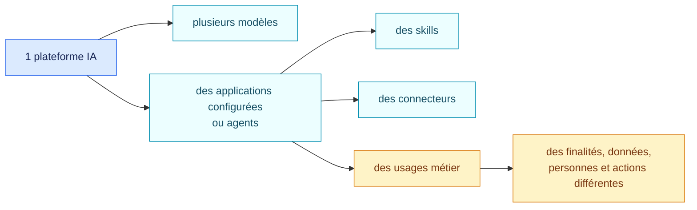
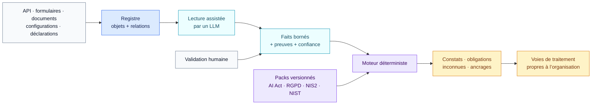
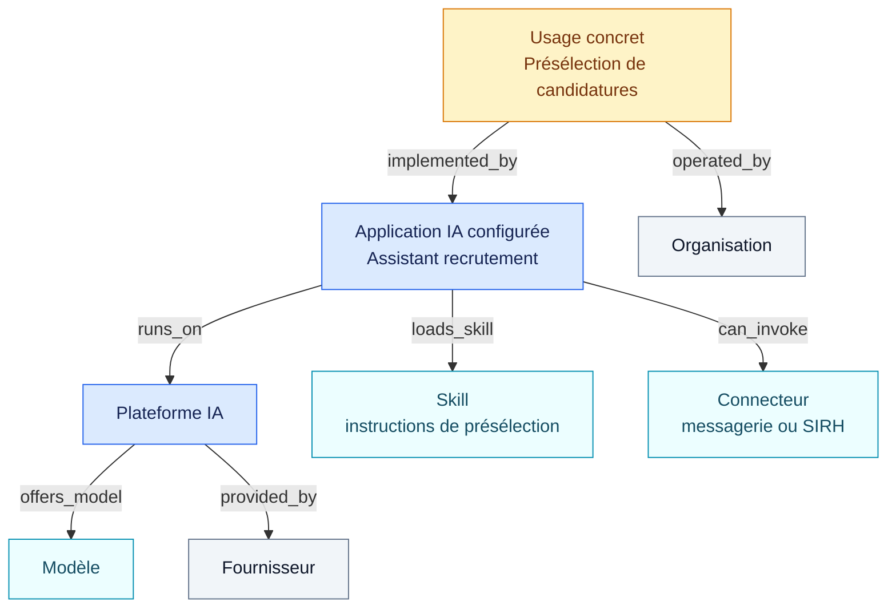

# AIR Framework

**AI Registry & Governance Framework**

[](https://github.com/NickChaps/AIR-Framework/actions/workflows/ci.yml)
[](LICENSE)
[](LICENSE-POLICY.md)

[Read in English](README.md)

AIR Framework est un socle ouvert pour construire un registre IA et qualifier
un parc à partir de faits prouvés et de règles versionnées. Il relie ce qui
existe réellement dans l’entreprise, ce que les textes exigent et les décisions
que l’organisation prend ensuite.

## Pourquoi ce projet existe

L’IA est déjà sortie des seuls laboratoires. En 2025, **20 % des entreprises de
l’Union européenne** utilisaient au moins une technologie d’IA, contre 13,5 %
en 2024. La proportion atteignait **55 % parmi les grandes entreprises**
([Eurostat, 2026](https://ec.europa.eu/eurostat/web/products-statistical-reports/w/ks-01-26-009)).

Dans le même temps, l’[AI Act européen](https://digital-strategy.ec.europa.eu/en/policies/regulatory-framework-ai)
est entré dans sa phase d’application. Les entreprises doivent savoir quels
systèmes et usages elles exploitent, pourquoi une qualification s’applique,
quelles preuves la soutiennent et ce qui a changé depuis la dernière revue.

Le problème de gouvernance ne vient pas seulement du nombre de fournisseurs.
Une plateforme peut exposer plusieurs modèles, héberger des dizaines
d’applications configurées souvent appelées « agents », charger des skills et
ouvrir des connecteurs vers les outils de l’entreprise. Chacun de ces éléments
peut être réutilisé dans plusieurs usages métier.



La volumétrie devient combinatoire. Une liste de logiciels ou une campagne
Excel ponctuelle ne suffit plus à expliquer qu’une même plateforme est utilisée
pour résumer des documents, assister un conseiller ou trier des candidatures.
Or la finalité, les données, les personnes concernées, les actions possibles et
les contrôles du runtime peuvent changer la qualification.

AIR Framework propose une manière reproductible de gérer cette complexité.

## AIR en trente secondes

1. **Inventorier** les systèmes, plateformes, applications, modèles, skills,
   connecteurs et usages, avec leurs relations.
2. **Établir des faits** précis à partir d’API, de déclarations et de documents,
   en conservant la preuve et le niveau de confiance.
3. **Appliquer des packs de règles déterministes** ancrés dans un texte juridique
   ou un référentiel publié.
4. **Conserver chaque version** de l’inventaire, des packs et des résultats pour
   expliquer un changement ou mesurer le drift.
5. **Laisser l’organisation décider** de ses validations et de ses circuits de
   traitement sans les présenter comme du droit.



Le modèle de langage **propose des faits**, il ne rend pas seul le jugement
juridique. Les mêmes faits et la même version d’un pack produisent le même
résultat déterministe.

## Le registre est un graphe, pas une simple liste

AIR conserve un inventaire de gouvernance plus large que le registre juridique
final. Un composant peut être utile pour expliquer un usage sans être lui-même
un système d’IA autonome au sens de la loi.



Dans cet exemple, le skill est un paquet textuel passif. Il ne peut pas appeler
un connecteur. L’application ou la plateforme effectue l’action dans la limite
des permissions du runtime. Le skill reste important au registre parce que ses
instructions peuvent contribuer à la finalité de l’usage.

Chaque pack déclare explicitement les relations qu’il traverse et les faits
qu’il autorise à hériter. Une qualification juridique finale n’est jamais
copiée mécaniquement d’un parent vers un enfant : elle est recalculée pour la
composition et l’usage évalués.

## Quatre couches qui ne se confondent pas

| Couche | Question traitée | Exemple |
| --- | --- | --- |
| **Objets et relations** | Qu’existe-t-il et comment les éléments se composent-ils ? | Cette application fonctionne sur cette plateforme et charge ce skill. |
| **Faits et preuves** | Que savons-nous réellement ? | Les instructions classent des candidatures ; la preuve est telle section du prompt. |
| **Packs normatifs** | Que conclut cette version de ce texte ou référentiel ? | La règle liée à l’annexe III de l’AI Act correspond aux faits établis. |
| **Voies organisationnelles** | Que décide l’entreprise après le constat ? | Revue juridique, demande de preuve, validation sécurité ou autre circuit interne. |

Cette séparation évite trois erreurs fréquentes : faire passer une politique
interne pour une obligation légale, demander au LLM d’inventer la conclusion,
ou considérer toute information absente comme un « non ».

## Ce que produit une évaluation

Une évaluation AIR conserve ensemble :

- la cible et le snapshot exact du registre ;
- les faits directs, hérités, inconnus ou contradictoires ;
- la preuve et la confiance associées à chaque fait ;
- la version et l’empreinte du pack appliqué ;
- la règle déclenchée, son explication et ses ancrages exacts ;
- les obligations, lacunes de preuve et inconnues ;
- un identifiant stable permettant de comparer deux évaluations.

Le produit hôte peut afficher la dernière version dans le registre tout en
gardant l’historique complet pour l’audit, la simulation d’impact et l’analyse
du drift.

## Packs livrés dans la première distribution

| Pack | Autorité | Ce qu’il apporte |
| --- | --- | --- |
| **[EU AI Act](packs/eu-ai-act/1.0.0/README.fr.md)** | Droit européen contraignant | Pratiques interdites, périmètres à haut risque et obligations couvertes par la version du pack. |
| **[EU GDPR · profil IA](packs/eu-gdpr-ai/1.0.0/README.fr.md)** | Droit européen contraignant | Données personnelles, catégories particulières, décisions automatisées et garanties associées. |
| **[EU NIS2 · socle](packs/eu-nis2-baseline/1.0.0/README.fr.md)** | Directive européenne à compléter nationalement | Mesures de gestion des risques et points de gouvernance cyber. |
| **[NIST AI RMF + profil GenAI](packs/nist-ai-rmf/1.0.0/README.fr.md)** | Référentiel volontaire | Fonctions Govern, Map, Measure et Manage pour les risques IA. |
| **[NIST CSF 2.0](packs/nist-csf/2.0.0/README.fr.md)** | Référentiel volontaire | Gouvernance et gestion des risques de cybersécurité. |
| **[Revue contractuelle fictive](packs/contract-review-example/1.0.0/README.fr.md)** | Exemple pédagogique | Démonstration du même moteur sur un contrat et un clausier fictifs. |

Chaque pack publie les faits attendus, les conditions déterministes, les
sources, la couverture et les lacunes connues. Une nouvelle version est
simulée sur le parc avant activation.

## Pour qui ?

- **Juridique et conformité** : relire la raison d’un constat, son texte source
  et les preuves manquantes sans parcourir du code.
- **Sécurité et risques** : rattacher les contrôles de plateforme, les
  connecteurs et les référentiels cyber aux usages concernés.
- **Équipes numériques et responsables de plateformes** : alimenter le registre
  depuis les API et comprendre l’effet d’une modification de configuration.
- **Métiers** : décrire la finalité et le contexte d’un usage avec des mots
  compréhensibles, puis répondre aux seules questions encore ouvertes.
- **Développeurs de solutions de gouvernance** : réutiliser les schémas, le
  moteur, les packs et les tests dans leur propre produit.

## Commencer ici

| Si vous voulez… | Ouvrez… |
| --- | --- |
| comprendre les concepts sans prérequis technique | **[Concepts d’AIR Framework](CONCEPTS.md)** |
| voir un parcours complet, du besoin métier à la décision | [Parcours métier](docs/fr/parcours-metier.md) |
| savoir ce que contient un registre IA utile | [Contenu du registre IA](docs/fr/registre-ia.md) |
| exécuter un exemple en dix minutes | [Démarrage rapide](docs/fr/demarrage.md) |
| lire correctement un résultat | [Lire une évaluation](docs/fr/lire-une-evaluation.md) |
| vérifier la couverture et les sources | [Sources et couverture](docs/fr/sources-et-couverture.md) |
| consulter l’audit actuel des packs | [Revue de viabilité des packs du 29 août 2026](docs/audits/2026-08-29-pack-viability.fr.md) |
| créer un nouveau pack | [Créer et publier un pack](docs/fr/creer-un-pack.md) |
| intégrer le moteur | [Spécification du graphe d’objets](spec/01-object-graph.md) |

La [documentation française complète](docs/fr/README.md) est organisée par
profil métier. Les spécifications sous `spec/` décrivent les contrats
techniques et normatifs du framework.

### Les deux skills fournis avec AIR

Le mot **skill** garde le même sens partout : un paquet d’instructions textuel.
Le dossier [`skills/`](skills/) en fournit deux prêts à l’emploi : l’un aide à
extraire des faits et relire une évaluation, l’autre aide à écrire et tester un
pack. Ils sont optionnels. Ils utilisent le framework sans remplacer le moteur
ni les règles. S’ils sont déployés sur une plateforme, ils peuvent être
inventoriés comme n’importe quel autre objet `skill` du parc.

| Même format, deux positions | Ce qu’AIR enregistre |
| --- | --- |
| Un skill trouvé dans un parc IA | Son texte, sa version, sa plateforme et son effet sur la finalité des usages composés |
| Un skill d’aide AIR déployé par une équipe | Les mêmes champs, avec des instructions destinées à guider l’évaluation ou la création de packs |

La différence vient de l’endroit où le skill est déployé et de ce que fait son
texte, pas d’un second type d’objet.

## Essayer l’exemple de gouvernance IA

Le moteur de référence n’a aucune dépendance d’exécution en dehors de
Python 3.11 ou supérieur.

```bash
python -m pip install .

air-framework validate-pack packs/eu-ai-act/1.0.0/pack.json
air-framework assess \
  --inventory examples/ai-governance/inventory.json \
  --pack packs/eu-ai-act/1.0.0/pack.json \
  --target use-recruiting-assistant

air-framework assess-profile \
  --inventory examples/ai-governance/inventory.json \
  --profile examples/ai-governance/pack-profile.json \
  --target use-recruiting-assistant
```

La commande de profil applique une sélection explicite de packs figés par
version et empreinte. Aucun jeu de règles global ne s’active en silence.

## Ce que le projet ne prétend pas

AIR Framework ne certifie pas la conformité et ne remplace pas les
professionnels du droit, de la sécurité ou des risques. Un résultat dépend de
la version des packs actifs, des preuves disponibles et de la qualité des faits
transmis au moteur.

Le dépôt contient la distribution de référence `v0.1.0-alpha`. Les schémas et
interfaces en ligne de commande peuvent encore évoluer. Consultez la
[déclaration clean-room](CLEAN_ROOM.md), les [décisions fondatrices](spec/00-project-decisions.md),
les [dépendances auditées](DEPENDENCIES.md) et le [guide de contribution](CONTRIBUTING.md).

## Licences et citation

Le code, les schémas, les packs de règles, les tests, les exemples et les
skills sont sous [licence Apache 2.0](LICENSE). Les guides et documents
explicatifs sont sous [Creative Commons Attribution 4.0](https://creativecommons.org/licenses/by/4.0/deed.fr).
Le détail figure dans [LICENSE-POLICY.md](LICENSE-POLICY.md).

Les lois, normes et publications externes ne sont pas placées sous ces
licences. Les packs renvoient vers leurs sources officielles et contiennent des
règles, tests et explications rédigés indépendamment. Les informations de
citation figurent dans [CITATION.cff](CITATION.cff).
