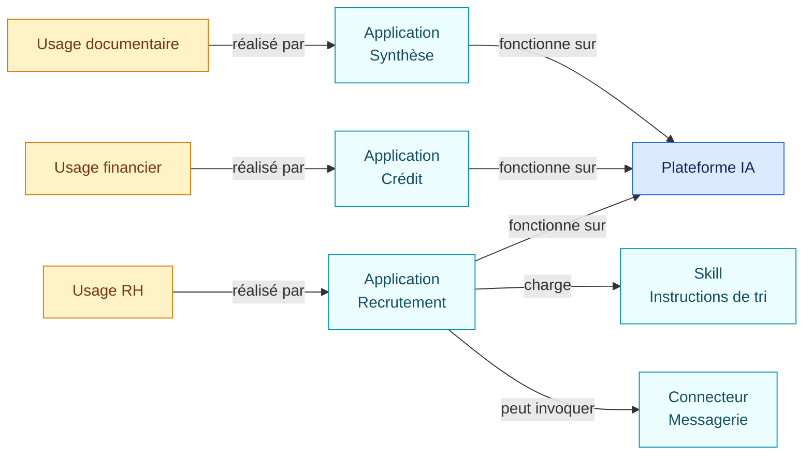
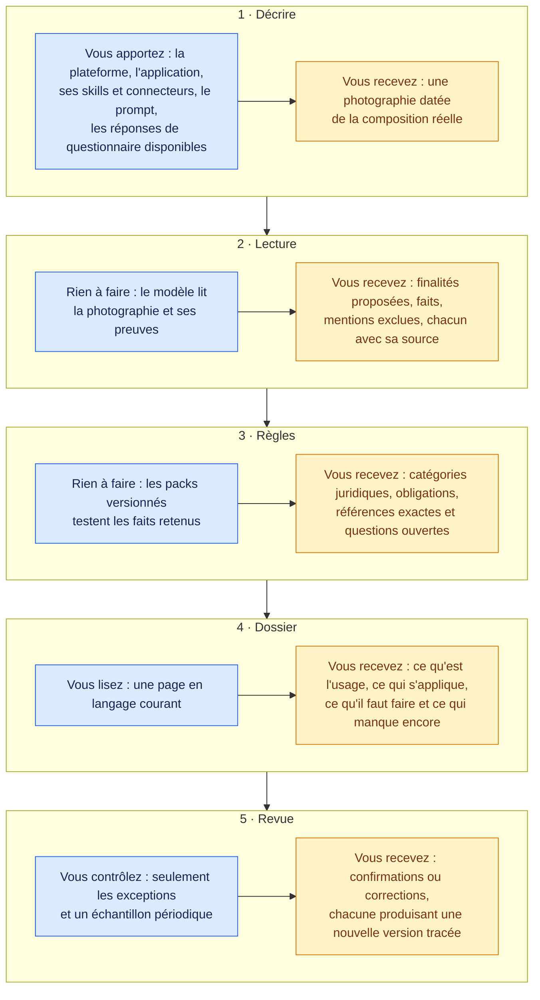
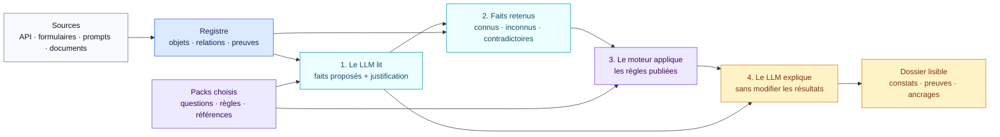
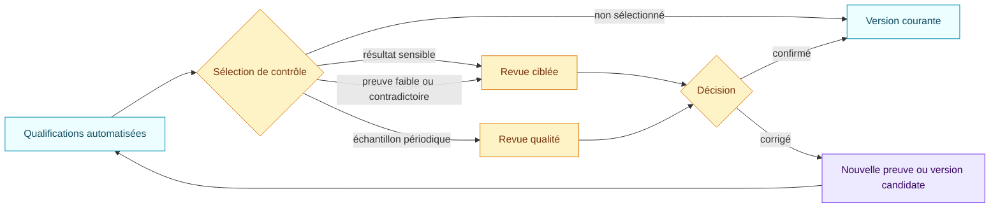

# AIR Framework

**AI Registry & Governance Framework**

[](https://github.com/NickChaps/AIR-Framework/actions/workflows/ci.yml)
[](LICENSE)
[](LICENSE-POLICY.md)

[Read in English](README.md)

AIR Framework aide une organisation à tenir son registre IA, qualifier ses
usages et expliquer chaque résultat. Il relie les systèmes réellement utilisés,
les preuves disponibles et des règles issues de textes identifiés comme l’AI
Act, le RGPD, NIS2 ou les référentiels NIST.

Il s’adresse aux équipes juridiques, conformité, sécurité, numériques et aux
développeurs qui doivent partager le même dossier sans adopter le même niveau
de détail technique.

Le résultat attendu est simple à lire : **ce que fait l’usage, ce que les règles
en concluent, pourquoi elles le concluent et ce qu’il reste à vérifier**.

## Le problème

Une entreprise peut déployer une plateforme IA, puis y créer des centaines
d’applications configurées, souvent appelées agents. Ces applications chargent
des instructions réutilisables, utilisent des modèles et accèdent parfois aux
outils de l’entreprise par des connecteurs.

Le nom de la plateforme ne suffit plus. Une même plateforme peut résumer des
documents, préparer un dossier de crédit ou classer des candidatures. La
finalité, les personnes concernées, les données, les actions possibles et les
contrôles techniques changent d’un usage à l’autre.



Ce qui rend ce parc difficile à gouverner, c'est que ces plateformes sont
génératives. La finalité d'une application ne vit pas dans un champ de base
de données : elle vit en texte libre, un prompt, un skill réutilisable, une
déclaration d'usage, écrits et réécrits en langage naturel par la personne
qui configure. Et une application générative ne se limite pas à sa fonction
déclarée : donnez-lui un connecteur de messagerie avec une autorisation
permanente, et elle peut envoyer ce qu'on lui demande d'envoyer. Aucune
liste de mots-clés ni analyseur figé ne peut classer un tel parc, et lire
des milliers de prompts à la main ne survit pas à la première
réorganisation.

La croissance est déjà visible. Dans son enquête publiée le 25 août 2026,
McKinsey rapporte que près de neuf répondants sur dix utilisent régulièrement
l’IA dans au moins une fonction, que 44 % déclarent un déploiement à l’échelle
de l’entreprise et que 40 % des organisations de plus d’un milliard de dollars
de chiffre d’affaires mettent des agents à l’échelle dans au moins une fonction
([McKinsey, 2026](https://www.mckinsey.com/capabilities/quantumblack/our-insights/the-state-of-ai)).

Dans le même temps, l’[AI Act européen](https://digital-strategy.ec.europa.eu/en/policies/regulatory-framework-ai)
entre progressivement en application. Les équipes juridiques, conformité,
sécurité et numériques doivent pouvoir retrouver un usage, comprendre sa
qualification et reproduire l’analyse qui était valable à une date donnée.

La réponse d'AIR utilise l'IA générative à l'intérieur même de la
qualification, sous des bornes strictes. Un modèle lit les prompts, les
skills et les configurations comme le ferait un relecteur attentif, parce
que seule une lecture sémantique distingue, dans du texte libre, une
finalité de recrutement active d'un exemple interdit. Mais ce modèle ne
peut que proposer des faits issus d'un catalogue fermé, chacun avec ses
preuves citées et sa confiance visible, et les conclusions du droit, les
classifications, constats et obligations, ne lui sont jamais demandées. Tout ce qui suit, les catégories légales, les
obligations, les informations manquantes, est calculé par des règles
déterministes versionnées que chacun peut auditer. Le modèle juge des
faits ; les règles jugent le droit.

## Ce qu’AIR apporte

AIR conserve dans le même dossier la composition réelle de l’usage, la lecture
des sources et l’effet exact des règles. Ces trois couches restent séparées et
peuvent être relues ou remplacées à leur propre rythme.

AIR construit un dossier commun à partir de quatre éléments :

| Élément | En langage courant | Exemple |
| --- | --- | --- |
| **Objet** | Une chose que l’organisation veut suivre | Plateforme, système, application configurée, skill, connecteur, modèle, usage, contrat |
| **Fait** | Une réponse précise utilisée par les règles | « L’application classe des candidats » |
| **Preuve** | La source qui permet d’affirmer ce fait | Extrait du prompt, configuration du connecteur, réponse du responsable métier |
| **Pack de règles** | Une version relue de questions, conditions et références | AI Act 1.3.1 ou RGPD 1.3.1 |

Une référence exacte au texte ou au référentiel est appelée **ancrage**. Une
photographie datée du registre est appelée **version d’inventaire** dans cette
documentation. Les termes techniques restent disponibles dans les fichiers
JSON et les spécifications, mais ils ne sont pas nécessaires pour comprendre
un dossier.

Avec ces éléments, AIR peut produire :

- un inventaire qui montre la composition réelle d’un usage ;
- une analyse écrite par un modèle de langage, avec les preuves citées et les
  incertitudes visibles ;
- des constats calculés par des règles stables ;
- les références juridiques ou méthodologiques exactes ;
- les obligations et informations encore manquantes ;
- un historique permettant d’expliquer chaque évolution ;
- un circuit interne défini séparément par l’organisation.

## Votre parcours pour une qualification

Aucune notion technique n'est nécessaire pour utiliser le résultat. Le
parcours tient en cinq étapes ; chacune précise ce que vous apportez et ce
que vous recevez.



| Étape | Vous apportez | AIR restitue |
| --- | --- | --- |
| Décrire | Composition, prompts, réponses de questionnaire | Une photographie datée de ce qui existe vraiment |
| Lecture | Rien | Finalités, faits et mentions exclues, avec preuves |
| Règles | Rien | Catégories juridiques, obligations, références, inconnues |
| Dossier | Quelques minutes de lecture | Un dossier défendable par usage |
| Revue | De l'attention sur les seules exceptions | Des corrections qui deviennent de nouvelles versions |

La lecture classe chaque passage pertinent avant de proposer une finalité :
une consigne qui interdit une activité est enregistrée comme mention exclue,
avec sa preuve, jamais comme l'activité elle-même. Un prompt qui dit « ne
jamais trier de CV » ne crée donc aucun usage de recrutement.

## Comment fonctionne une qualification

Le modèle de langage et le moteur de règles ont deux responsabilités
différentes.



### 1. Le modèle lit et justifie

Le LLM reçoit l’objet à qualifier, les composants liés, les preuves et la liste
fermée des questions posées par les packs choisis. Il produit deux sorties dans
le même appel :

- des faits structurés, avec un état, une preuve, une confiance et une raison
  courte ;
- une analyse en texte courant qui décrit le périmètre, les observations, les
  inconnues et les points de vigilance.

Il ne peut proposer que les faits déclarés par les packs. Il ne peut pas créer
une règle, une obligation ou une référence juridique. Une consigne de sécurité
écrite dans un prompt prouve l’existence de la consigne. Elle ne prouve pas
qu’un contrôle technique est réellement activé.

### 2. AIR conserve les désaccords

Les données fiables reçues par API ou configuration restent prioritaires. Si
la lecture du modèle contredit une information déjà établie, AIR conserve le
désaccord. Il ne remplace pas silencieusement la valeur existante. Une absence
d’information reste une inconnue ; elle ne devient jamais automatiquement un
« non ».

### 3. Le moteur applique les règles

Le moteur Python lit les faits retenus et teste les conditions des packs. Cette
étape n’appelle aucun modèle. À faits identiques et version de règles identique,
le résultat est identique.

Les règles rattachent alors les constats, les obligations et les ancrages
publiés. Les conclusions de l’AI Act, du RGPD, de NIS2 et des profils NIST
restent séparées.

### 4. Le LLM rédige le dossier final

Un second appel transforme les faits et les résultats calculés en une note
lisible. Chaque affirmation importante doit renvoyer à un fait et une preuve,
ou à une règle et ses ancrages. Le texte ne peut ni modifier un résultat ni
ajouter une conclusion absente du moteur.

Le dossier conserve donc les deux formes utiles : une structure exploitable par
la machine et une explication que les équipes métier peuvent relire.

## Exemple : une application trie des CV

Imaginons une application configurée sur une plateforme d’entreprise. Elle
charge un skill de présélection, classe les candidatures et possède un
connecteur capable d’envoyer un refus sans confirmation humaine séparée.

Le LLM peut proposer les faits suivants :

| Fait proposé | Preuve | Confiance |
| --- | --- | --- |
| L’usage filtre et classe des candidatures | Déclaration d’usage et instructions | 0,99 |
| Le connecteur peut envoyer un refus sans étape humaine distincte | Configuration du connecteur | 0,97 |
| Aucune AIPD terminée n’est prouvée | Déclaration du responsable | 0,99 |

Son analyse explique en quelques paragraphes pourquoi ces sources décrivent une
présélection de candidats, quel rôle joue le connecteur et quelles informations
restent inconnues.

Le moteur applique ensuite les packs. Dans l’exemple livré, le pack AI Act
retient le cas de recrutement de l’annexe III, dérive la classification à
haut risque du résultat de l’article 6(3) et déclenche les obligations
associées. Le pack RGPD établit l’exposition à l’article 22 par conception,
à partir de la finalité déterminante et d’un refus que le connecteur peut
envoyer sans garde humaine imposée, avec un effet significatif, sans
exception établie, ainsi qu’une AIPD requise dont l’achèvement n’est pas
prouvé. Le profil NIST conserve
ses propres écarts, sans les présenter comme une non-conformité juridique.

[Ouvrir le cas complet, sans lancer de code](examples/ai-governance/README.fr.md).

## Le contrôle humain à l’échelle d’un parc

Une entreprise qui possède des milliers d’applications ne peut pas demander une
validation manuelle de chaque lecture. AIR exécute la qualification, conserve
les preuves et applique ensuite la politique de contrôle définie par
l’organisation.



Une correction reste visible et déclenche une nouvelle évaluation. Les équipes
peuvent mesurer la qualité par type d’usage, modèle, pack et période, puis
améliorer le protocole de lecture ou les règles après validation.

[Lire le guide du contrôle qualité](docs/fr/controle-qualite.md).

## Ce qui est livré aujourd’hui

La distribution contient :

- le modèle d’inventaire et de relations ;
- les formats de faits, preuves, extractions, évaluations, notes et revues ;
- un moteur Python sans dépendance d’exécution ;
- une commande facultative `qualify` qui appelle un service compatible avec
  l’API Chat Completions, une fois pour la lecture et une fois pour la note ;
- la vérification locale de chaque référence produite par le modèle ;
- une chaîne de qualification dérivée : les règles émettent des faits
  juridiques (voie annexe III, résultat de l'article 6(3), statut haut
  risque, exposition article 22) que les règles d'obligation consomment,
  si bien qu'aucune évaluation n'exige de conclusion juridique préremplie ;
- une taxonomie de finalités versionnée et l'extraction d'usages proposés,
  pour que la finalité reste le centre explicite de chaque qualification ;
- des faits de composition dérivés de façon déterministe des actions
  déclarées par les connecteurs, pour que capacité et validations ne
  dépendent jamais d'une supposition du modèle ;
- les packs versionnés et leurs tests ;
- la comparaison de deux évaluations et la simulation d’une nouvelle version
  de pack ;
- un mécanisme séparé pour les circuits internes de l’organisation ;
- des exemples complets sur la gouvernance IA, les connecteurs et les contrats.

Le framework n’impose ni fournisseur de modèle, ni modèle précis, ni circuit
d’approbation interne. La clé d’API reste dans une variable d’environnement.

## Ce qui n'existe pas encore

Le périmètre est volontairement explicite pour que personne ne le découvre
trop tard :

- des adaptateurs d'import qui lisent les API des plateformes et produisent
  les photographies d'inventaire ;
- la matérialisation automatique des usages proposés en objets du registre,
  avec états de revue ;
- un questionnaire résiduel dynamique qui ne demande aux personnes que les
  faits qu'aucune API, aucun héritage et aucune lecture ne peuvent fournir ;
- un service de registre durable et une interface de revue ;
- une matrice complète des obligations par acteur (applicable, satisfaite,
  manquante ou indéterminée pour chaque obligation), au-delà des constats
  d'écart actuels ;
- la consolidation des expositions des usages, agents et skills vers leur
  plateforme parente ;
- un corpus public d'évaluation des extractions difficiles : interdictions,
  exemples, ambiguïtés, capacités non utilisées et usages réels ;
- des packs supplémentaires et les traductions de la taxonomie de finalités.

Chacun de ces chantiers est une contribution bienvenue. La spécification dans
[`spec/`](spec/) décrit déjà le comportement cible de la plupart d'entre eux.

## Packs fournis

| Pack | Nature | Périmètre résumé |
| --- | --- | --- |
| [EU AI Act 1.3.1](packs/eu-ai-act/1.3.1/README.fr.md) | Droit européen | Article 5, annexe III, article 6, obligations des opérateurs, transparence et modèles d’IA à usage général |
| [RGPD pour les usages IA 1.3.1](packs/eu-gdpr-ai/1.3.1/README.fr.md) | Droit européen | Applicabilité, principes, rôles, droits, article 22, AIPD, sécurité et transferts |
| [NIS2 1.1.0](packs/eu-nis2-baseline/1.1.0/README.fr.md) | Directive européenne | Gouvernance, mesures de l’article 21 et signalement des incidents, à appliquer avec le droit national concerné |
| [NIST AI RMF 1.1.0](packs/nist-ai-rmf/1.1.0/README.fr.md) | Référentiel volontaire | 72 résultats du Core dans un profil choisi par l’organisation |
| [NIST CSF 2.1.0](packs/nist-csf/2.1.0/README.fr.md) | Référentiel volontaire | 106 résultats du Core dans un profil choisi par l’organisation |
| [Revue contractuelle fictive](packs/contract-review-example/1.0.0/README.fr.md) | Exemple | Contrat comparé à un clausier fictif avec le même moteur |

Chaque guide indique l’autorité, la version, la couverture, les limites et les
sources officielles. Une entreprise choisit explicitement les packs et versions
qu’elle active.

## Essayer le framework

Le moteur exige Python 3.11 ou une version plus récente.

### Sans appel à un modèle

```bash
python -m pip install .

air-framework assess-profile \
  --inventory examples/ai-governance/inventory.json \
  --profile examples/ai-governance/pack-profile.json \
  --target use-recruiting-assistant
```

Cette commande rejoue les règles sur les faits déjà présents dans l’exemple.
`evaluate` et `evaluate-profile` sont des alias de `assess` et
`assess-profile` : ils appliquent des packs à des faits établis et ne lisent
jamais le sujet eux-mêmes. `qualify` est la commande qui inclut la lecture
par le modèle.

### Avec lecture et justification par un LLM

Le fournisseur doit accepter le format OpenAI-compatible Chat Completions et
les réponses JSON. La commande n’accepte pas de clé secrète en argument.
Elle envoie au service choisi la cible, sa composition et les preuves liées :
vérifiez donc que ce service est autorisé à recevoir ces contenus.

```bash
export AIR_LLM_API_KEY="votre-cle"
export AIR_LLM_MODEL="votre-modele"
export AIR_LLM_BASE_URL="https://votre-fournisseur.example/v1"

air-framework qualify \
  --inventory examples/ai-governance/inventory.json \
  --profile examples/ai-governance/pack-profile.json \
  --target use-recruiting-assistant \
  --reasoning-effort low \
  --output-dir qualification-demo
```

Le dossier de sortie contient cinq fichiers :

1. l’extraction et la justification du LLM ;
2. la nouvelle version d’inventaire ;
3. les résultats déterministes ;
4. la note lisible produite après calcul ;
5. un manifeste avec l’empreinte de chaque fichier.

Aucun appel payant n’est nécessaire pour exécuter les tests du dépôt. Le client
LLM est remplacé par un faux client déterministe dans les tests.

## Où aller ensuite

Il existe beaucoup de fichiers parce que les packs sont bilingues et conservent
leurs versions. Pour découvrir le projet, quatre entrées suffisent :

| Votre besoin | Point de départ |
| --- | --- |
| Comprendre AIR avec un exemple et les mots essentiels | [Comprendre AIR](docs/fr/concepts.md) |
| Voir exactement ce que contient un registre IA | [Le registre IA](docs/fr/registre-ia.md) |
| Exécuter les exemples et inspecter les fichiers | [Parcours de dix minutes](docs/fr/demarrage.md) |
| Créer des règles ou intégrer le moteur | [Documentation par rôle](docs/fr/README.md) |
| Situer AIR parmi les projets voisins | [Travaux proches](docs/fr/travaux-proches.md) |

Les spécifications techniques se trouvent dans [`spec/`](spec/). Les revues
datées de couverture se trouvent dans [`docs/audits/`](docs/audits/). Elles
servent de preuves de maintenance et ne font pas partie du parcours de lecture
initial.

## Limites

AIR Framework ne certifie pas la conformité et ne remplace pas un avis
juridique, une analyse de sécurité ou une décision de l’organisation. Un
résultat dépend des preuves disponibles, de la qualité de la lecture, des packs
choisis et de leur version.

Le framework conserve toute inconnue ou tout désaccord. Il ne produit pas de
réponse rassurante sans preuve. Les contrôles humains peuvent être ciblés ou
échantillonnés selon le risque et la politique interne.

La version actuelle est `v0.1.0-alpha.8`. Les formats peuvent encore évoluer.

## Licence et citation

Le code, les schémas, les tests, les exemples et les skills sont publiés sous
[Apache 2.0](LICENSE). Les guides, textes explicatifs et packs de règles sont
sous [CC BY-SA 4.0](https://creativecommons.org/licenses/by-sa/4.0/deed.fr) :
les adaptations partagées de la base de connaissances restent ouvertes. Les sources
externes conservent leurs propres droits. Consultez [LICENSE-POLICY.md](LICENSE-POLICY.md),
[CITATION.cff](CITATION.cff) et la [déclaration clean-room](CLEAN_ROOM.md).
