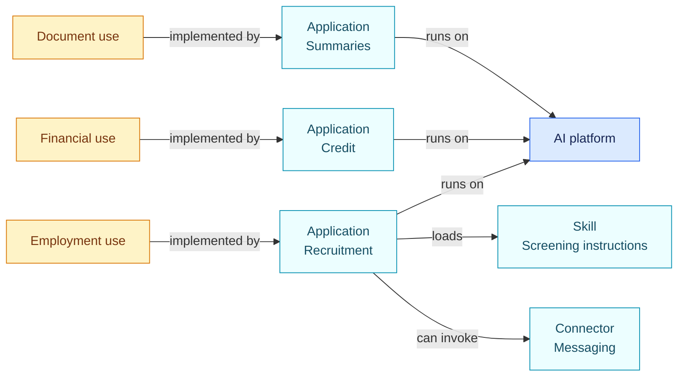
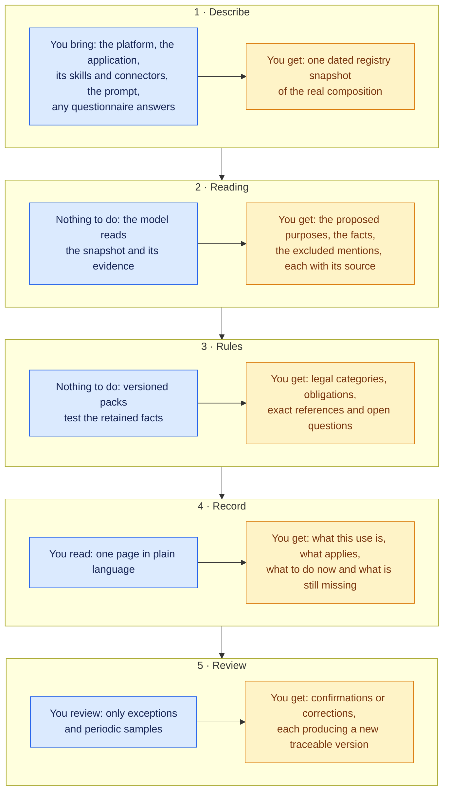
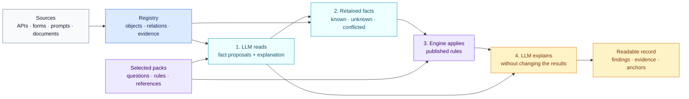
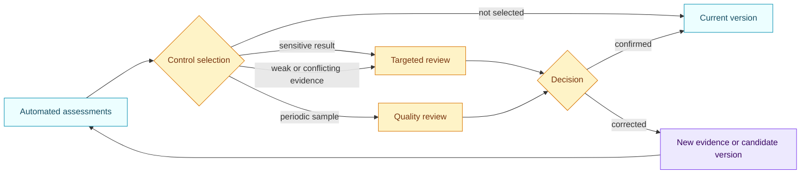

# Open AIRS

**Open AI Registry System**

[](https://github.com/NickChaps/Open-AIRS/actions/workflows/ci.yml)
[](LICENSE)
[](LICENSE-POLICY.md)

[Lire en français](README.fr.md)

Open AIRS helps an organisation maintain its AI registry, assess its uses
and explain every result. It connects deployed systems, available evidence and
rules derived from identified sources such as the EU AI Act, GDPR, NIS2 and
NIST publications.

It is written for legal, compliance, security and digital teams as well as the
developers who must share one case file without needing the same level of
technical detail.

The expected result is easy to read: **what the use does, what the rules
conclude, why they conclude it and what still needs evidence**.

## The problem

An organisation can deploy one AI platform and create hundreds of configured
applications on it, commonly called agents. These applications may load
reusable instructions, use several models and access business tools through
connectors.

The platform name is no longer enough. The same platform can summarise
documents, prepare a credit file or rank job applications. Purpose, affected
people, data, possible actions and technical controls differ for each use.



What makes this estate hard to govern is that these platforms are
generative. The purpose of an application does not live in a database
field: it lives in free text, a prompt, a reusable skill, a use
declaration, written and rewritten in natural language by whoever
configures it. And a generative application is not limited to its declared
function: give it a messaging connector with a standing authorisation and
it can send whatever someone asks it to send. No keyword list or fixed
parser can classify such an estate, and reading thousands of prompts by
hand does not survive the first reorganisation.

The scale is already visible. McKinsey's survey published on 25 August 2026
reports regular AI use in at least one function by almost nine respondents in
ten, enterprise-wide scaling by 44%, and agent scaling in at least one function
by 40% of organisations with more than $1 billion in annual revenue
([McKinsey, 2026](https://www.mckinsey.com/capabilities/quantumblack/our-insights/the-state-of-ai)).

The [EU AI Act](https://digital-strategy.ec.europa.eu/en/policies/regulatory-framework-ai)
is also entering its application stages. Legal, compliance, security and
digital teams need to find a use, understand its assessment and reproduce the
analysis that applied on a given date.

Open AIRS uses generative AI inside the assessment itself, under strict
bounds. A model reads the prompts, skills and configurations the way a
careful reviewer would, because only semantic reading can tell an active
recruitment purpose from a forbidden example in free text. But the model
may only propose facts from a fixed catalogue, each with cited evidence
and visible confidence, and the conclusions of the law, classifications,
findings and obligations, are never requested from it.
Everything that follows, the legal categories, the obligations, the
missing information, is computed by versioned deterministic rules anyone
can audit. The model judges facts; the rules judge the law.

## What Open AIRS provides

Open AIRS keeps the actual composition, source reading and exact effect of the rules
in one case file. These three layers remain separate and can be reviewed or
updated on their own schedules.

Open AIRS builds one reviewable record from four elements:

| Element | Plain meaning | Example |
| --- | --- | --- |
| **Object** | Something the organisation needs to track | Platform, system, configured application, skill, connector, model, use or contract |
| **Fact** | A precise answer used by rules | “The application ranks candidates” |
| **Evidence** | The source supporting that fact | Prompt excerpt, connector configuration, use-owner declaration |
| **Rule pack** | A reviewed version of questions, conditions and references | EU AI Act 1.3.1 or GDPR 1.3.1 |

An exact reference to a law or framework is called an **anchor**. A dated copy
of the registry is called an **inventory version** in the reader guides. JSON
files and specifications retain the technical field names, but readers do not
need them to understand an assessment.

Open AIRS can then produce:

- an inventory that shows the real composition of a use;
- model-written analysis with cited evidence and visible uncertainty;
- findings calculated by stable rules;
- exact legal or methodological references;
- obligations and missing information;
- history that explains each change;
- a separate internal process owned by the organisation.

## Your journey through one assessment

You do not need any technical background to use the result. The journey has
five steps; each one states what you bring and what you get back.



| Step | You bring | Open AIRS returns |
| --- | --- | --- |
| Describe | Composition, prompts, questionnaire answers | A dated snapshot of what really exists |
| Reading | Nothing | Purposes, facts and excluded mentions, with evidence |
| Rules | Nothing | Legal categories, obligations, references, unknowns |
| Record | A few minutes of reading | One defensible case file per use |
| Review | Attention on exceptions only | Corrections that become new versions |

The reading step also classifies every relevant passage before proposing a
purpose: an instruction that forbids an activity is recorded as an excluded
mention with its evidence, never as the activity itself. A prompt that says
"never screen CVs" therefore creates no recruitment use.

## How an assessment works

The language model and the rule engine have different jobs.



### 1. The model reads and explains

The LLM receives the assessment target, connected components, evidence and the
closed list of questions declared by the selected packs. It returns two forms
of output in one call:

- structured fact proposals with a state, evidence, confidence and short
  rationale;
- plain-language analysis describing scope, observations, unknowns and
  cautions.

The model can propose only fact ids declared by the packs. It cannot create a
rule, obligation or legal reference. A security guideline in a prompt proves
that the instruction exists. It does not prove that the operating platform enforces the
control.

### 2. Open AIRS keeps disagreements visible

Reliable API and configuration values remain authoritative. If the model
contradicts an established value, Open AIRS records a conflict. It never overwrites
that value silently. Missing information stays unknown; it never becomes an
automatic “no”.

### 3. The engine applies the rules

The Python engine reads the retained facts and tests each published condition.
This step makes no model call. The same facts and the same rule version produce
the same result.

Rules attach findings, obligations and published anchors. EU AI Act, GDPR,
NIS2 and NIST results remain separate.

### 4. The model writes the final record

A second call turns the facts and calculated results into a readable note.
Every important statement must cite a fact and evidence, or a rule and its
anchors. The note cannot change a result or add a conclusion absent from the
engine.

The record therefore contains both machine-readable data and an explanation
that business reviewers can inspect.

## Example: an application screens CVs

Consider a configured application on an enterprise platform. It loads a
screening skill, ranks applicants and has a connector that can send rejection
messages without a separate human confirmation step.

The LLM may propose:

| Proposed fact | Evidence | Confidence |
| --- | --- | --- |
| The use filters and ranks job applications | Use declaration and instructions | 0.99 |
| The connector can send a rejection without a separate human step | Connector configuration | 0.97 |
| No completed DPIA is evidenced | Use-owner declaration | 0.99 |

Its analysis explains why those sources describe candidate screening, how the
connector changes the use and which information remains unknown.

The engine then applies the selected packs. In the bundled example, the EU AI
Act pack matches the Annex III employment route, derives the high-risk
classification from the Article 6(3) outcome and fires the related
obligations. The GDPR pack establishes the Article 22 exposure by design,
from the determinative purpose and a rejection the connector can send with
no enforced human gate, with a significant effect, no established Article
22 exception, and a required DPIA whose completion is not evidenced. The selected NIST profile keeps its own gaps
separate and does not present them as legal non-compliance.

[Open the complete worked example without running code](examples/ai-governance/README.md).

## Human control across a large estate

An organisation with thousands of applications cannot manually approve every
model reading. Open AIRS runs the assessment, stores the evidence and then applies
the organisation's control policy.



A correction stays visible and triggers a new assessment. Teams can measure
quality by use type, model, pack and period, then improve the reading protocol
or rules after approval.

[Read the quality-control guide](docs/en/quality-control.md).

## What the repository contains today

The distribution includes:

- the inventory and relationship model;
- formats for facts, evidence, extractions, assessments, notes and reviews;
- a dependency-free Python rule engine;
- an optional `qualify` command that calls a Chat Completions compatible
  service once for source reading and once for the final note;
- local validation of every reference produced by the model;
- a versioned purpose taxonomy and proposed-use extraction, so the purpose
  stays the explicit centre of each assessment;
- deterministic composition facts derived from declared connector actions,
  so capability and approval gates never depend on a model guess;
- a derived qualification chain: rules emit legal facts (Annex III route,
  Article 6(3) outcome, high-risk status, Article 22 exposure) that
  downstream obligation rules consume, so no assessment needs a pre-filled
  legal conclusion;
- versioned packs and conformance tests;
- assessment comparison and pack-impact simulation;
- a separate mechanism for organisation-owned internal processes;
- complete examples for AI governance, connector topology and contracts.

The framework does not impose a model provider, a particular model or an
internal approval process. The API key stays in an environment variable.

## What is not built yet

The scope is deliberately explicit so nobody discovers it late:

- import adapters that read platform APIs and produce inventory snapshots;
- automatic materialisation of proposed uses as registry objects with review
  states;
- a dynamic residual questionnaire that asks people only the facts that no
  API, inheritance or reading can supply;
- a durable registry service and a review interface;
- an execution-telemetry adapter that reads connector action logs, at the
  action level and never conversation content, so an exposure established
  by design can be compared with observed execution without surveilling
  what people write;
- a full obligations matrix per actor (applicable, satisfied, missing or
  indeterminate for each obligation), beyond today's gap findings;
- roll-up of use, agent and skill exposures to their parent platform;
- a public evaluation corpus of tricky extractions: prohibitions, examples,
  ambiguities, unused capabilities and real uses;
- additional packs, and translations of the purpose taxonomy.

Each of these is a welcome contribution. The specification in [`spec/`](spec/)
already describes the target behaviour for most of them.

## Bundled packs

| Pack | Nature | Summary |
| --- | --- | --- |
| [EU AI Act 1.3.1](packs/eu-ai-act/1.3.1/README.md) | EU law | Article 5, Annex III, Article 6, operator duties, transparency and general-purpose AI models |
| [GDPR for AI uses 1.3.1](packs/eu-gdpr-ai/1.3.1/README.md) | EU law | Scope, principles, roles, rights, Article 22, DPIAs, security and transfers |
| [NIS2 1.1.0](packs/eu-nis2-baseline/1.1.0/README.md) | EU directive | Governance, Article 21 measures and incident reporting, to be applied with the relevant national law |
| [NIST AI RMF 1.1.0](packs/nist-ai-rmf/1.1.0/README.md) | Voluntary framework | 72 Core outcomes within an organisation-selected target profile |
| [NIST CSF 2.1.0](packs/nist-csf/2.1.0/README.md) | Voluntary framework | 106 Core outcomes within an organisation-selected target profile |
| [Fictional contract review](packs/contract-review-example/1.0.0/README.md) | Example | A fictional agreement checked against a clause library by the same engine |

Each guide states its authority, version, coverage, limits and official
sources. An organisation explicitly selects the pack versions it uses.

## Try the framework

The engine requires Python 3.11 or later.

### Without a model call

```bash
python -m pip install .

open-airs assess-profile \
  --inventory examples/ai-governance/inventory.json \
  --profile examples/ai-governance/pack-profile.json \
  --target use-recruiting-assistant
```

This replays the rules on facts already present in the example.
`evaluate` and `evaluate-profile` are aliases of `assess` and
`assess-profile`: they apply packs to established facts and never read the
subject themselves. `qualify` is the command that includes the model reading.

### With LLM reading and explanation

The provider must accept the OpenAI-compatible Chat Completions shape and JSON
responses. The command never accepts a secret key as an argument.
It sends the selected service the target, its composition and linked evidence,
so confirm that the service is authorised to receive that material.

```bash
export OPEN_AIRS_LLM_API_KEY="your-key"
export OPEN_AIRS_LLM_MODEL="your-model"
export OPEN_AIRS_LLM_BASE_URL="https://your-provider.example/v1"

open-airs qualify \
  --inventory examples/ai-governance/inventory.json \
  --profile examples/ai-governance/pack-profile.json \
  --target use-recruiting-assistant \
  --reasoning-effort low \
  --output-dir qualification-demo
```

The output directory contains five files:

1. LLM extraction and source analysis;
2. the new inventory version;
3. deterministic results;
4. the readable note written after calculation;
5. a manifest containing every file hash.

Repository tests make no paid model call. They replace the client with a
deterministic fake.

## Where to go next

The repository contains many files because packs are bilingual and retain
their earlier versions. Four entry points cover the normal reading path:

| Need | Start here |
| --- | --- |
| Understand Open AIRS through an example and essential terms | [Understand Open AIRS](docs/en/concepts.md) |
| See what an AI registry contains | [The AI registry](docs/en/ai-registry.md) |
| Run the examples and inspect the files | [Ten-minute walkthrough](docs/en/quickstart.md) |
| Author rules or integrate the engine | [Documentation by role](docs/en/README.md) |
| Compare Open AIRS with neighbouring projects | [Related work](docs/en/related-work.md) |

Technical specifications live in [`spec/`](spec/). Dated coverage reviews live
in [`docs/audits/`](docs/audits/). They are maintenance evidence and are not
part of the initial reading path.

## Limits

Open AIRS does not certify compliance and does not replace legal advice,
security analysis or an organisation's decision. A result depends on available
evidence, reading quality, selected packs and their versions.

The framework preserves unknowns and conflicts. Human controls can be targeted
or sampled according to risk and internal policy.

The current release is `v0.1.0-alpha.9`. Formats may still change.

## Licence and citation

Code, schemas, tests, examples and skills are published under
[Apache 2.0](LICENSE). Reader documentation and rule packs are published under
[CC BY-SA 4.0](https://creativecommons.org/licenses/by-sa/4.0/), so shared
adaptations of the knowledge base stay open. External sources
retain their own rights. See [LICENSE-POLICY.md](LICENSE-POLICY.md),
[CITATION.cff](CITATION.cff) and the [clean-room statement](CLEAN_ROOM.md).
