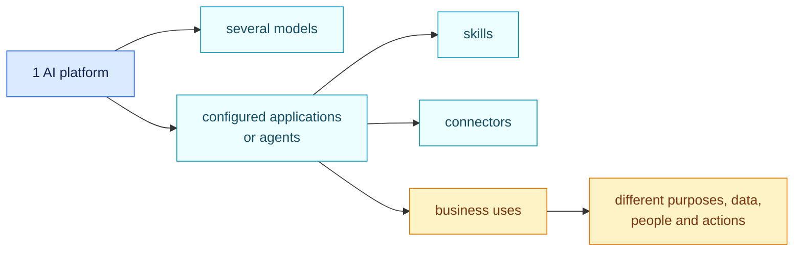
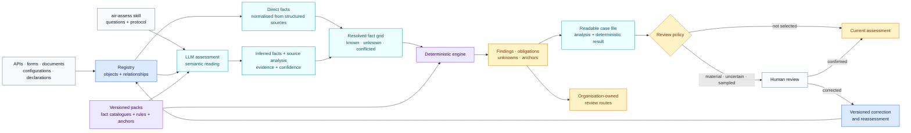
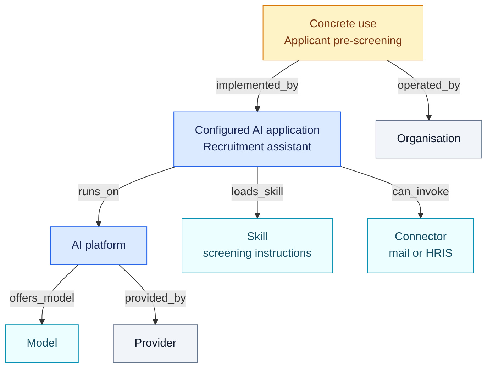

# AIR Framework

**AI Registry & Governance Framework**

[](https://github.com/NickChaps/AIR-Framework/actions/workflows/ci.yml)
[](LICENSE)
[](LICENSE-POLICY.md)

[Lire en français](README.fr.md)

AIR Framework is an open foundation for building an AI registry and evaluating
an AI estate from evidence-backed facts and versioned rules. It connects what
actually exists in an organisation, what published authorities require and the
decisions the organisation makes next.

## Why this project exists

McKinsey's global survey published on 25 August 2026 collected 1,719 responses
across 97 countries between May and June. Nearly **nine in ten respondents**
report regular AI use in at least one business function, and **44%** report
enterprise-wide scaling. Among organisations with more than $1 billion in
annual revenue, **40%** report scaling agents in at least one function, up from
27% a year earlier
([McKinsey, 2026](https://www.mckinsey.com/capabilities/quantumblack/our-insights/the-state-of-ai)).

At the same time, the European [AI Act](https://digital-strategy.ec.europa.eu/en/policies/regulatory-framework-ai)
has entered its application phase. Organisations need to know which systems
and uses they operate, why a qualification applies, which evidence supports it
and what has changed since the previous review.

Counting vendors does not describe the governed estate. One platform may
expose several models, host dozens of configured applications commonly called
“agents”, load skills and provide connectors to business systems. Each
component can be reused across several business uses.



The number of combinations grows quickly. A software list or a one-off
spreadsheet campaign cannot explain that the same platform is used to
summarise documents, assist an adviser and screen job applicants. Yet intended
purpose, data, affected people, available actions and runtime controls can all
change the assessment.

AIR Framework provides a reproducible way to govern that complexity.

## AIR in thirty seconds

1. **Inventory** systems, platforms, applications, models, skills, connectors
   and concrete uses, including their relationships.
2. **Establish precise facts** from APIs, declarations and documents while
   retaining the evidence and confidence level.
3. **Apply deterministic rule packs** anchored to a published legal or
   methodological source.
4. **Keep every version** of the inventory, packs and outcomes so a change or
   drift can be explained.
5. **Let the organisation decide** its review and approval routes without
   presenting those choices as law.



Structured API and configuration values can populate facts directly. The
language model handles semantic reading and bounded judgements, then writes an
evidence-linked source analysis. AIR resolves direct and inferred values into
one grid before the deterministic engine applies pinned rules and supplies the
stable findings, anchors and obligations. The same resolved facts evaluated
with the same pack version produce the same result.

Human review is a control layer around the automated pipeline. An organisation
can require it for material or uncertain cases and use stratified samples for
the rest of a large inventory. A correction creates a new source snapshot or a
candidate extractor, pack, route or explanation version, then a new assessment;
prior versions remain available. See [human review at registry
scale](docs/en/quality-control.md).

`air-assess` is used by the host LLM or agent at the semantic-reading stage.
The dependency-free Python engine does not call a model: its CLI begins with an
inventory that already contains structured facts. This boundary lets each
organisation choose its model and execution environment while keeping the
fact, evidence and review records portable.

The alpha ships the skill, record formats, validators and deterministic engine.
The host product supplies model invocation, fact resolution, periodic sampling,
storage, access control and the reviewer interface.

## The registry graph

AIR keeps the components needed to explain each use in its governance
inventory. Some matter to governance without constituting standalone AI
systems in law. The final legal registry is a view of this graph.



In this example, the skill is a passive text package. It cannot call a
connector. The application or platform performs an action within the runtime’s
permissions. The skill still belongs in the inventory because its instructions
may contribute to the purpose of the use.

Each pack explicitly declares the relations it may traverse and the facts that
may be inherited. A final legal classification is never copied mechanically
from a parent to a child. It is recalculated for the assessed composition and
use.

## Four decision layers

| Layer | Question | Example |
| --- | --- | --- |
| **Objects and relationships** | What exists and how is it composed? | This application runs on that platform and loads this skill. |
| **Facts and evidence** | What do we actually know? | The instructions rank applicants; the evidence is this section of the prompt. |
| **Normative packs** | What does this version of the authority conclude? | The rule anchored to Annex III of the AI Act matches the established facts. |
| **Organisation-owned routes** | What does the organisation decide after the finding? | Legal review, evidence request, security approval or another internal route. |

This separation prevents three common errors: presenting internal policy as a
legal obligation, asking an LLM to invent the conclusion, and treating missing
information as “no”.

## What an assessment contains

An AIR assessment keeps together:

- the target and exact registry snapshot;
- direct, inherited, unknown and conflicting facts;
- evidence for every established fact and confidence when a model inferred it;
- the version and content hash of the applied pack;
- the matched rule, explanation and exact anchors;
- obligations, evidence gaps and unknowns;
- a stable identifier used to compare assessments.

The extraction record carries the model’s semantic fact proposals and source
analysis. A separate assessment note turns facts and deterministic findings
into readable prose whose material statements reference their evidence, rules
and anchors. The review record captures why a case was selected, what a person
confirmed or corrected and which versioned action followed.

A host product may display the latest assessment in the registry while
retaining the full history for audit, impact simulation and drift analysis.

## Packs in the first distribution

| Pack | Authority | Contribution |
| --- | --- | --- |
| **[EU AI Act](packs/eu-ai-act/1.1.0/README.md)** | Binding European law | All Article 5 routes, all Annex III cases, high-risk operator readiness, Article 50 and GPAI. |
| **[EU GDPR · AI profile](packs/eu-gdpr-ai/1.1.0/README.md)** | Binding European law with marked EDPB guidance | Scope, principles, rights, automated decisions, DPIA, security, transfers and AI-model questions. |
| **[EU NIS2 · baseline](packs/eu-nis2-baseline/1.1.0/README.md)** | European directive requiring national overlays | Article 20, all ten Article 21 measure families and Article 23 incident reporting. |
| **[NIST AI RMF + GenAI Profile](packs/nist-ai-rmf/1.1.0/README.md)** | Voluntary framework | All 72 Core outcomes through an organisation-selected target profile. |
| **[NIST CSF 2.0](packs/nist-csf/2.1.0/README.md)** | Voluntary framework | All 106 current Core outcomes through an organisation-selected Target Profile. |
| **[Fictional contract review](packs/contract-review-example/1.0.0/README.md)** | Teaching example | The same engine applied to a fictional contract and clause library. |

Each pack publishes its fact definitions, deterministic conditions, sources,
coverage and known gaps. A new pack version is dry-run against the registry
before activation.

## Who is it for?

- **Legal and compliance teams** can inspect why a finding exists, its source
  text and missing evidence without reading code.
- **Security and risk teams** can connect platform controls, connectors and
  cyber frameworks to the affected uses.
- **Digital and platform teams** can populate the registry from APIs and see
  the impact of a configuration change.
- **Business owners** can describe purpose and context in plain language, then
  answer only the questions that remain open.
- **Governance product developers** can embed the schemas, engine, packs and
  conformance tests in their own product.

## Start here

| If you want to… | Open… |
| --- | --- |
| understand the model without a technical prerequisite | **[AIR Framework concepts](CONCEPTS.md)** |
| follow a complete path from business need to decision | [Governance workflow](docs/en/governance-workflow.md) |
| understand what a useful AI registry contains | [AI registry guide](docs/en/ai-registry.md) |
| understand human review and sampling at scale | [Quality-control guide](docs/en/quality-control.md) |
| see the AI-governance result without running code | [Worked AI-governance example](examples/ai-governance/README.md) |
| see contract review without running code | [Worked contract-review example](examples/contract-review/README.md) |
| model shared and application-specific connectors | [Connector topology example](examples/connector-topologies/README.md) |
| run an example in ten minutes | [Quickstart](docs/en/quickstart.md) |
| read facts, findings and the auditable narrative | [Reading an assessment](docs/en/reading-an-assessment.md) |
| verify source coverage | [Sources and coverage](docs/en/sources-and-coverage.md) |
| inspect the current pack audit | [Rule-pack coverage review, 29 August 2026](docs/audits/2026-08-29-pack-viability.md) |
| create a new pack | [Authoring and releasing a pack](docs/en/authoring-packs.md) |
| integrate the engine | [Object graph specification](spec/01-object-graph.md) |

The [complete English documentation](docs/en/README.md) is organised by role.
The files under `spec/` define the framework’s technical and normative
contracts.

### The two skills shipped with AIR

The word **skill** has one meaning throughout the project: a package of textual
instructions. The [`skills/`](skills/) directory provides two ready-to-use
skills. One helps extract facts and review assessments; the other helps author
and test a pack. They are optional. They use the framework without replacing
the engine or its rules. When deployed on a platform, they can be inventoried
like any other `skill` object in the estate.

| Same format, two positions | What AIR records |
| --- | --- |
| A skill found in an AI estate | Its text, version, platform and effect on the intended purpose of composed uses |
| An AIR helper skill deployed by a team | The same fields, plus the fact that its instructions guide assessment or pack authoring |

Deployment context and content determine the skill's role. Its object schema
remains the same.

## Run the AI governance example

The reference engine has no runtime dependency beyond Python 3.11+.

```bash
python -m pip install .

air-framework validate-extraction examples/ai-governance/extraction.json
air-framework validate-pack packs/eu-ai-act/1.1.0/pack.json
air-framework assess \
  --inventory examples/ai-governance/inventory.json \
  --pack packs/eu-ai-act/1.1.0/pack.json \
  --target use-recruiting-assistant

air-framework assess-profile \
  --inventory examples/ai-governance/inventory.json \
  --profile examples/ai-governance/pack-profile.json \
  --target use-recruiting-assistant

air-framework validate-note examples/ai-governance/assessment-note.json
air-framework validate-review examples/ai-governance/review.json
```

The profile command evaluates an explicit selection of packs pinned by version
and content hash. No hidden global ruleset becomes active.

## Scope of the alpha release

AIR Framework does not certify compliance and does not replace legal, security
or risk professionals. A result depends on the active pack versions, available
evidence and the quality of facts supplied to the engine.

This repository contains the `v0.1.0-alpha.3` reference distribution. Schemas and
command-line interfaces may still change. See the [clean-room statement](CLEAN_ROOM.md),
[foundational decisions](spec/00-project-decisions.md), [audited dependencies](DEPENDENCIES.md)
and [contribution guide](CONTRIBUTING.md).

## Licensing and citation

Code, schemas, rule packs, tests, examples and skills are licensed under
the [Apache License 2.0](LICENSE). Human-readable guides and explanatory
documentation are licensed under
[Creative Commons Attribution 4.0](https://creativecommons.org/licenses/by/4.0/).
See [LICENSE-POLICY.md](LICENSE-POLICY.md) for the file-level policy.

Official laws, standards and external publications are not relicensed by this
repository. Packs point to authoritative sources and contain independently
written rules, tests and explanations. Citation metadata is provided in
[CITATION.cff](CITATION.cff).
