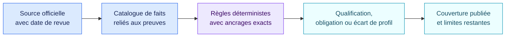

<!-- SPDX-License-Identifier: CC-BY-4.0 -->

# Revue de couverture des packs · 29 août 2026

[Read in English](2026-08-29-pack-viability.md)

Ce document consigne les packs publics, leurs sources officielles, leur
couverture exécutable et leurs limites à la date de revue. Les constats
juridiques soutiennent la qualification et la préparation. Ils ne constituent
ni une certification réglementaire ni une consultation juridique.

## Distribution actuelle

| Pack | Version | Faits | Règles | Couverture exécutable | Principale limite restante |
| --- | --- | ---: | ---: | --- | --- |
| Socle AI Act UE | 1.1.0 | 124 | 94 | Qualification et préparation des opérateurs | Droit produit annexe I et chapitres procéduraux |
| Socle RGPD IA | 1.1.0 | 68 | 41 | Traitements IA et responsabilité | Analyse juridique du cas et droit national |
| Socle NIS2 UE | 1.1.0 | 31 | 27 | Gouvernance, mesures et incidents au niveau de la directive | Transposition nationale et profils sectoriels détaillés |
| NIST AI RMF | 1.1.0 | 75 | 74 | 72 résultats du Core AI RMF 1.0 | Profil cible de l’organisation et future révision NIST |
| NIST CSF | 2.1.0 | 107 | 107 | 106 résultats actuels du Core CSF 2.0 | Profil cible, niveaux de mise en œuvre et références |

## Socle AI Act UE 1.1.0

Le pack est ancré sur le règlement (UE) 2024/1689 consolidé au 27 juillet 2026
après le règlement (UE) 2026/1744.

| Domaine | Couverture |
| --- | --- |
| Périmètre et rôles | Test de système d’IA, rôles des opérateurs, finalité et changements de rôle dans la chaîne de valeur |
| Pratiques interdites | 10 voies de l’article 5, dont les deux voies applicables le 2 décembre 2026 |
| Qualification haut risque | Entrée par les produits annexe I, 25 cas annexe III et test d’exception de l’article 6(3) |
| Exigences haut risque | Articles 9 à 15 et préparation des fournisseurs, mandataires, importateurs, distributeurs, déployeurs et accords de chaîne de valeur concernés |
| Personnes et supervision | Information des travailleurs et personnes concernées, supervision humaine et analyse des droits fondamentaux de l’article 27 |
| Transparence | Toutes les voies de l’article 50 : interaction, marquage synthétique, émotion ou biométrie, deep fakes et texte d’intérêt public |
| GPAI | Obligations des modèles à usage général et des modèles à risque systémique, articles 51 à 55 |
| Dates d’application | Entrée en vigueur et calendrier par étapes jusqu’au 2 août 2028 dans les métadonnées |

Le pack ne décompose pas chaque texte produit de l’annexe I, procédure
d’organisme notifié, pouvoir de surveillance, dispositif de bac à sable,
sanction, voie de recours, norme harmonisée ou futur document de la Commission.
Ces éléments demandent des profils dédiés ou de nouvelles versions relues.

## Socle RGPD IA 1.1.0

La couche contraignante s’ancre sur le règlement (UE) 2016/679. L’avis EDPB
28/2024 apparaît séparément comme ligne directrice réglementaire.

Le pack couvre les périmètres matériel et territorial, les rôles, les principes
de l’article 5, les articles 6, 9 et 10, l’information et les droits, l’article
22, la gouvernance des responsables et sous-traitants, les registres, la
sécurité, les violations, les articles 24 à 30 et 35, la consultation
préalable, le DPO, les transferts et les questions de
développement des modèles issues de l’avis EDPB.

Le pack ne choisit pas une base légale, ne décide pas une exception de
l’article 14, ne prouve pas l’anonymat, ne réalise pas une AIPD et ne tranche
pas les conditions de droit national. Il identifie les questions et lacunes à
documenter.

## Socle NIS2 UE 1.1.0

Le pack s’ancre sur la directive (UE) 2022/2555 et porte un marqueur
d’applicabilité du règlement d’exécution (UE) 2024/2690.

Il couvre la preuve de classification de l’entité, l’analyse d’équivalence de
l’article 4, la gouvernance de l’article 20, les dix familles de l’article
21(2), la proportionnalité, les fournisseurs, la correction et toute la
séquence de l’article 23 : alerte sous 24 heures, notification sous 72 heures,
rapports intermédiaires, rapport final sous un mois et voie pour l’incident en
cours.

NIS2 s’applique par transposition nationale. Classification, autorité
compétente, canal de déclaration, délais locaux et contrôle demandent un profil
juridictionnel relu. Les contrôles détaillés de l’annexe du règlement 2024/2690
restent une analyse séparée.

## Profils NIST

NIST AI RMF 1.0 est représenté par les 72 résultats du Core répartis entre
GOVERN, MAP, MEASURE et MANAGE. NIST CSF 2.0 est représenté par ses 106
résultats actuels, six fonctions et 22 catégories.

Les deux packs demandent un profil cible explicitement sélectionné par
l’organisation. Un résultat absent de la sélection ne produit aucun écart.
NIST AI 600-1, les actions du Playbook, les niveaux de mise en œuvre CSF, les
exemples et références restent des matériaux de profil distincts. NIST a
annoncé la révision d’AI RMF 1.0 ; le Core actuel reste figé jusqu’à la
publication d’un successeur dans une nouvelle version relue.

## Sources officielles

- [AI Act consolidé au 27 juillet 2026](https://eur-lex.europa.eu/eli/reg/2024/1689/2026-07-27/fra)
- [Règlement (UE) 2026/1744](https://eur-lex.europa.eu/eli/reg/2026/1744/oj/fra)
- [RGPD](https://eur-lex.europa.eu/eli/reg/2016/679/oj/fra)
- [Avis EDPB 28/2024](https://www.edpb.europa.eu/our-work-tools/our-documents/opinion-board-art-64/opinion-282024-certain-data-protection-aspects_fr)
- [Directive NIS2](https://eur-lex.europa.eu/eli/dir/2022/2555/oj/fra)
- [Règlement d’exécution (UE) 2024/2690](https://eur-lex.europa.eu/eli/reg_impl/2024/2690/oj/fra)
- [NIST AI RMF 1.0](https://doi.org/10.6028/NIST.AI.100-1)
- [Playbook NIST AI RMF](https://airc.nist.gov/airmf-resources/airmf/5-sec-core/)
- [Profil Generative AI NIST AI 600-1](https://doi.org/10.6028/NIST.AI.600-1)
- [NIST Cybersecurity Framework 2.0](https://doi.org/10.6028/NIST.CSWP.29)

Les anciens répertoires restent immuables pour reproduire les évaluations
historiques. Les nouveaux profils doivent figer les versions de cette revue et
conserver leurs empreintes de contenu.
