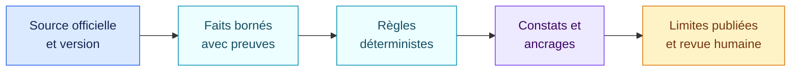

<!-- SPDX-License-Identifier: CC-BY-4.0 -->

# Revue de viabilité des packs · 29 août 2026

[Read in English](2026-08-29-pack-viability.md)

Cette revue vérifie si les packs livrés avec AIR Framework représentent
correctement les textes et référentiels qu’ils annoncent, dans les limites
publiées. Elle porte sur les sources, les faits demandés, la logique des règles,
les ancrages retournés et les limites affichées.

Elle ne constitue pas une consultation juridique et ne transforme pas un pack
de triage en certification de conformité.

## Conclusion

| Pack | Conclusion au 29 août 2026 | Usage raisonnable |
| --- | --- | --- |
| AI Act européen | **Viable pour le triage alpha du périmètre encodé** | Détecter certains usages interdits, qualifier les voies haut risque couvertes, examiner le rôle fournisseur et quelques obligations ciblées |
| RGPD pour l’IA | **Viable comme filtre initial de protection des données** | Repérer les analyses Article 9, Article 22, AIPD et privacy by design à ouvrir |
| NIS2 | **Viable uniquement avec une surcouche nationale** | Poser un socle européen après qualification de l’entité selon le droit national applicable |
| NIST AI RMF 1.0 | **Source actuelle, profil volontaire et synthétique** | Vérifier l’existence des quatre fonctions et amorcer un profil organisationnel plus précis |
| NIST CSF 2.0 | **Source actuelle, socle d’intégration volontaire** | Relier un profil Current/Target propre à l’organisation aux six fonctions du CSF |

## AI Act européen

### Sources vérifiées

- règlement (UE) 2024/1689 ;
- règlement modificatif (UE) 2026/1744 ;
- texte consolidé au 27 juillet 2026 ;
- calendrier d’application publié par la Commission européenne.

### Corrections effectuées pendant la revue

1. La règle de chaîne de valeur couvre désormais les trois hypothèses de
   l’article 25(1) : apposition du nom ou de la marque sur un système à haut
   risque existant, modification substantielle laissant le système à haut
   risque, et changement de finalité transformant un système en système à haut
   risque.
2. Le fait relatif à la modification substantielle inclut maintenant les
   conditions « système déjà à haut risque » et « demeure à haut risque ». Une
   simple modification ne suffit plus à déclencher ce constat.
3. La règle de transparence de l’article 50(1) demande si l’exception limitée
   prévue pour certains systèmes autorisés par la loi en matière d’infractions
   est applicable. Une exception inconnue rend le résultat indéterminé ; elle
   n’est pas supposée absente.
4. Les règles relatives aux pratiques interdites, au haut risque et à
   l’interaction directe exigent maintenant que la composition réponde à la
   définition d’un système d’IA. Une automatisation non-IA ne peut plus
   déclencher ces qualifications par simple ressemblance de finalité.

### Limites qui demeurent

Le pack encode neuf règles de triage. Il ne couvre pas encore la majorité des
domaines de l’annexe III, les obligations exhaustives des fournisseurs et
déployeurs, les régimes GPAI, les textes produit de l’annexe I ni les nouvelles
interdictions de 2026. Il est donc adapté à une première qualification du
périmètre publié, pas à une déclaration de conformité globale.

## RGPD pour l’IA

### Source vérifiée

- règlement (UE) 2016/679, notamment ses articles 5, 9, 22, 25 et 35.

### Correction effectuée pendant la revue

Une règle distincte encode désormais l’article 22(4). Lorsqu’une décision
exclusivement automatisée produisant un effet juridique ou similaire repose
sur des catégories particulières de données, le moteur vérifie séparément :

- qu’une condition de l’article 9(2)(a) ou 9(2)(g) est établie ;
- que des garanties adaptées protègent les droits, libertés et intérêts de la
  personne.

Une condition générale de l’article 9 ne suffit donc plus à résoudre ce cas
particulier.

Le fait « AIPD terminée » est également devenu opérant : le pack distingue le
déclenchement de l’obligation d’AIPD de la lacune constatée lorsqu’aucune AIPD
adaptée n’est démontrée avant le traitement.

### Limites qui demeurent

Le pack ne remplace ni le registre des traitements, ni une AIPD, ni une analyse
des transferts, durées de conservation, contrats de sous-traitance, notices ou
droits des personnes. Il sert à ouvrir les bonnes analyses à partir de faits
traçables.

## NIS2

### Sources vérifiées

- directive (UE) 2022/2555, articles 20, 21 et 23, annexes I et II ;
- règlement d’exécution (UE) 2024/2690, identifié comme extension non encodée.

Le pack reprend correctement la validation et la supervision par l’organe de
direction, sa formation, un sous-ensemble des mesures de l’article 21, la
sécurité de la chaîne d’approvisionnement et l’existence d’un processus de
notification des incidents.

La directive doit être transposée. AIR ne déduit donc pas le statut d’entité
essentielle ou importante depuis un nom, un secteur ou une taille. Cette
qualification et les canaux de notification doivent venir d’un profil national
révisé. Les délais détaillés de l’article 23 et le règlement d’exécution
2024/2690 restent explicitement hors de ce socle.

## NIST AI RMF 1.0

Les sources NIST AI 100-1 et NIST AI 600-1 restent les versions épinglées par
ce pack. NIST indique toutefois que l’AI RMF 1.0 est en cours de révision. Une
future publication devra donc créer une nouvelle version de pack, avec
simulation d’impact, sans remplacer silencieusement la version 1.0.

Les cinq règles actuelles vérifient uniquement l’existence d’un socle GOVERN,
MAP, MEASURE, MANAGE et la prise en compte du profil GenAI. Une organisation
doit préciser ses résultats cibles, mesures et seuils avant d’en tirer une
évaluation de maturité.

## NIST CSF 2.0

NIST CSF 2.0 reste la version officielle courante. Le pack pose une question de
haut niveau pour chacune des six fonctions : GOVERN, IDENTIFY, PROTECT, DETECT,
RESPOND et RECOVER.

Ces six réponses n’ont de sens que si l’organisation définit auparavant son
profil cible et les résultats sous-jacents attendus. Le pack est un point
d’intégration stable ; il ne représente pas à lui seul l’ensemble du CSF Core,
les Implementation Tiers ou les Informative References.

## Sources officielles

- [AI Act consolidé au 27 juillet 2026](https://eur-lex.europa.eu/legal-content/FR/TXT/?uri=CELEX:02024R1689-20260727)
- [Règlement (UE) 2026/1744](https://eur-lex.europa.eu/eli/reg/2026/1744/oj/fra)
- [RGPD](https://eur-lex.europa.eu/eli/reg/2016/679/oj/fra)
- [Directive NIS2](https://eur-lex.europa.eu/eli/dir/2022/2555/oj/fra)
- [Règlement d’exécution (UE) 2024/2690](https://eur-lex.europa.eu/eli/reg_impl/2024/2690/oj/fra)
- [NIST AI RMF](https://www.nist.gov/itl/ai-risk-management-framework)
- [NIST CSF 2.0](https://www.nist.gov/cyberframework)

## Critère de publication

Une évolution de pack est publiable lorsque ses sources et sa portée sont
identifiées, chaque fait juridique est distinct d’une conclusion, chaque règle
retourne ses ancrages, les cas positifs et les exceptions sont testés, les
lacunes sont visibles et l’impact sur un inventaire de référence est simulé.

## Vérifications exécutées

La distribution a passé 34 tests automatisés, dont les validations de schémas,
les exemples, l’héritage, les versions épinglées, le routage séparé et les cas
juridiques corrigés. Un test vérifie désormais qu’aucun fait déclaré par un
pack ne reste inutilisé.

Les exemples publics donnent les résultats attendus :

- l’usage fictif de recrutement déclenche le candidat annexe III, la
  qualification haut risque et la transparence de l’interaction ;
- le profil RGPD du même usage déclenche l’applicabilité, l’article 22, l’AIPD
  requise et la lacune d’AIPD ;
- le contrat fictif signale deux clauses absentes et conserve une clause
  ambiguë comme indéterminée.

Un échantillon local de trois prompts bruts a aussi été évalué manuellement,
sans appel API. Les textes et noms ne sont pas intégrés au dépôt :

| Cas anonymisé | AI Act | RGPD | Lecture |
| --- | --- | --- | --- |
| Recommandation d’offres à des entreprises | Aucun constat AI Act | Données personnelles indéterminées | Le moteur demande la composition réelle des comptes rendus au lieu d’inventer une absence de données |
| Revue de conformité citant le recrutement dans ses garde-fous | Aucun constat AI Act | Données du dossier indéterminées | Le mot « recrutement » présent dans une règle d’exclusion n’est pas traité comme la finalité de l’agent |
| Évaluation de candidats à partir de CV et d’entretiens | Candidat annexe III et haut risque | RGPD applicable et AIPD requise ; article 22 non déclenché car la décision n’est pas exclusivement automatisée | Les axes AI Act et RGPD restent distincts |

Ce dernier essai valide la couche déterministe après extraction humaine des
faits. Il ne mesure pas encore la qualité d’un extracteur LLM donné.
