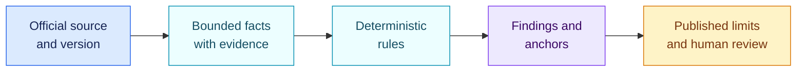

<!-- SPDX-License-Identifier: CC-BY-4.0 -->

# Rule-pack viability review · 29 August 2026

[Lire en français](2026-08-29-pack-viability.fr.md)

This review checks whether the rule packs distributed with AIR Framework
faithfully represent the sources and scope they claim. It covers source
versions, requested facts, deterministic conditions, returned anchors and
published limitations.

It is not legal advice and does not turn a triage pack into a compliance
certification.

## Conclusion

| Pack | Conclusion on 29 August 2026 | Reasonable use |
| --- | --- | --- |
| EU AI Act | **Viable for alpha triage within its encoded scope** | Detect selected prohibited uses, qualify covered high-risk routes, review provider role and selected duties |
| EU GDPR for AI | **Viable as an initial data-protection screen** | Identify Article 9, Article 22, DPIA and privacy-by-design reviews to open |
| NIS2 | **Viable only with a national overlay** | Apply an EU baseline after the entity has been classified under applicable national law |
| NIST AI RMF 1.0 | **Current source, intentionally concise voluntary profile** | Check that the four functions exist and start a more precise organisational profile |
| NIST CSF 2.0 | **Current source, voluntary integration baseline** | Connect an organisation-owned Current and Target Profile to the six CSF functions |

## EU AI Act

The review used Regulation (EU) 2024/1689, Regulation (EU) 2026/1744, the
consolidated text current on 27 July 2026 and the Commission implementation
overview.

Four corrections were made. The Article 25 rule now covers all three cases in
paragraph 1, including name or trademark placement. The substantial-
modification fact now requires an existing high-risk system that remains
high-risk. The Article 50(1) direct-interaction rule includes the limited
law-enforcement exception as an explicit fact; missing evidence produces an
indeterminate result. The prohibited-practice, high-risk and direct-interaction
rules also require the composition to meet the AI-system definition,
preventing non-AI automation from matching solely because its purpose looks
similar.

The pack contains nine triage rules. It still excludes most Annex III areas,
complete provider and deployer requirements, GPAI regimes, Annex I sector
legislation and the new 2026 prohibitions. It is suitable for the published
slice, not for an overall declaration of conformity.

## EU GDPR for AI

The review covered Articles 5, 9, 22, 25 and 35 of Regulation (EU) 2016/679.
A distinct rule now encodes Article 22(4). A solely automated significant
decision based on special-category data requires both the limited Article
9(2)(a) or 9(2)(g) condition and suitable safeguards.

The previously declared “DPIA completed” fact is now operative. The pack keeps
the Article 35 trigger separate from the gap produced when a suitable DPIA is
required but not evidenced as complete before processing.

The pack does not replace a record of processing activities, DPIA, transfer
assessment, retention analysis, processor contract, notice or data-subject
rights review. It opens the relevant reviews from traceable facts.

## NIS2

The pack correctly represents selected duties from Articles 20, 21 and 23 of
Directive (EU) 2022/2555. It requires a national overlay for entity scope,
transposed duties, notification channels and sector rules. Detailed incident
timelines and Implementing Regulation (EU) 2024/2690 remain published gaps.

## NIST AI RMF 1.0

NIST AI 100-1 and NIST AI 600-1 remain the sources pinned by this version.
NIST states that AI RMF 1.0 is under revision. A later publication must be a
new pack version with an impact simulation, not a silent replacement.

The five rules are a top-level GOVERN, MAP, MEASURE, MANAGE and GenAI Profile
readiness check. An organisation still needs its own target outcomes,
measurements and tolerances before interpreting maturity.

## NIST CSF 2.0

CSF 2.0 remains NIST's current framework. This pack has one high-level question
for each function. Those answers are useful only when an organisation owns the
underlying Target Profile and expected outcomes. The pack is an integration
baseline, not the complete CSF Core, Implementation Tiers or Informative
References.

## Official sources

- [Consolidated AI Act, 27 July 2026](https://eur-lex.europa.eu/legal-content/EN/TXT/?uri=CELEX:02024R1689-20260727)
- [Regulation (EU) 2026/1744](https://eur-lex.europa.eu/eli/reg/2026/1744/oj/eng)
- [GDPR](https://eur-lex.europa.eu/eli/reg/2016/679/oj/eng)
- [NIS2 Directive](https://eur-lex.europa.eu/eli/dir/2022/2555/oj/eng)
- [Implementing Regulation (EU) 2024/2690](https://eur-lex.europa.eu/eli/reg_impl/2024/2690/oj/eng)
- [NIST AI RMF](https://www.nist.gov/itl/ai-risk-management-framework)
- [NIST CSF 2.0](https://www.nist.gov/cyberframework)

## Release criterion

A pack change is publishable when its source and scope are identified, legal
facts are separate from conclusions, each rule returns exact anchors, positive
cases and exceptions are tested, limitations are visible, and impact is
simulated against a reference inventory.

## Behaviour verification

Versioned conformance cases cover matches, non-matches, missing information,
conflicts and encoded exceptions. Continuous integration also checks schemas,
worked examples, inheritance, pack profiles and the separation of
organisation-owned routing. An integrity check requires every fact declared by
a pack to be consumed by a rule or inheritance policy.

These checks cover deterministic engine behaviour and internal pack
consistency. They do not establish complete legal coverage or the quality of an
LLM extractor. Both require separate review against the relevant sources and
evaluation corpora.
