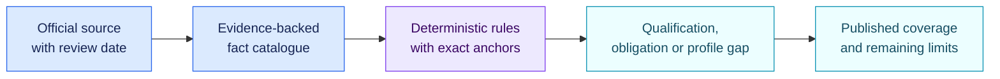

<!-- SPDX-License-Identifier: CC-BY-4.0 -->

# Rule-pack coverage review · 29 August 2026

[Lire en français](2026-08-29-pack-viability.fr.md)

This document records the public packs, official sources, executable coverage
and remaining boundaries on the review date. Legal findings support triage and
readiness work. They do not provide a regulatory certification or legal opinion.

## Current distribution

| Pack | Version | Facts | Rules | Executable coverage | Main remaining boundary |
| --- | --- | ---: | ---: | --- | --- |
| EU AI Act core | 1.1.0 | 124 | 94 | Qualification and operator-readiness core | Sector-specific Annex I product law and procedural chapters |
| EU GDPR AI core | 1.1.0 | 68 | 41 | AI-relevant processing and accountability core | Case-specific legal analysis and Member State law |
| EU NIS2 baseline | 1.1.0 | 31 | 27 | Directive-level governance, measures and incidents | National transposition and detailed sector profiles |
| NIST AI RMF | 1.1.0 | 75 | 74 | All 72 AI RMF 1.0 Core outcomes | Organisation-selected target profile and future NIST revision |
| NIST CSF | 2.1.0 | 107 | 107 | All 106 current CSF 2.0 Core outcomes | Organisation-selected Target Profile, Tiers and references |

## EU AI Act core 1.1.0

The pack is anchored to Regulation (EU) 2024/1689 consolidated on 27 July
2026 after Regulation (EU) 2026/1744.

| Area | Coverage |
| --- | --- |
| Scope and roles | AI-system gate, operator roles, intended purpose and value-chain provider triggers |
| Prohibited practices | All 10 Article 5 routes, including the two routes applicable from 2 December 2026 |
| High-risk qualification | Annex I product entry test, all 25 Annex III use cases and Article 6(3) exception test |
| High-risk requirements | Articles 9 to 15 and readiness checks for providers, authorised representatives, importers, distributors, deployers and relevant value-chain agreements |
| People and oversight | Worker and affected-person information, human oversight and Article 27 fundamental-rights impact assessment |
| Transparency | All Article 50 routes for interaction, synthetic marking, emotion or biometric systems, deep fakes and public-interest text |
| GPAI | General-purpose model duties and systemic-risk duties in Articles 51 to 55 |
| Application dates | Entry into force and staged dates through 2 August 2028 stored in pack metadata |

The pack does not decompose every Annex I sectoral product instrument,
notified-body procedure, market-surveillance power, sandbox process, penalty,
remedy, harmonised standard or future Commission document. Those materials
need dedicated profiles or later reviewed versions.

## EU GDPR AI core 1.1.0

The binding layer is anchored to Regulation (EU) 2016/679. EDPB Opinion
28/2024 is marked separately as regulatory guidance.

The pack covers territorial and material scope, roles, Article 5 principles,
Articles 6, 9 and 10, information and data-subject rights, Article 22,
controller and processor governance, records, security, breach handling,
Articles 24 to 30 and 35,
prior consultation, DPO governance, international transfers and AI-model
development questions from the EDPB opinion.

The pack cannot choose a lawful basis, decide an Article 14 exception, prove
anonymity, complete a DPIA or resolve national-law conditions. It identifies
the questions and gaps that require a documented review.

## EU NIS2 baseline 1.1.0

The pack is anchored to Directive (EU) 2022/2555 and carries an applicability
marker for Commission Implementing Regulation (EU) 2024/2690.

It covers entity classification evidence, Article 4 sector-equivalence review,
Article 20 management governance, all ten Article 21(2) measure families,
proportionality, supplier review, corrective action and the complete Article 23
sequence: 24-hour warning, 72-hour notification, intermediate reports,
one-month final report and the ongoing-incident route.

NIS2 duties operate through national transposition. Entity classification,
competent authority, reporting channel, local deadlines and enforcement need a
reviewed jurisdiction profile. The detailed Annex controls in Regulation
2024/2690 remain a separate assessment.

## NIST profiles

NIST AI RMF 1.0 is represented by all 72 Core outcomes across GOVERN, MAP,
MEASURE and MANAGE. NIST CSF 2.0 is represented by all 106 current Core
outcomes across its six Functions and 22 Categories.

Both packs require an explicit organisation-selected target profile. Outcomes
outside that selection produce no gap. NIST AI 600-1, Playbook actions, CSF
Implementation Tiers, implementation examples and informative references stay
available as separate profile material. NIST has announced work on a revision
of AI RMF 1.0, so the current Core remains pinned until a successor receives a
new reviewed pack version.

## Official sources

- [Consolidated AI Act, current 27 July 2026](https://eur-lex.europa.eu/eli/reg/2024/1689/2026-07-27/eng)
- [Regulation (EU) 2026/1744](https://eur-lex.europa.eu/eli/reg/2026/1744/oj/eng)
- [GDPR](https://eur-lex.europa.eu/eli/reg/2016/679/oj/eng)
- [EDPB Opinion 28/2024](https://www.edpb.europa.eu/our-work-tools/our-documents/opinion-board-art-64/opinion-282024-certain-data-protection-aspects_en)
- [NIS2 Directive](https://eur-lex.europa.eu/eli/dir/2022/2555/oj/eng)
- [Implementing Regulation (EU) 2024/2690](https://eur-lex.europa.eu/eli/reg_impl/2024/2690/oj/eng)
- [NIST AI RMF 1.0](https://doi.org/10.6028/NIST.AI.100-1)
- [NIST AI RMF Playbook](https://airc.nist.gov/airmf-resources/airmf/5-sec-core/)
- [NIST AI 600-1 Generative AI Profile](https://doi.org/10.6028/NIST.AI.600-1)
- [NIST Cybersecurity Framework 2.0](https://doi.org/10.6028/NIST.CSWP.29)

Earlier pack directories remain immutable for historical replay. New profiles
should pin the versions listed in this review and record their content hashes.
