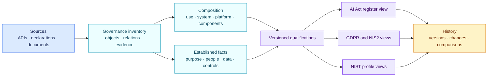

<!-- SPDX-License-Identifier: CC-BY-SA-4.0 -->

# What the AI registry contains

The governance inventory is broader than the legal list of AI systems. It
needs enough context to explain why a legal system boundary and intended
purpose were chosen.

The EU AI Act does not provide one internal registry template for every
organisation. AIR gathers the information needed for qualification,
documentation and applicable duties, then projects the legal view that fits
the organisation's role and context.

## A register entry answers four questions

| Question | Information shown | Why it matters |
| --- | --- | --- |
| What is being used? | Name, owner, business purpose, lifecycle, system boundary and suppliers | Establishes the governed object and accountable people |
| How does it work? | Platform, model, skills, connectors, permissions, human gates, logging and monitoring | Explains the real composition and action capabilities |
| Who and what can it affect? | People, material decisions, personal data, special-category data and other sensitive information | Provides the factual basis for legal qualification |
| What follows? | AI Act qualification, separate GDPR and security findings, reasons, anchors, evidence gaps, obligations and due dates | Makes the result reviewable and actionable |

Every entry also carries the assessment version, source inventory version and change
history. A register can therefore show the current result and reproduce the
result that was active at an earlier date.

A legal export can project only items that meet the chosen legal definition.
The governance inventory retains components that explain the result without
mislabeling every model, skill or connector as a standalone AI system.
