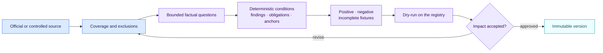

<!-- SPDX-License-Identifier: CC-BY-4.0 -->

# Authoring and releasing a pack

## The files a reviewer receives

| File | Human purpose | Machine purpose |
| --- | --- | --- |
| `README.md` and `README.fr.md` | Explain the authority, decision path, coverage and limits | None |
| `pack.json` | Inspect questions, rules and anchors when needed | Executable pack consumed by the engine |
| `CHANGELOG.md` | Understand the difference from the previous version | Supports release review |
| Conformance fixtures | Review concrete expected outcomes | Prevent regressions in positive, negative and incomplete cases |

## Identify the authority and scope

Record whether the source is binding law, guidance, a voluntary framework,
company policy or a fictional example. Identify jurisdiction, version,
effective date and an official URL. State coverage and gaps before writing a
rule.

## Break the test into verifiable facts

For each legal element, ask a question that a reviewer can answer with
evidence. Do not encode “high risk” as an extracted fact when the pack is meant
to decide high risk. Preserve unknown and conflict states.

## Write an auditable condition

Use the v0.1 condition language. Add an independently written summary, stable
finding code, exact anchors and resulting obligations. Keep organisation routes
out of the public pack.

## Test three directions

Every material rule needs:

- a positive fixture that matches;
- a negative fixture that does not match;
- an incomplete or conflicting fixture that is indeterminate.

## Simulate before activation

Run `air-framework impact` with the active and candidate pack. Review every
new, removed and changed finding. Release the candidate as a new immutable
version, then let an authorised person activate it in the host product.
