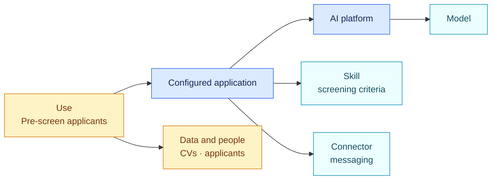
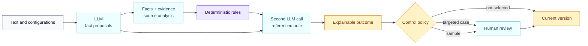

<!-- SPDX-License-Identifier: CC-BY-4.0 -->

# Understanding AIR Framework

AIR turns a scattered AI estate into governance records that can be understood,
verified and replayed.

A record connects a business use to the application that implements it, its
platform, models, skills, connectors, providers and evidence. Versioned rule
packs then evaluate the established facts.

## An example before the definitions

An organisation uses a general-purpose AI platform. A configured application
on that platform loads a skill describing how to analyse CVs. It also has
access to a connector capable of sending messages to applicants.

The platform name, skill text and connector presence do not qualify the use on
their own. AIR connects them:

The record can then establish precise facts: the use filters applications,
processes personal data, influences a recruitment decision and may trigger an
external action. Every fact points to evidence. AI Act and GDPR packs evaluate
the same factual basis on separate axes.

## The six parts of the model

### 1. Object

An object is something to govern or something needed to explain a use: AI
system, platform, configured application, skill, connector, model, concrete
use, organisation, provider, service or contract.

All these objects may belong in the inventory without being classified as
standalone AI systems in law.

### 2. Relationship

A relationship describes composition: this application runs on that platform,
loads this skill, can invoke this connector and implements this use. The graph
retains the context that each component contributes to the use.

### 3. Fact

A fact answers a bounded question:

- does the use process personal data?
- does the application filter job applications?
- does the platform actually enforce human confirmation?
- does the system interact directly with a person?

A fact has four states: `known`, `unknown`, `conflicted` or `not_applicable`.
Missing information therefore never becomes an automatic “no”.

### 4. Evidence

Evidence records where the fact came from: declaration, platform
configuration, prompt, skill, contract, provider documentation, API or human
review. AIR retains the useful excerpt, capture date and confidence assigned to
the fact.

### 5. Rule pack

A pack translates an identified version of a legal text or framework into
factual questions, deterministic conditions, outcomes, obligations and source
anchors. It also publishes its coverage and known gaps.

The initial distribution includes AI Act, GDPR, NIS2, NIST AI RMF and NIST CSF
packs, together with a fictional contract example.

### 6. Assessment

An assessment preserves the registry version, pack version, effective facts,
rules tested and outcome. Two assessments can be compared to explain a change
in the estate, evidence or authority.

## The role of the concrete use

One general-purpose platform can serve several purposes. One application
summarises documents, another prepares a credit decision and a third screens
job applicants. Composition, intended purpose and use context produce a more
precise qualification than the product or model name alone.

A skill is a passive text object. It does not perform an action on its own, but
its instructions may contribute to an application’s purpose. AIR therefore
connects it to the affected application and use. Action capabilities belong to
the operating platform and the connectors it actually authorises.

## What the language model does

The LLM reads unstructured material and answers the pack's precise questions
with evidence: “these instructions rank applicants”, “this configuration
enforces human confirmation”, or “the evidence is insufficient”. It also
writes a plain-language source analysis. That analysis explains scope,
observations and unknowns; it does not replace the structured facts.

The model creates no legal rule, obligation or reference. It does not turn a
written instruction into an enforced control. The engine tests facts against
the published pack version. A second model call may then write the final note
from the calculated results. Every important sentence must cite the facts,
evidence, rules and references supporting it.

Human review therefore follows qualification for cases selected by the control
policy. It is not a required step for every application in the estate.

## Decisions owned by the organisation

The pack produces a legal or methodological finding. The organisation may then
route it to review, request evidence, assign an owner or block deployment.
These organisational routes stay separate from the public pack.

A new pack version follows the same discipline: dry-run across the estate,
impact comparison, explicit approval and activation. Earlier versions remain
available for audit.

## Continue

- [Follow the complete governance workflow](governance-workflow.md)
- [Understand what the AI registry contains](ai-registry.md)
- [Read an assessment](reading-an-assessment.md)
- [Review sources and coverage](sources-and-coverage.md)
- [Open the object graph specification](../../spec/01-object-graph.md)
