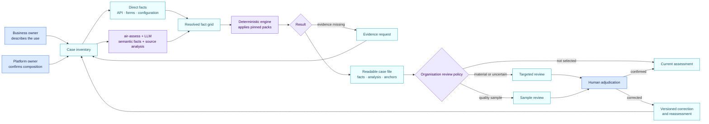

<!-- SPDX-License-Identifier: CC-BY-4.0 -->

# From a business request to a traceable decision

Consider a fictional case: a team wants an AI application to screen job
applications and prepare replies. It runs on an enterprise platform, loads a
screening skill and can access a messaging connector.

AIR does not ask a legal reviewer to inspect platform code. It builds one case
file that every role can review.

| Stage | What the person sees | What AIR retains | Who confirms |
| --- | --- | --- | --- |
| 1. Describe the use | Purpose, affected people and expected actions | An `ai_use` object and source declaration | Business owner |
| 2. Link components | Application, platform, model, skills and connectors | A dated relationship graph | Platform administrator |
| 3. Establish facts | “screens CVs”, “sends a message”, “no human gate” | Direct facts plus an extraction record with evidence, confidence and analysis | Automated by default; reviewer when selected |
| 4. Apply packs | Separate AI Act, GDPR, NIS2 or NIST findings | Pack version and hash, matched rule and anchor | Deterministic engine |
| 5. Resolve unknowns | Missing evidence or contradictory answers | `unknown` or `conflicted`, never a silent false | Evidence owner |
| 6. Select reviews | Material finding, uncertainty, change or quality sample | Selection reason and review type | Organisation review policy |
| 7. Adjudicate | Facts, findings and readable analysis shown together | Immutable review record | Selected reviewer |
| 8. Choose a workflow | Legal review, security review, evidence request or another internal queue | A route profile kept separate from law | Organisation-authorised person |
| 9. Replay a change | Diff of findings and obligations | Old and new snapshots, versions and impact | Change reviewer |

## What a language model may do

Guided by `air-assess`, it reads the prompt, metadata, graph, configuration and
documents that require semantic interpretation. It proposes the bounded fact
“the instructions rank candidates,” cites the evidence and states its
confidence. It also writes a concise source analysis that explains the scope,
observations and unknowns in plain language. Values already supplied in a
reliable structured form enter the fact grid directly.

It must not invent a runtime control or mistake a safety guideline for an
action that actually happened. Any controlled legal characterisation proposed
for the pack remains visible in the grid with its evidence and confidence. The
model cannot create the pack's finding codes, anchors or obligations.

## What the engine decides

The engine receives the fact grid and applies published conditions. In the
recruitment example, it can follow the use to the application and then to the
skill. It can therefore establish that the instructions contribute to a CV
screening purpose. The skill remains passive text; the application or platform
may invoke the connector under runtime permissions.

## What remains human

The organisation selects active packs, defines review triggers and sampling,
resolves interpretations outside pack coverage and owns its work routes. A
person does not need to approve every configuration before the engine runs.
Material or uncertain cases can require review; the rest can enter a stratified
quality sample.

Reviewer corrections form an adjudicated evaluation set. A source correction
creates a new snapshot. An extraction, pack, route or explanation correction
creates a candidate version that passes regression and impact testing before
approval. The [quality-control guide](quality-control.md) describes this loop.

The result is a reproducible case file: same evidence, same facts, same rule
version, same deterministic result. It is not an AI-issued compliance
certification.
