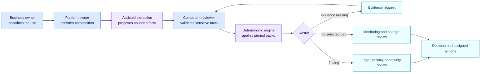

<!-- SPDX-License-Identifier: CC-BY-4.0 -->

# From a business request to a traceable decision

Consider a fictional case: a team wants an AI application to screen job
applications and prepare replies. It runs on an enterprise platform, loads a
screening skill and can access a messaging connector.

AIR does not ask a legal reviewer to inspect platform code. It builds one case
file that every role can review.

| Stage | What the person sees | What AIR retains | Who confirms |
| --- | --- | --- | --- |
| 1. Describe the use | Purpose, affected people and expected actions | An `ai_use` object and source declaration | Business owner |
| 2. Link components | Application, platform, model, skills and connectors | A dated relationship graph | Platform administrator |
| 3. Establish facts | “screens CVs”, “sends a message”, “no human gate” | Value, evidence, confidence and fact state | Business or competent expert |
| 4. Apply packs | Separate AI Act, GDPR, NIS2 or NIST findings | Pack version and hash, matched rule and anchor | Deterministic engine |
| 5. Resolve unknowns | Missing evidence or contradictory answers | `unknown` or `conflicted`, never a silent false | Evidence owner |
| 6. Choose a workflow | Legal review, security review, evidence request or another internal queue | A route profile kept separate from law | Organisation-authorised person |
| 7. Replay a change | Diff of findings and obligations | Old and new snapshots, versions and impact | Change reviewer |

## What a language model may do

It may read a prompt, configuration or document and propose a bounded fact:
“the instructions rank candidates.” It should cite its evidence and disclose
uncertainty.

It must not invent a runtime control, mistake a safety guideline for an action
that actually happened, or directly supply the legal conclusion that the pack
is designed to compute.

## What the engine decides

The engine receives reviewed facts and applies published conditions. In the
recruitment example, it can follow the use to the application and then to the
skill. It can therefore establish that the instructions contribute to a CV
screening purpose. The skill remains passive text; the application or platform
may invoke the connector under runtime permissions.

## What remains human

The organisation selects active packs, confirms sensitive facts, resolves
interpretations outside pack coverage and defines its own work routes. A new
pack version is first simulated against the registry. It replaces the active
version only after explicit approval.

The result is a reproducible case file: same evidence, same facts, same rule
version, same deterministic result. It is not an AI-issued compliance
certification.
