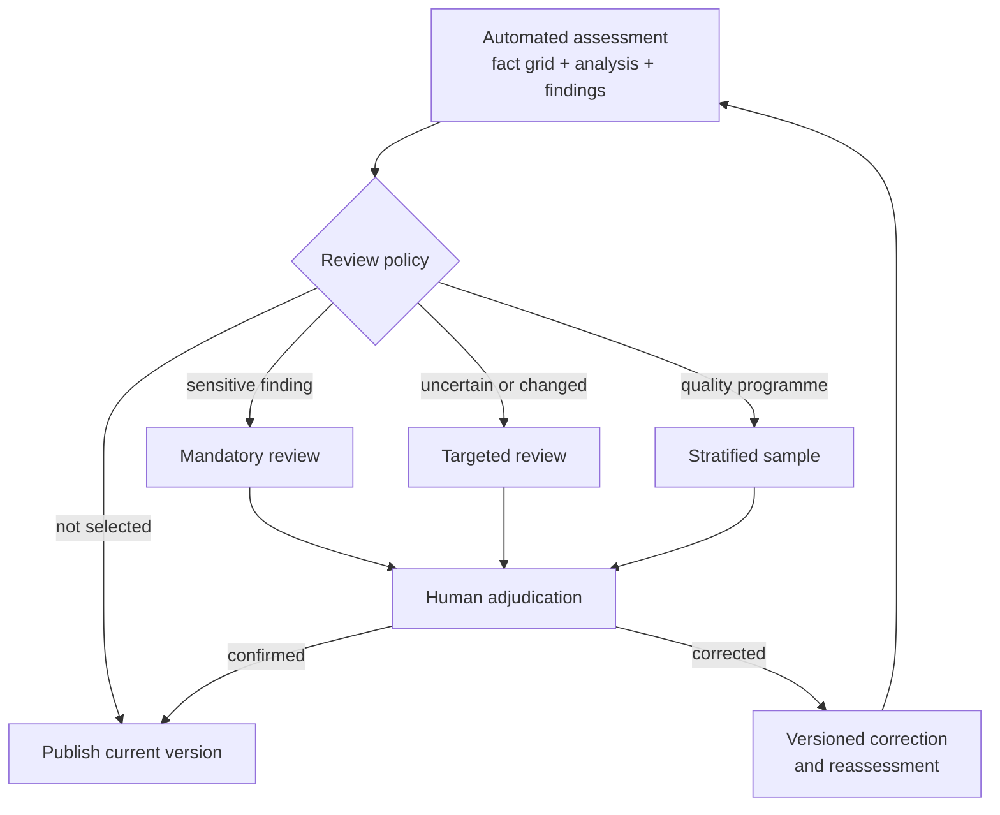

<!-- SPDX-License-Identifier: CC-BY-4.0 -->

# Human review at registry scale

A platform may contain thousands of configured applications and skills. AIR
runs automated extraction and deterministic evaluation across the inventory.
Reviewers concentrate on important cases, uncertainty, change and representative
samples.

The `qualify` command provides the reference model-call flow. Software that
integrates AIR selects the model, schedules samples and presents the review
queue to the relevant teams.

Review selection belongs to the organisation. A public framework cannot decide
which internal committee, threshold or approval applies. It can keep the
selection reason, reviewer role, adjudication and corrective action in a common
record.

For configured applications and skills, a stratified sample is often the only
practical control at scale. The complete use still matters. A passive skill can
change the purpose of an application, and a platform connector can make an
action possible. A sensitive composed use can therefore trigger a full review
even when the skill or configured application is not a standalone AI system in
law.

## What reviewers examine

| Layer | Review question | Typical correction |
| --- | --- | --- |
| Source and composition | Did AIR receive the current prompt, metadata, platform and connector configuration? | Capture a missing source or relationship |
| Extraction | Does each proposed fact follow from the cited evidence? | Correct the fact and create a new inventory version |
| Pack | Does the rule express the reviewed source correctly? | Publish a candidate pack and run impact analysis |
| Route | Does the organisation send this finding to the right workflow? | Publish a new route profile |
| Explanation | Does the readable note match the facts, findings and anchors? | Correct the renderer or assessment skill |

## How the system improves

Reviewed disagreements form an adjudicated evaluation set. A correction can
target source data, composition, extraction, a pack, a route or the readable
explanation. Changes to the extractor skill, prompt, model, rule pack and route
profile remain separate. Each candidate is tested against that set and the
existing registry before a new version is approved.

| Measure | What it reveals |
| --- | --- |
| Reviewer agreement by fact family | Where semantic extraction remains unstable |
| False-negative rate for important cases | Whether sensitive cases escape the expected findings |
| Unknown and conflict rate | Whether sources or questions are incomplete |
| Anchor fidelity | Whether every normative sentence resolves to the returned source |
| Explanation fidelity | Whether readable prose matches facts and findings |
| Quality change by model, skill and period | Whether a new component changed quality |

A quality programme should combine representative stratified samples with
extra coverage of rare important findings and low-confidence cases. A reviewed
subset can use two independent reviewers to measure adjudication consistency.

This process supports rising measured accuracy while retaining an audit trail.
It does not create silent online learning or a permanently valid accuracy
claim.

The technical record formats are defined in
[`spec/08-extraction-review-and-learning.md`](../../spec/08-extraction-review-and-learning.md).
