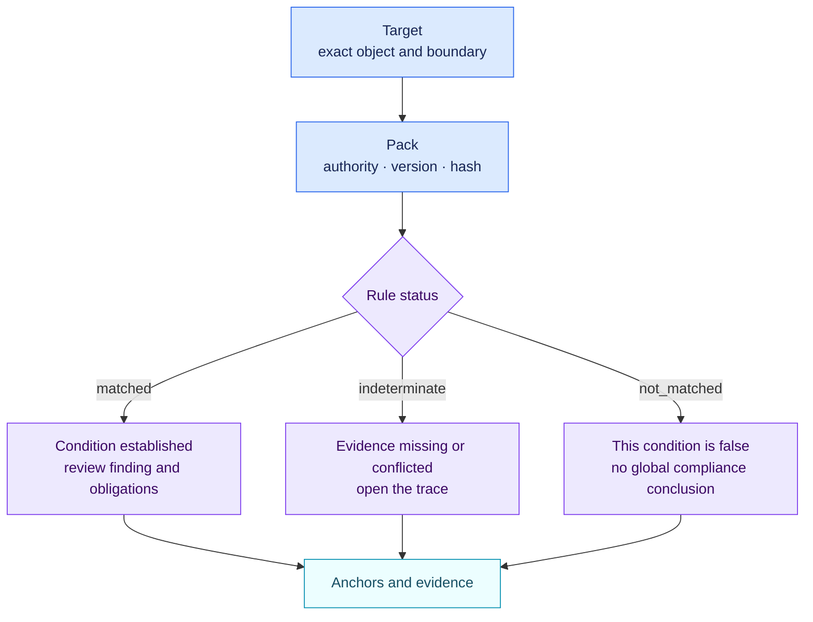

<!-- SPDX-License-Identifier: CC-BY-4.0 -->

# How to read an assessment

Start with five fields:

1. `target`: the exact object and system boundary assessed;
2. `pack`: source family, authority type, version and content hash;
3. `status`: matched, not matched or indeterminate;
4. `trace`: facts, evidence, conflicts and related objects used;
5. `anchors`: the exact legal or methodological locations behind the rule.

`matched` means the published deterministic condition is true for the supplied
facts. It does not mean a regulator certified the result. `indeterminate` means
evidence is missing or contradictory; it is not a pass. `not_matched` means the
condition is false, not that the entire object is compliant.

The `level` vocabulary belongs to the source pack. A company route is a
separate output with its own version and hash.
