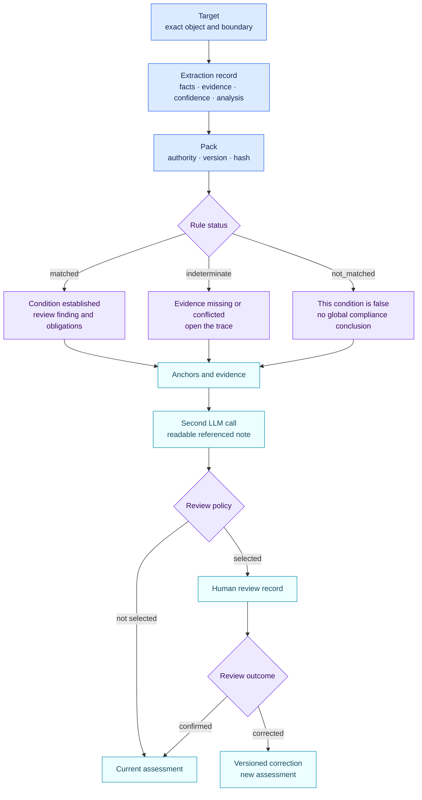

<!-- SPDX-License-Identifier: CC-BY-4.0 -->

# How to read an assessment

The first LLM call reads the sources and proposes facts. The engine then
calculates the findings. The second call writes the readable note without
changing those findings. Start the review with seven fields:

1. `target`: the exact object and system boundary assessed;
2. `extraction`: semantic fact proposals, evidence, confidence and source analysis;
3. `pack`: source family, authority type, version and content hash;
4. `status`: matched, not matched or indeterminate;
5. `trace`: facts, evidence, conflicts and related objects used;
6. `anchors`: the exact legal or methodological locations behind the rule;
7. `review`: selection reason and human adjudication when the case was selected.

The readable case file is a separate `assessment-note` record. Each important
sentence points back to the facts and evidence or to the assessment, rule and
anchors that support it.

`matched` means the published deterministic condition is true for the supplied
facts. It does not mean a regulator certified the result. `indeterminate` means
evidence is missing or contradictory; it is not a pass. `not_matched` means the
condition is false, not that the entire object is compliant.

The `level` vocabulary belongs to the source pack. A company route is a
separate output with its own version and hash.

The readable note should be checked against the structured records. Its factual
claims resolve to fact and evidence ids; its normative claims resolve to engine
findings and anchors. The note contains a reviewable rationale, not private
model chain-of-thought.
