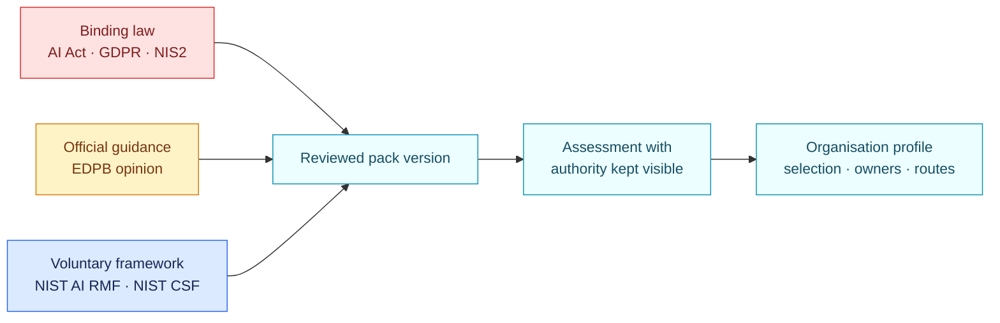

<!-- SPDX-License-Identifier: CC-BY-4.0 -->

# Sources and coverage

| Pack | Latest version | Authority | Pinned source | Coverage |
| --- | --- | --- | --- | --- |
| EU AI Act core | 1.1.0 | Binding EU regulation | Consolidated Regulation (EU) 2024/1689 after Regulation (EU) 2026/1744 | 10 Article 5 routes, 25 Annex III cases, Article 6, operator readiness, Article 50 and GPAI |
| EU GDPR AI core | 1.1.0 | Binding EU regulation, with marked EDPB guidance | Regulation (EU) 2016/679 and EDPB Opinion 28/2024 | Scope, principles, legal bases, rights, Article 22, processors, DPIA, security, breaches, DPO, transfers and AI-model guidance |
| NIS2 baseline | 1.1.0 | Binding directive through national law | Directive (EU) 2022/2555 and Regulation (EU) 2024/2690 marker | Scope, Article 20, all 10 Article 21 measure families and complete Article 23 reporting sequence |
| NIST AI RMF | 1.1.0 | Voluntary framework | NIST AI 100-1, with NIST AI 600-1 marker | All 72 Core outcomes through an organisation-selected target profile |
| NIST CSF | 2.1.0 | Voluntary framework | NIST CSWP 29 | All 106 current Core outcomes through an organisation-selected Target Profile |

Each `pack.json` contains the authoritative links, review date and explicit
known gaps. NIS2 still needs national overlays. NIST states that AI RMF 1.0 is
under revision; this repository pins the current Core until a separately
reviewed successor is released. Earlier pack directories remain available for
reproducibility and should not be selected for new profiles.

ISO publications are not embedded. Their copyright and licence conditions do
not permit this repository to reproduce or operationalise protected text
without the necessary permission.
