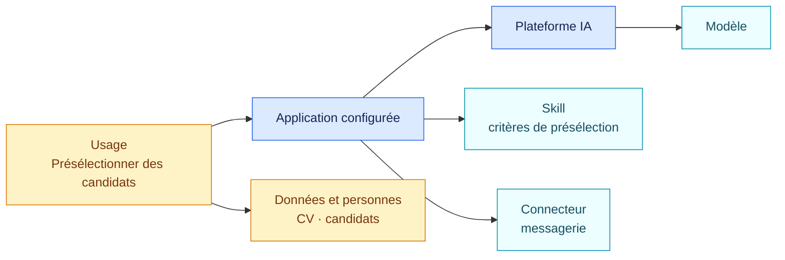
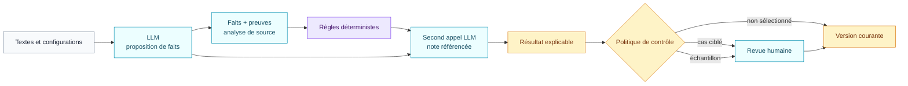

<!-- SPDX-License-Identifier: CC-BY-4.0 -->

# Comprendre AIR Framework

AIR transforme un parc dispersé en dossiers de gouvernance que l’on peut
comprendre, vérifier et rejouer.

Un dossier relie un usage métier à l’application qui le réalise, à sa
plateforme, ses modèles, ses skills, ses connecteurs, ses fournisseurs et ses
preuves. Des packs de règles versionnés évaluent ensuite les faits établis.

## Un exemple avant les définitions

Une entreprise utilise une plateforme IA généraliste. Une application
configurée sur cette plateforme charge un skill qui décrit comment analyser
des CV. Elle dispose aussi d’un connecteur capable d’envoyer des messages aux
candidats.

Pris séparément, le nom de la plateforme, le texte du skill ou la présence du
connecteur ne suffisent pas à qualifier l’usage. AIR relie les éléments :

Le dossier peut alors établir des faits précis : l’usage filtre des
candidatures, traite des données personnelles, influence une décision de
recrutement et peut déclencher une action externe. Chaque fait renvoie à sa
preuve. Les packs AI Act et RGPD appliquent leurs règles à cette même base
factuelle, chacun sur son propre axe.

## Les six éléments du modèle

### 1. Objet

Un objet est un élément que l’on veut gouverner ou utiliser pour expliquer un
usage : système d’IA, plateforme, application configurée, skill, connecteur,
modèle, usage concret, organisation, fournisseur, service ou contrat.

Tous ces objets peuvent figurer dans l’inventaire sans être qualifiés comme des
systèmes d’IA autonomes au sens de la loi.

### 2. Relation

Une relation explique la composition : cette application fonctionne sur cette
plateforme, charge ce skill, peut invoquer ce connecteur et réalise cet usage.
Le graphe conserve le contexte que chaque logiciel apporte à l’usage.

### 3. Fait

Un fait répond à une question bornée :

- l’usage traite-t-il des données personnelles ?
- l’application filtre-t-elle des candidatures ?
- la plateforme impose-t-elle réellement une validation humaine ?
- le système interagit-il directement avec une personne ?

Un fait a quatre états : `known`, `unknown`, `conflicted` ou `not_applicable`.
L’absence d’information ne devient donc jamais automatiquement un « non ».

### 4. Preuve

Une preuve indique d’où vient le fait : réponse déclarative, configuration de
plateforme, prompt, skill, contrat, documentation fournisseur, API ou revue
humaine. AIR conserve l’extrait utile, la date de capture et la confiance
accordée au fait.

### 5. Pack de règles

Un pack traduit une version identifiée d’un texte ou d’un référentiel en
questions factuelles, conditions déterministes, résultats, obligations et
ancrages. Il publie également sa couverture et ses lacunes.

La distribution initiale comprend des packs AI Act, RGPD, NIS2, NIST AI RMF et
NIST CSF ainsi qu’un exemple contractuel fictif.

### 6. Évaluation

Une évaluation conserve la version du registre, la version du pack, les faits
effectifs, les règles testées et le résultat. Deux évaluations peuvent être
comparées pour expliquer un changement du parc, d’une preuve ou du référentiel.

## Le rôle de l’usage concret

Une plateforme généraliste peut servir plusieurs finalités. Une application
résume des documents ; une autre prépare une décision de crédit ; une troisième
filtre des candidatures. La composition, la finalité et le contexte d’usage
déterminent la qualification avec davantage de précision que le seul nom du
produit ou du modèle.

Un skill est un objet textuel passif. Il n’exécute pas seul une action, mais ses
instructions peuvent contribuer à la finalité d’une application. AIR le relie
donc à l’application et à l’usage concernés. Les capacités d’action sont
portées par la plateforme en fonctionnement et les connecteurs effectivement autorisés.

## Ce que fait le modèle de langage

Le LLM lit des contenus peu structurés et répond aux questions précises du pack
avec leurs preuves : « cette instruction classe des candidats », « cette
configuration impose une confirmation humaine » ou « la preuve est
insuffisante ». Il rédige aussi une analyse en texte courant. Cette analyse
explique le périmètre, les observations et les inconnues ; elle ne remplace pas
les faits structurés.

Il ne crée ni règle juridique, ni obligation, ni référence. Il ne transforme
pas une consigne écrite en contrôle réellement appliqué. Le moteur teste les
faits contre la version publiée du pack. Un second appel au LLM peut ensuite
rédiger la note finale à partir des résultats calculés. Chaque phrase importante
doit citer les faits, preuves, règles et références qui la soutiennent.

La revue humaine intervient donc après la qualification, sur les cas choisis
par la politique de contrôle. Elle n’est pas une étape obligatoire pour chaque
application du parc.

## Les décisions propres à l’entreprise

Le pack produit un constat juridique ou méthodologique. L’entreprise peut
ensuite l’orienter vers une revue, demander une preuve, affecter un responsable
ou bloquer un déploiement. Ces voies organisationnelles restent séparées du
pack public.

Une nouvelle version de pack suit le même principe : simulation sur le parc,
comparaison des impacts, validation explicite, puis activation. Les versions
précédentes restent disponibles pour l’audit.

## Continuer

- [Voir le parcours métier complet](parcours-metier.md)
- [Comprendre ce que contient le registre IA](registre-ia.md)
- [Lire une évaluation](lire-une-evaluation.md)
- [Consulter les sources et la couverture](sources-et-couverture.md)
- [Ouvrir la spécification du graphe](../../spec/01-object-graph.md)
