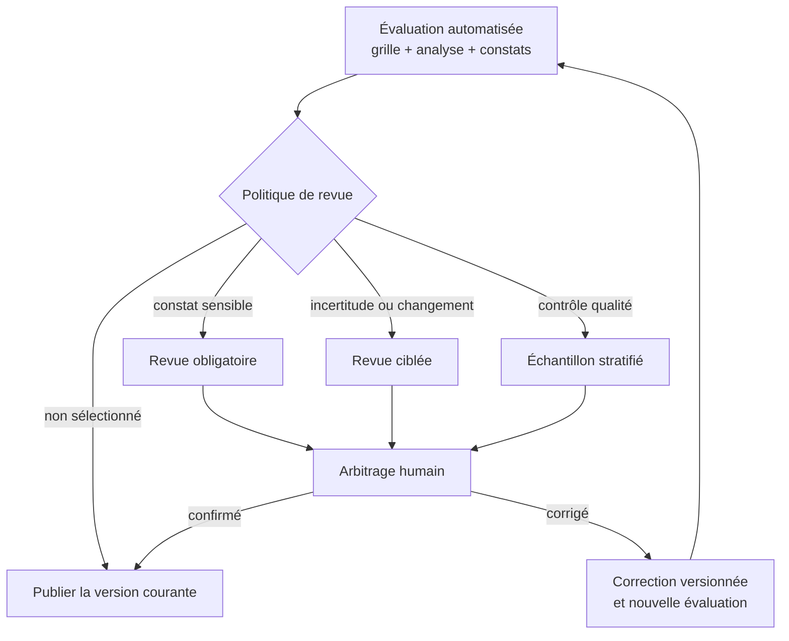

<!-- SPDX-License-Identifier: CC-BY-SA-4.0 -->

# La revue humaine à l’échelle d’un parc

Une plateforme peut contenir des milliers d’applications configurées et de
skills. Open AIRS exécute l’extraction automatisée et l’évaluation déterministe sur
le parc. Les relecteurs se concentrent sur les cas importants, l’incertitude,
les changements et des échantillons représentatifs.

La commande `qualify` fournit le flux de référence pour appeler le modèle. Le
logiciel qui intègre Open AIRS choisit le modèle, planifie les échantillons et
présente la file de revue aux équipes concernées.

L’organisation choisit les critères de revue. Un framework public ne peut pas
décider quel comité, seuil ou circuit interne s’applique. Il peut conserver la
raison de la sélection, le rôle du relecteur, l’arbitrage et l’action corrective
dans un format commun.

Pour les applications configurées et les skills, un échantillonnage stratifié
est souvent le seul contrôle praticable à grande échelle. La composition de
l’usage reste déterminante. Un skill passif peut modifier la finalité d’une
application, tandis qu’un connecteur de plateforme peut rendre une action
possible. Un usage composé sensible peut donc exiger une revue complète même
si le skill ou l’application configurée ne constitue pas un système d’IA
autonome au sens juridique.

## Ce que les relecteurs contrôlent

| Couche | Question de contrôle | Correction habituelle |
| --- | --- | --- |
| Source et composition | Open AIRS a-t-il reçu le prompt, les métadonnées, la plateforme et les connecteurs à jour ? | Capturer la source ou la relation manquante |
| Extraction | Chaque fait proposé découle-t-il de la preuve citée ? | Corriger le fait et créer une nouvelle version d’inventaire |
| Pack | La règle traduit-elle correctement la source relue ? | Publier un pack candidat et simuler son impact |
| Voie | Le constat rejoint-il le bon parcours interne ? | Publier un nouveau profil de routage |
| Explication | La note lisible correspond-elle aux faits, constats et ancrages ? | Corriger le rendu ou le skill d’évaluation |

## Comment le système progresse

Les désaccords relus forment un jeu d’évaluation arbitré. Une correction peut
porter sur la source, la composition, l’extraction, un pack, une voie ou
l’explication lisible. Les changements du skill d’extraction, du prompt, du
modèle, du pack de règles et du profil de routage restent séparés. Chaque
candidat est testé sur ce jeu et sur le registre existant avant la validation
d’une nouvelle version.

| Mesure | Ce qu’elle révèle |
| --- | --- |
| Accord des relecteurs par famille de faits | Les lectures sémantiques encore instables |
| Taux de faux négatifs sur les cas importants | Les situations sensibles qui échappent aux constats attendus |
| Taux d’inconnues et de contradictions | Les sources ou questions incomplètes |
| Fidélité des ancrages | La correspondance entre chaque phrase normative et la source retournée |
| Fidélité de l’explication | La correspondance entre le texte lisible, les faits et les constats |
| Écart de qualité par modèle, skill et période | L’effet d’un nouveau composant sur la qualité |

Le programme qualité combine des échantillons stratifiés représentatifs avec
une couverture renforcée des constats importants rares et des faibles niveaux de
confiance. Un sous-ensemble peut être relu par deux personnes indépendantes afin
de mesurer la cohérence des arbitrages.

Ce processus permet d’augmenter la précision mesurée tout en conservant une
trace d’audit. Il ne crée ni apprentissage silencieux en production ni promesse
de précision permanente.

Les formats techniques sont décrits dans
[`spec/08-extraction-review-and-learning.md`](../../spec/08-extraction-review-and-learning.md).
