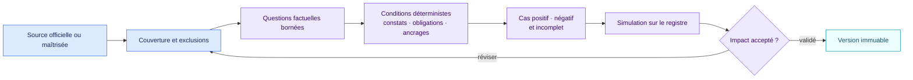

<!-- SPDX-License-Identifier: CC-BY-SA-4.0 -->

# Créer et publier un pack

## Les fichiers remis au relecteur

| Fichier | Utilité pour la personne | Utilité pour le moteur |
| --- | --- | --- |
| `README.md` et `README.fr.md` | Comprendre l’autorité, le chemin de décision, la couverture et les limites | Aucune |
| `pack.json` | Inspecter les questions, règles et ancrages si nécessaire | Pack exécutable consommé par le moteur |
| `CHANGELOG.md` | Comprendre l’écart avec la version précédente | Soutient la revue de publication |
| Cas de conformité | Relire des résultats attendus concrets | Évite les régressions sur les cas positifs, négatifs et incomplets |

## Identifier l’autorité et le périmètre

Indiquez si la source relève du droit contraignant, d’une ligne directrice,
d’un référentiel volontaire, d’une politique d’entreprise ou d’un exemple
fictif. Identifiez la juridiction, la version, la date d’effet et l’URL
officielle. Décrivez la couverture et les lacunes avant d’écrire les règles.

## Décomposer le test en faits vérifiables

Pour chaque élément du test, posez une question à laquelle un relecteur peut
répondre avec une preuve. N’extrayez pas « haut risque » comme un fait si le
pack doit précisément le déterminer. Conservez les inconnues et les conflits.

## Écrire une condition auditable

Utilisez le langage de conditions v0.1. Ajoutez un résumé original, un code de
constat stable, les ancrages exacts et les obligations. Ne mettez pas les voies
de l’entreprise dans un pack public.

## Tester dans trois directions

Chaque règle importante exige un cas positif, un cas négatif et un cas
incomplet ou contradictoire qui doit rester indéterminé.

## Simuler avant activation

Exécutez `air-framework impact` avec le pack actif et le candidat. Relisez
chaque constat ajouté, supprimé ou modifié. Publiez une version immuable, puis
laissez une personne autorisée l’activer dans le produit hôte.
