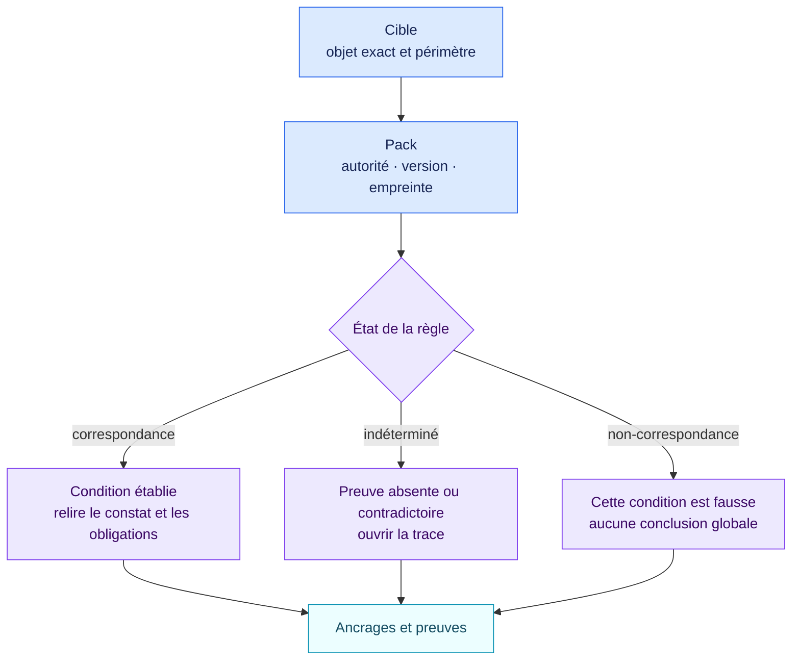

<!-- SPDX-License-Identifier: CC-BY-4.0 -->

# Comment lire une évaluation

Commencez par cinq champs :

1. `target` : l’objet exact et le périmètre évalué ;
2. `pack` : la source, son type d’autorité, sa version et son empreinte ;
3. `status` : correspondance, non-correspondance ou résultat indéterminé ;
4. `trace` : les faits, preuves, conflits et objets liés utilisés ;
5. `anchors` : les emplacements juridiques ou méthodologiques exacts.

`matched` signifie que la condition déterministe publiée est vraie avec les
faits fournis. Ce n’est pas une certification. `indeterminate` signale une
preuve manquante ou contradictoire ; ce n’est pas un feu vert. `not_matched`
signifie que cette condition est fausse, pas que tout l’objet est conforme.

Le vocabulaire de `level` appartient au pack source. Une voie d’entreprise est
un résultat séparé, avec sa propre version et sa propre empreinte.
