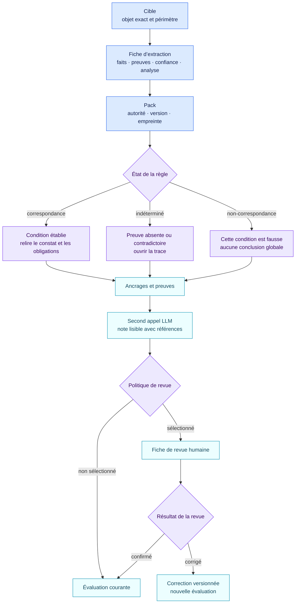

<!-- SPDX-License-Identifier: CC-BY-4.0 -->

# Comment lire une évaluation

Le premier appel LLM lit les sources et propose les faits. Le moteur calcule
ensuite les constats. Le second appel rédige la note lisible sans pouvoir
modifier ces constats. Commencez la relecture par sept champs :

1. `target` : l’objet exact et le périmètre évalué ;
2. `extraction` : les faits sémantiques proposés, les preuves, la confiance et l’analyse de source ;
3. `pack` : la source, son type d’autorité, sa version et son empreinte ;
4. `status` : correspondance, non-correspondance ou résultat indéterminé ;
5. `trace` : les faits, preuves, conflits et objets liés utilisés ;
6. `anchors` : les emplacements juridiques ou méthodologiques exacts ;
7. `review` : la raison de sélection et l’arbitrage humain lorsqu’il existe.

Le dossier lisible est une fiche `assessment-note` séparée. Chaque affirmation
importante renvoie aux faits et preuves ou à l’évaluation, à la règle et aux
ancrages qui l’étayent.

`matched` signifie que la condition déterministe publiée est vraie avec les
faits fournis. Ce n’est pas une certification. `indeterminate` signale une
preuve manquante ou contradictoire ; ce n’est pas un feu vert. `not_matched`
signifie que cette condition est fausse, pas que tout l’objet est conforme.

Le vocabulaire de `level` appartient au pack source. Une voie d’entreprise est
un résultat séparé, avec sa propre version et sa propre empreinte.

La note lisible doit rester vérifiable dans les fiches structurées. Ses
affirmations factuelles renvoient aux faits et aux preuves ; ses affirmations
normatives renvoient aux constats et ancrages du moteur. Elle fournit une
justification relisible, sans exposer le raisonnement interne privé du modèle.
