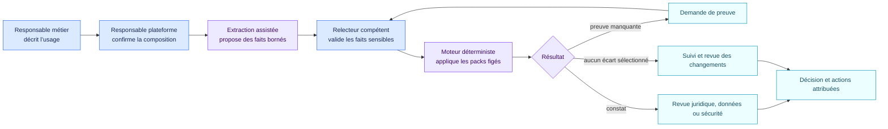

<!-- SPDX-License-Identifier: CC-BY-4.0 -->

# Du besoin métier à la décision traçable

Prenons un cas fictif : une équipe souhaite utiliser une application IA pour
trier des candidatures et préparer des réponses. Elle fonctionne sur une
plateforme d’entreprise, charge un skill de présélection et peut accéder à un
connecteur de messagerie.

AIR ne demande pas au juriste de lire le code de la plateforme. Il construit
un dossier commun que chacun peut relire.

| Étape | Ce que la personne voit | Ce qu’AIR conserve | Qui confirme |
| --- | --- | --- | --- |
| 1. Décrire l’usage | La finalité, les personnes concernées et les actions attendues | Un objet `ai_use` et la déclaration source | Responsable métier |
| 2. Relier les composants | Application, plateforme, modèle, skills et connecteurs | Un graphe de relations daté | Administrateur de plateforme |
| 3. Relever les faits | « trie des CV », « envoie un message », « validation humaine absente » | Valeur, preuve, confiance et état du fait | Métier ou expert compétent |
| 4. Appliquer les packs | Constats AI Act, RGPD, NIS2 ou NIST sur des axes séparés | Version et empreinte de chaque pack, règle déclenchée et ancrage | Moteur déterministe |
| 5. Traiter les inconnues | Questions sans preuve ou réponses contradictoires | `unknown` ou `conflicted`, jamais un faux « non » | Propriétaire de la preuve |
| 6. Décider du parcours | Revue juridique, sécurité, demande de preuve ou autre file interne | Profil de routage séparé du droit | Personne autorisée par l’organisation |
| 7. Rejouer après changement | Diff des constats et des obligations | Ancien et nouveau snapshot, versions et impact | Relecteur du changement |

## Ce que le modèle de langage peut faire

Il peut lire un prompt, une configuration ou un document et proposer un fait
borné : « les instructions classent des candidats ». Il doit citer la preuve
utilisée et signaler son incertitude.

Il ne doit pas inventer un contrôle runtime, transformer une consigne de
sécurité en action réellement exécutée, ni produire directement la conclusion
juridique que le pack est chargé de calculer.

## Ce que le moteur décide

Le moteur reçoit les faits validés et applique les conditions publiées. Pour
le cas de recrutement, il peut relier l’usage à l’application puis au skill.
Il peut ainsi constater que les instructions contribuent à une finalité de tri
de candidatures. Le skill reste un texte passif ; c’est l’application ou la
plateforme qui peut invoquer le connecteur selon ses autorisations.

## Ce qui reste humain

L’organisation choisit les packs actifs, valide les faits sensibles, tranche
les interprétations qui dépassent le pack et décide de ses propres voies de
traitement. Une nouvelle version de pack est d’abord simulée sur le registre.
Elle ne remplace la version active qu’après validation explicite.

Le résultat prend la forme d’un dossier reproductible : mêmes preuves, mêmes
faits, même version de règle, même résultat déterministe. Il ne constitue pas
une certification de conformité par une IA.
