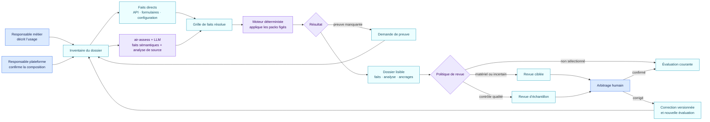

<!-- SPDX-License-Identifier: CC-BY-4.0 -->

# Du besoin métier à la décision traçable

Prenons un cas fictif : une équipe souhaite utiliser une application IA pour
trier des candidatures et préparer des réponses. Elle fonctionne sur une
plateforme d’entreprise, charge un skill de présélection et peut accéder à un
connecteur de messagerie.

AIR ne demande pas au juriste de lire le code de la plateforme. Il construit
un dossier commun que chacun peut relire.

| Étape | Ce que la personne voit | Ce qu’AIR conserve | Qui confirme |
| --- | --- | --- | --- |
| 1. Décrire l’usage | La finalité, les personnes concernées et les actions attendues | Un objet `ai_use` et la déclaration source | Responsable métier |
| 2. Relier les composants | Application, plateforme, modèle, skills et connecteurs | Un graphe de relations daté | Administrateur de plateforme |
| 3. Relever les faits | « trie des CV », « envoie un message », « validation humaine absente » | Faits directs et fiche d’extraction avec preuve, confiance et analyse | Automatique par défaut ; relecteur si sélectionné |
| 4. Appliquer les packs | Constats AI Act, RGPD, NIS2 ou NIST sur des axes séparés | Version et empreinte de chaque pack, règle déclenchée et ancrage | Moteur déterministe |
| 5. Traiter les inconnues | Questions sans preuve ou réponses contradictoires | `unknown` ou `conflicted`, jamais un faux « non » | Propriétaire de la preuve |
| 6. Sélectionner les revues | Constat matériel, incertitude, changement ou échantillon qualité | Raison de la sélection et type de revue | Politique de revue de l’organisation |
| 7. Arbitrer | Faits, constats et analyse lisible présentés ensemble | Fiche de revue immuable | Relecteur sélectionné |
| 8. Décider du parcours | Revue juridique, sécurité, demande de preuve ou autre file interne | Profil de routage séparé du droit | Personne autorisée par l’organisation |
| 9. Rejouer après changement | Diff des constats et des obligations | Ancien et nouveau snapshot, versions et impact | Relecteur du changement |

## Ce que le modèle de langage peut faire

Guidé par `air-assess`, il lit le prompt, les métadonnées, le graphe, la
configuration et les documents qui demandent une interprétation sémantique. Il
propose le fait borné « les instructions classent des candidats », cite la
preuve et indique sa confiance. Il rédige aussi une analyse de source courte qui
explique le périmètre, les observations et les inconnues en langage courant.
Les valeurs déjà fournies sous une forme structurée fiable alimentent
directement la grille de faits.

Il ne doit ni inventer un contrôle runtime ni transformer une consigne de
sécurité en action réellement exécutée. Toute caractérisation juridique
contrôlée proposée pour le pack reste visible dans la grille avec sa preuve et
sa confiance. Le modèle ne peut pas créer les codes de constats, ancrages ou
obligations du pack.

## Ce que le moteur décide

Le moteur reçoit la grille de faits et applique les conditions publiées. Pour
le cas de recrutement, il peut relier l’usage à l’application puis au skill.
Il peut ainsi constater que les instructions contribuent à une finalité de tri
de candidatures. Le skill reste un texte passif ; c’est l’application ou la
plateforme qui peut invoquer le connecteur selon ses autorisations.

## Ce qui reste humain

L’organisation choisit les packs actifs, définit les déclencheurs et
l’échantillonnage, tranche les interprétations qui dépassent le pack et décide
de ses voies de traitement. Une personne n’a pas à approuver chaque
configuration avant le passage du moteur. Les cas matériels ou incertains
peuvent exiger une revue ; le reste peut rejoindre un échantillon qualité
stratifié.

Les corrections arbitrées forment un jeu d’évaluation. Une correction de
source crée un nouveau snapshot. Une correction de l’extraction, du pack, de la
voie ou de l’explication crée une version candidate qui passe les tests de
régression et la simulation d’impact avant validation. Le [guide de contrôle
qualité](controle-qualite.md) décrit cette boucle.

Le résultat prend la forme d’un dossier reproductible : mêmes preuves, mêmes
faits, même version de règle, même résultat déterministe. Il ne constitue pas
une certification de conformité par une IA.
