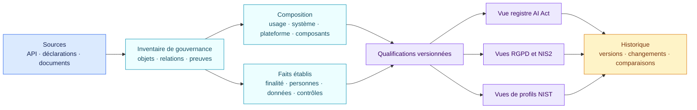

<!-- SPDX-License-Identifier: CC-BY-SA-4.0 -->

# Ce que contient le registre IA

L’inventaire de gouvernance est plus large que la seule liste juridique des
systèmes d’IA. C’est volontaire : il doit expliquer pourquoi un périmètre et
une finalité ont été retenus.

L’AI Act ne fournit pas un modèle unique de registre interne valable pour toute
organisation. AIR rassemble les informations nécessaires aux qualifications,
à la documentation et aux obligations applicables, puis permet d’en extraire
la vue juridique adaptée au rôle et au contexte de l’organisation.

## Une fiche de registre répond à quatre questions

| Question | Informations affichées | Utilité |
| --- | --- | --- |
| Qu’utilise l’organisation ? | Nom, responsable, finalité, cycle de vie, périmètre du système et fournisseurs | Établit l’objet gouverné et les responsabilités |
| Comment cela fonctionne-t-il ? | Plateforme, modèle, skills, connecteurs, droits, validations humaines, journaux et suivi | Explique la composition réelle et les capacités d’action |
| Qui et quoi peut être affecté ? | Personnes, décisions importantes, données personnelles, catégories particulières et autres données sensibles | Fournit la base factuelle de la qualification juridique |
| Quelles suites donner ? | Qualification AI Act, constats RGPD et sécurité séparés, raisons, ancrages, preuves manquantes, obligations et échéances | Rend le résultat relisible et exploitable |

Chaque fiche conserve aussi la version de l’évaluation, la version d’inventaire source et
l’historique. Le registre peut afficher le résultat actuel et reproduire celui
qui était actif à une date antérieure.

Un export juridique peut ne retenir que les éléments qui correspondent à la
définition choisie. L’inventaire conserve les composants explicatifs sans
présenter chaque modèle, skill ou connecteur comme un système d’IA autonome.
