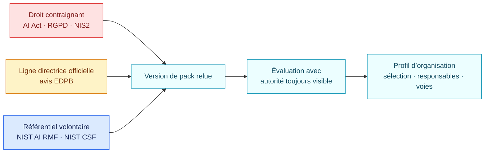

<!-- SPDX-License-Identifier: CC-BY-SA-4.0 -->

# Sources et couverture

| Pack | Dernière version | Autorité | Source figée | Couverture |
| --- | --- | --- | --- | --- |
| AI Act UE | 1.1.0 | Règlement européen contraignant | Règlement (UE) 2024/1689 consolidé après le règlement (UE) 2026/1744 | 10 voies de l’article 5, 25 cas annexe III, article 6, préparation des opérateurs, article 50 et GPAI |
| RGPD et IA | 1.1.0 | Règlement européen, avec lignes EDPB identifiées | Règlement (UE) 2016/679 et avis EDPB 28/2024 | Périmètre, principes, bases légales, droits, article 22, sous-traitants, AIPD, sécurité, violations, DPO, transferts et modèles IA |
| Socle NIS2 | 1.1.0 | Directive à appliquer par le droit national concerné | Directive (UE) 2022/2555 et marqueur du règlement (UE) 2024/2690 | Périmètre, article 20, 10 familles de l’article 21 et séquence complète de l’article 23 |
| NIST AI RMF | 1.1.0 | Référentiel volontaire | NIST AI 100-1, avec marqueur NIST AI 600-1 | 72 résultats du Core dans un profil cible choisi par l’organisation |
| NIST CSF | 2.1.0 | Référentiel volontaire | NIST CSWP 29 | 106 résultats actuels du Core dans un profil cible choisi par l’organisation |

Chaque `pack.json` contient les liens officiels, la date de revue et les
lacunes connues. NIS2 exige toujours des déclinaisons nationales. NIST indique
que l’AI RMF 1.0 est en cours de révision ; le dépôt conserve le Core actuel
jusqu’à la publication séparée d’un successeur relu. Les anciens répertoires
restent disponibles pour reproduire les évaluations historiques et ne doivent
plus être choisis pour de nouveaux profils.

Les publications ISO ne sont pas embarquées. Leur droit d’auteur et leurs
licences ne permettent pas de reproduire ou d’opérationnaliser leurs textes
protégés ici sans autorisation adaptée.
