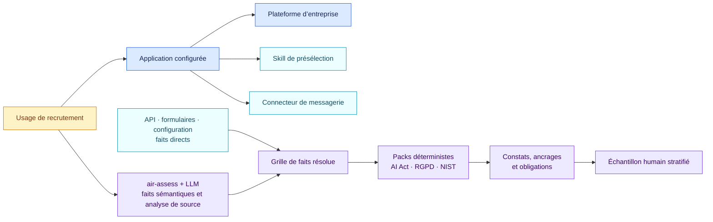

# Exemple complet de gouvernance IA

[Read in English](README.md)

Tous les noms et toutes les preuves sont fictifs. Une équipe de recrutement
configure une application qui classe des CV et peut envoyer des refus par un
connecteur de plateforme. L’exemple montre la composition, les faits directs et
inférés par le modèle, les constats déterministes et une revue humaine par
échantillon.



## Ce qu’AIR reçoit

| Source | Information utile |
| --- | --- |
| Instructions de l’application | Filtrer et classer les candidatures ; préparer les refus |
| Skill de présélection | Critères d’analyse des CV |
| Configuration du connecteur | Les messages peuvent partir sans confirmation humaine séparée |
| Déclaration d’usage | Finalité de recrutement, données personnelles et interaction avec les candidats |
| Snapshot de plateforme | Contrôles communs de journalisation, sécurité et exploitation |

Le skill reste un texte passif. L’application configurée invoque le connecteur
selon les autorisations de la plateforme.

## Ce que le modèle d’évaluation écrit

[`extraction.json`](extraction.json) montre la couche sémantique : propositions
de faits, preuves, confiance et analyse de source. Les valeurs fiables déjà
structurées dans les API, formulaires et configurations alimentent directement
la grille résolue. La fiche auditable
[`assessment-note.json`](assessment-note.json) combine ces deux sources avec le
résultat déterministe :

> L’application configurée trie et classe les candidats et peut envoyer des
> refus sans barrière de confirmation humaine séparée. Le pack AI Act qualifie
> l’usage à haut risque au titre du point 4(a) de l’annexe III et relève des
> lacunes de supervision et de transparence. Le pack RGPD relève une lacune sur
> la condition de l’article 22 et une AIPD absente. Le profil NIST sélectionné
> retourne trois écarts de gouvernance.

La fiche conserve le périmètre, les affirmations reliées aux preuves, les
inconnues et les précautions. Elle précise qu’une consigne dans un prompt ne
prouve pas son application dans le runtime.

Les principales propositions sémantiques restent visibles avant le passage des
règles :

| Fait proposé | Valeur | Confiance | Preuve |
| --- | --- | ---: | --- |
| Tâches | Filtrer, classer et envoyer un refus | 0,99 | Déclaration d’usage, instructions |
| Cas annexe III | Recrutement et sélection, point 4(a) | 0,98 | Déclaration, note de triage juridique |
| Supervision humaine attribuée | Non | 0,96 | Instructions, note de triage juridique |
| Décision exclusivement automatisée | Oui | 0,97 | Instructions, politique du connecteur |
| Effet important | Oui | 0,95 | Note de triage juridique |
| AIPD réalisée | Non | 0,99 | Déclaration d’usage |

La confiance porte sur l’extraction. Les constats déterministes ne reçoivent pas
de score de confiance du modèle.

## Ce que le moteur déterministe retourne

| Pack | Résultat | Principal ancrage ou effet |
| --- | --- | --- |
| AI Act 1.1.0 | Candidat annexe III 4(a) et qualification à haut risque | Article 6 et annexe III |
| AI Act 1.1.0 | Lacunes de supervision, d’information de la personne et de transparence IA | Articles 26 et 50 |
| RGPD IA 1.1.0 | Décision relevant de l’article 22 sans condition de l’article 22(2) établie | Article 22 |
| RGPD IA 1.1.0 | AIPD requise et absente | Article 35 |
| NIST AI RMF 1.1.0 | Deux résultats Core sélectionnés non atteints et profil GenAI non sélectionné | Profil choisi par l’organisation |

Le profil fictif de l’organisation envoie le constat haut risque vers
`formal_conformity_path`. Cette voie interne ne modifie pas le constat juridique.

## Ce que voit le relecteur échantillonné

[`review.json`](review.json) consigne un échantillon qualité stratifié. Le
relecteur confirme la tâche de recrutement, l’absence de validation humaine,
le constat haut risque et l’analyse lisible. Aucune erreur de source,
d’extraction, de pack, de routage ou d’explication n’est relevée. L’évaluation
automatique d’origine reste identifiable après la revue.

## Rejouer le même exemple

```bash
PYTHONPATH=src python -m air_framework validate-extraction \
  examples/ai-governance/extraction.json

PYTHONPATH=src python -m air_framework assess \
  --inventory examples/ai-governance/inventory.json \
  --pack packs/eu-ai-act/1.1.0/pack.json \
  --target use-recruiting-assistant

PYTHONPATH=src python -m air_framework validate-review \
  examples/ai-governance/review.json

PYTHONPATH=src python -m air_framework validate-note \
  examples/ai-governance/assessment-note.json
```

Le profil figé dans [`pack-profile.json`](pack-profile.json) applique les packs
AI Act, RGPD, NIS2 et NIST sélectionnés sans activation silencieuse d’un jeu de
règles global.
