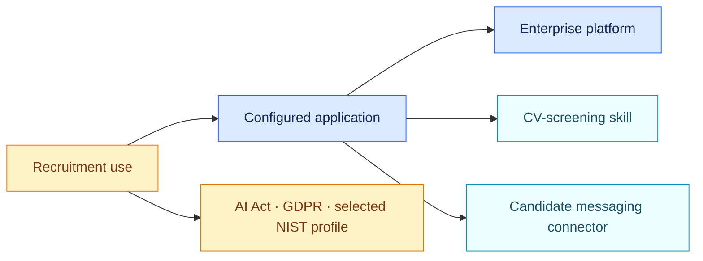

# Worked AI-governance example

All names and evidence are fictional. The graph demonstrates the distinction
between:

- a platform that exposes controls;
- a configured application that executes;
- a passive skill that contributes CV-screening instructions;
- a connector that makes outbound action possible;
- a concrete recruitment use that is the relevant legal composition.



Run:

```bash
PYTHONPATH=src python -m air_framework assess \
  --inventory examples/ai-governance/inventory.json \
  --pack packs/eu-ai-act/1.1.0/pack.json \
  --target use-recruiting-assistant
```

Then run the same target against `packs/eu-gdpr-ai/1.1.0/pack.json`. The AI Act
pack returns the Annex III recruitment route, high-risk qualification and
specific operator or transparency gaps. The GDPR pack independently returns
scope, Article 22 and DPIA findings. The selected NIST profile evaluates four
Core outcomes and leaves the other 68 outside this assessment.
