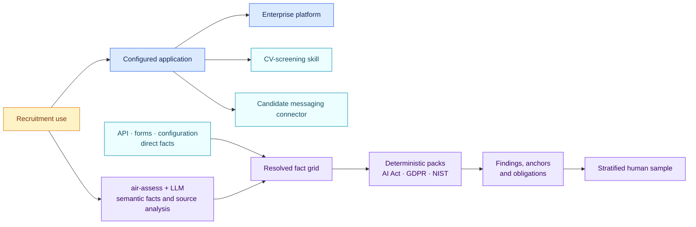

# Worked AI-governance example

[Lire en français](README.fr.md)

All names and evidence are fictional. A recruitment team configures an
application that ranks CVs and can send rejection messages through a platform
connector. The example shows the complete composition, direct and model-inferred
facts, deterministic findings and a sampled human review.



## What AIR receives

| Source | Relevant information |
| --- | --- |
| Application instructions | Filter and rank applications; prepare rejection outcomes |
| Screening skill | Criteria for analysing CVs |
| Connector configuration | Candidate messages can be sent without a separate confirmation gate |
| Use declaration | Employment recruitment purpose, personal data and direct interaction with applicants |
| Platform snapshot | Shared logging, security and operational controls |

The skill remains passive text. The connector is invoked by the configured
application under platform permissions.

## What the assessment model writes

[`extraction.json`](extraction.json) shows the semantic layer: fact proposals,
evidence, confidence and source analysis. Reliable API, form and configuration
values already present in the inventory enter the resolved grid directly. The
auditable [`assessment-note.json`](assessment-note.json) combines both sources
with the deterministic result:

> The configured application screens and ranks job applicants and can send
> rejection messages without a separate human confirmation gate. The AI Act
> pack classifies the use as high-risk under Annex III point 4(a) and returns
> oversight and transparency gaps. The GDPR pack returns an Article 22
> condition gap and a missing DPIA. The selected NIST profile returns three
> governance gaps.

The note retains the scope, evidence-linked statements, unknowns and cautions.
It records that prompt guidelines do not prove runtime enforcement.

Key semantic proposals are visible before the rules run:

| Proposed fact | Value | Confidence | Evidence |
| --- | --- | ---: | --- |
| Tasks | Filter applications, rank candidates, send rejection | 0.99 | Use declaration, application instructions |
| Annex III use case | Recruitment and selection, point 4(a) | 0.98 | Use declaration, legal triage note |
| Human oversight assigned | No | 0.96 | Application instructions, legal triage note |
| Solely automated decision | Yes | 0.97 | Application instructions, connector policy |
| Significant effect | Yes | 0.95 | Legal triage note |
| DPIA completed | No | 0.99 | Use declaration |

Confidence describes extraction certainty. The deterministic findings do not
receive a model-confidence score.

## What the deterministic engine returns

| Pack | Result | Main anchors or consequence |
| --- | --- | --- |
| AI Act 1.1.0 | Annex III 4(a) candidate and high-risk classification | Article 6 and Annex III |
| AI Act 1.1.0 | Human oversight, affected-person notice and AI-interaction disclosure gaps | Articles 26 and 50 |
| GDPR AI 1.1.0 | Article 22 decision with no evidenced Article 22(2) condition | Article 22 |
| GDPR AI 1.1.0 | DPIA required and missing | Article 35 |
| NIST AI RMF 1.1.0 | Two selected Core outcomes unmet and GenAI profile not selected | Selected organisation profile |

The organisation's fictional route profile maps the high-risk finding to
`formal_conformity_path`. This route is an internal workflow output and does not
change the legal finding.

## What the sampled reviewer sees

[`review.json`](review.json) records a stratified quality sample. The reviewer
confirms the recruitment task, the absence of a human gate, the high-risk
finding and the readable analysis. No source, extraction, pack, routing or
explanation error is recorded. The original automated assessment remains
identifiable even after the review.

## Run the same example

```bash
PYTHONPATH=src python -m air_framework validate-extraction \
  examples/ai-governance/extraction.json

PYTHONPATH=src python -m air_framework assess \
  --inventory examples/ai-governance/inventory.json \
  --pack packs/eu-ai-act/1.1.0/pack.json \
  --target use-recruiting-assistant

PYTHONPATH=src python -m air_framework validate-review \
  examples/ai-governance/review.json

PYTHONPATH=src python -m air_framework validate-note \
  examples/ai-governance/assessment-note.json
```

The version-pinned profile in [`pack-profile.json`](pack-profile.json) applies
the AI Act, GDPR, NIS2 and selected NIST packs without activating any global
rule set silently.
