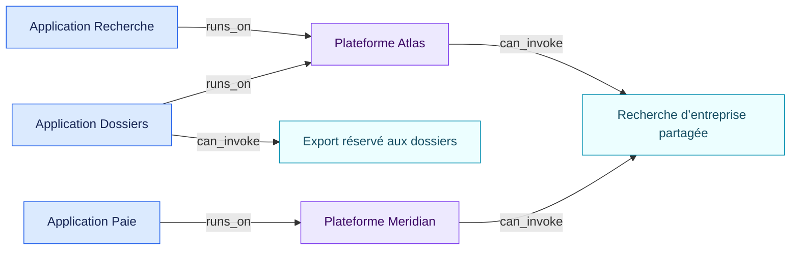

# Connecteurs partagés et propres à une application

[Read in English](README.md)

Le même graphe d’objets représente trois périmètres courants :

| Périmètre | Représentation dans le graphe | Résultat |
| --- | --- | --- |
| Partagé dans l’entreprise | Un connecteur relié à plusieurs plateformes | Les applications de chaque plateforme l’atteignent par `runs_on`, puis `can_invoke` |
| Propre à une plateforme | Un connecteur relié à une seule plateforme | Les applications de cette plateforme peuvent l’atteindre |
| Propre à une application | Un connecteur relié directement à une application | Cette application seule peut l’atteindre |

`can_invoke` signifie que la capacité est disponible dans la configuration
capturée de la plateforme. Cette relation ne prouve pas qu’une action a eu lieu. Les
exécutions, identifiants, droits et validations humaines demandent leurs propres
preuves.

Si un connecteur du même catalogue possède des droits ou contrôles différents
sur deux plateformes, chaque installation devient un objet connecteur distinct.
L’identifiant commun du catalogue reste dans `external_ids`.
