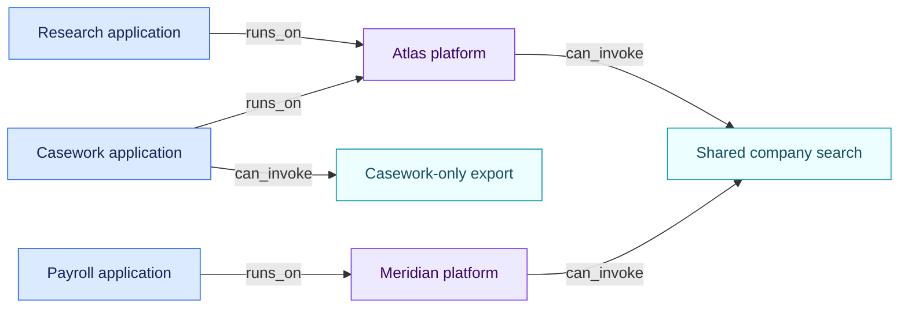

# Shared and application-specific connectors

[Lire en français](README.fr.md)

The same object graph represents three common scopes:

| Scope | Graph representation | Result |
| --- | --- | --- |
| Enterprise shared | One connector linked from several platforms | Applications on either platform can reach it through `runs_on` then `can_invoke` |
| Platform specific | One connector linked from one platform | Applications on that platform can reach it |
| Application specific | Connector linked directly from one application | Only that application can reach it |

`can_invoke` means the capability is available in the captured platform
configuration. It does not prove that an action occurred. Actual executions,
credentials, permission sets and human confirmation gates need their own
evidence.

Each connector also declares its exposed actions as the structured
`connector.actions` fact (action id, kind, approval level, enforcement,
bypassability), the convention defined in
[the object-graph specification](../../spec/01-object-graph.md). The engine
derives composition facts from these declarations, and the inventory
validator rejects malformed entries instead of reading them as working
gates.

When the same catalogue connector has different permissions or controls on two
platforms, represent each installation as a separate connector object and keep
the shared catalogue identifier in `external_ids`.
