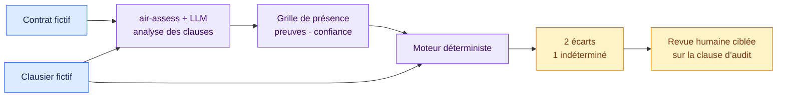

# Exemple complet de revue contractuelle

[Read in English](README.md)

Ce contrat SaaS fictif passe contre un clausier fictif de six clauses. Le
parcours reprend les mêmes étapes que la gouvernance IA : lecture de la source,
grille de faits, règles déterministes, résultat lisible et revue humaine
lorsqu’une preuve reste ambiguë.



## Lecture des clauses

| Famille | Contenu du contrat fictif | Fait proposé |
| --- | --- | --- |
| Confidentialité | Une clause de confidentialité mutuelle est présente | Présent |
| Traitement des données | Les rôles et instructions sont traités | Présent |
| Propriété intellectuelle | Le contrat ne traite pas la propriété ou les licences des livrables | Absent |
| Incidents de sécurité | Aucun mécanisme de notification n’est défini | Absent |
| Coopération à l’audit | Une formule générale de coopération pourrait couvrir l’assurance, mais le texte reste flou | Inconnu |
| Responsabilité | Des plafonds et exclusions répartissent la responsabilité | Présent |

La sortie structurée du modèle se trouve dans [`extraction.json`](extraction.json).
La fiche auditable [`assessment-note.json`](assessment-note.json) combine cette
analyse de source avec le résultat déterministe :

> Le contrat couvre la confidentialité, le traitement des données et la
> responsabilité. Il ne traite ni la propriété ou les licences des livrables,
> ni la notification des incidents de sécurité. La formule générale de
> coopération ne suffit pas à établir un droit d’audit ou d’assurance ; ce
> point reste donc inconnu.

## Résultat déterministe

| État | Constat | Ancrage du clausier | Suite |
| --- | --- | --- | --- |
| Correspondance | La propriété intellectuelle n’est pas traitée | CL-03 | Revoir la propriété et les licences |
| Correspondance | La notification des incidents n’est pas traitée | CL-04 | Revoir le périmètre, les délais et la coopération |
| Indéterminé | La coopération à l’audit ne peut pas être établie | CL-05 | Obtenir le texte complet ou une interprétation juridique |

Le moteur ne transforme pas une ambiguïté en clause absente. La trace conserve
l’état inconnu et la source exacte.

## Revue humaine

[`review.json`](review.json) montre une revue ciblée de la formulation ambiguë
sur l’audit. Le relecteur laisse le point ouvert et demande une meilleure
preuve. Aucune évaluation passée n’est modifiée.

## Rejouer l’exemple

```bash
PYTHONPATH=src python -m air_framework validate-extraction \
  examples/contract-review/extraction.json

PYTHONPATH=src python -m air_framework assess \
  --inventory examples/contract-review/inventory.json \
  --pack packs/contract-review-example/1.0.0/pack.json \
  --target contract-cloud-demo

PYTHONPATH=src python -m air_framework validate-review \
  examples/contract-review/review.json

PYTHONPATH=src python -m air_framework validate-note \
  examples/contract-review/assessment-note.json
```

Le clausier est pédagogique. Il ne constitue ni une rédaction juridique ni un
standard contractuel de production.
