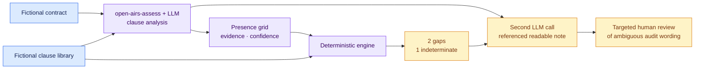

# Worked contract-review example

[Lire en français](README.fr.md)

This fictional SaaS agreement is evaluated against a fictional six-clause
library. The example uses the same sequence as AI governance: source reading,
fact grid, deterministic rules, readable result and human review when evidence
is ambiguous.



## Clause reading

| Clause family | What the fictional contract says | Proposed fact |
| --- | --- | --- |
| Confidentiality | A mutual confidentiality clause is present | Present |
| Data processing | Data-processing roles and instructions are addressed | Present |
| Intellectual property | Ownership and licensing of deliverables are silent | Absent |
| Security incidents | No notification mechanism is stated | Absent |
| Audit cooperation | General cooperation language may cover assurance, but the wording is unclear | Unknown |
| Liability | Caps and exclusions allocate liability | Present |

The structured model output is [`extraction.json`](extraction.json). The
auditable [`assessment-note.json`](assessment-note.json) combines that source
analysis with the deterministic result:

> The agreement covers confidentiality, data processing and liability. It does
> not address ownership or licensing of deliverables and contains no defined
> security-incident notification mechanism. The general cooperation wording is
> too ambiguous to establish an audit or assurance right, so that clause remains
> unknown.

## Deterministic result

| Status | Finding | Clause-library anchor | Follow-up |
| --- | --- | --- | --- |
| Matched | Intellectual-property allocation is not addressed | CL-03 | Review ownership and licence terms |
| Matched | Security-incident notice is not addressed | CL-04 | Review scope, timing and cooperation |
| Indeterminate | Audit or assurance cooperation cannot be established | CL-05 | Obtain the complete wording or legal interpretation |

The engine does not turn ambiguity into an absent clause. The trace preserves
the unknown state and the exact source used.

## Human review

[`review.json`](review.json) shows a targeted review of the ambiguous audit
language. The reviewer leaves the point unresolved and requests better evidence.
No past assessment is edited.

## Run the example

```bash
PYTHONPATH=src python -m open_airs validate-extraction \
  examples/contract-review/extraction.json

PYTHONPATH=src python -m open_airs assess \
  --inventory examples/contract-review/inventory.json \
  --pack packs/contract-review-example/1.0.0/pack.json \
  --target contract-cloud-demo

PYTHONPATH=src python -m open_airs validate-review \
  examples/contract-review/review.json

PYTHONPATH=src python -m open_airs validate-note \
  examples/contract-review/assessment-note.json
```

The clause library is educational. It is not legal drafting or a production
contract standard.
