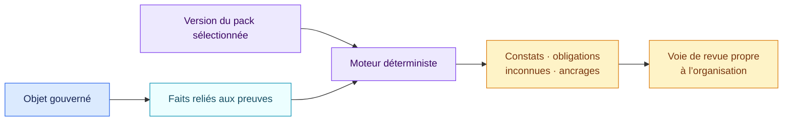

# Packs de règles

[Read in English](README.md)

Un pack de règles est une version relue et immuable de questions factuelles,
conditions déterministes, constats, obligations et ancrages. Il indique au
moteur ce qu’il doit tester sans masquer l’autorité ni la version appliquées.

## Packs de cette distribution

| Pack | Version | Autorité | Périmètre | Guide lisible |
| --- | --- | --- | --- | --- |
| Socle AI Act UE | 1.1.0 | Règlement européen contraignant | Toutes les voies de l’article 5, tous les cas annexe III, article 6, opérateurs, article 50 et GPAI | [Ouvrir](eu-ai-act/1.1.0/README.fr.md) |
| Socle RGPD IA | 1.1.0 | Règlement européen avec lignes EDPB identifiées | Périmètre, principes, droits, article 22, AIPD, sécurité, transferts et modèles IA | [Ouvrir](eu-gdpr-ai/1.1.0/README.fr.md) |
| Socle NIS2 UE | 1.1.0 | Directive européenne et profils nationaux | Article 20, dix familles de l’article 21 et déclarations de l’article 23 | [Ouvrir](eu-nis2-baseline/1.1.0/README.fr.md) |
| NIST AI RMF | 1.1.0 | Référentiel volontaire | 72 résultats du Core dans un profil cible sélectionné | [Ouvrir](nist-ai-rmf/1.1.0/README.fr.md) |
| NIST CSF | 2.1.0 | Référentiel volontaire | 106 résultats actuels du Core dans un profil cible sélectionné | [Ouvrir](nist-csf/2.1.0/README.fr.md) |
| Revue contractuelle | 1.0.0 | Exemple fictif | Présence de clauses d’un clausier fictif | [Ouvrir](contract-review-example/1.0.0/README.fr.md) |

Chaque guide explique la source, les questions, le chemin de décision, les
résultats, les limites et un exemple. Un juriste ou une personne de la
conformité ne devrait pas avoir à ouvrir `pack.json` pour comprendre le pack.

La [revue datée de couverture](../docs/audits/2026-08-29-pack-viability.fr.md)
consigne les sources officielles vérifiées, les corrections effectuées et les
limites résiduelles des packs juridiques et méthodologiques.

Les anciens répertoires de version restent immuables afin de reproduire une
évaluation passée. Les nouveaux profils doivent figer les versions du tableau.

## L’autorité reste visible

`authority_type` distingue droit contraignant, lignes directrices,
référentiels volontaires, politiques d’organisation et exemples fictifs. Les
constats issus de ces sources restent sur des axes distincts. AIR ne les réduit
pas à un score universel.

Aucun pack public n’attribue un feu organisationnel ou une voie d’approbation.
Chaque organisation définit ces décisions dans un profil de routage séparé et
versionné.

## Cycle de version

Chaque répertoire de version publié devient immuable :

1. écrire une version candidate ;
2. valider sa structure et ses cas de conformité ;
3. la simuler sur le registre existant ;
4. relire l’écart de constats et de routage ;
5. approuver et figer la version ;
6. conserver les évaluations précédentes pour l’audit et le drift.

`pack.json` est la source interprétable par la machine. Le README et le
CHANGELOG voisins sont la surface de revue humaine.
