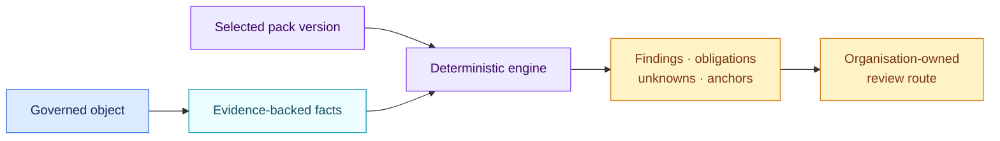

# Rule packs

[Lire en français](README.fr.md)

A rule pack is a reviewed, immutable release of factual questions,
deterministic conditions, findings, obligations and source anchors. It tells
the engine what to test without hiding the applicable authority or version.

## Packs in this distribution

| Pack | Version | Authority | Scope | Human-readable guide |
| --- | --- | --- | --- | --- |
| EU AI Act core | 1.0.0 | Binding EU regulation | Selected prohibited practices, high-risk entry points, transparency and AI literacy | [Open](eu-ai-act/1.0.0/README.md) |
| EU GDPR AI core | 1.0.0 | Binding EU regulation | Personal data, Article 9, Article 22, DPIA and privacy by design | [Open](eu-gdpr-ai/1.0.0/README.md) |
| NIS2 EU baseline | 1.0.0 | EU directive plus national overlays | Management governance, selected risk measures and incident process | [Open](eu-nis2-baseline/1.0.0/README.md) |
| NIST AI RMF | 1.0.0 | Voluntary framework | GOVERN, MAP, MEASURE, MANAGE and GenAI profile marker | [Open](nist-ai-rmf/1.0.0/README.md) |
| NIST CSF | 2.0.0 | Voluntary framework | Six top-level cybersecurity functions | [Open](nist-csf/2.0.0/README.md) |
| Contract review example | 1.0.0 | Fictional example | Presence checks against a fictional clause library | [Open](contract-review-example/1.0.0/README.md) |

Each guide explains the source, questions, decision path, outputs, limits and a
worked example. A legal or compliance reader should not need to inspect
`pack.json` to understand what the pack does.

The [dated viability review](../docs/audits/2026-08-29-pack-viability.md)
records the official sources checked, corrections made and residual limits for
the legal and methodological packs.

## Authority remains visible

`authority_type` distinguishes binding law, regulatory guidance, voluntary
frameworks, organisational policy and fictional examples. Findings from those
sources remain separate in the output. AIR does not convert them into a single
universal score.

No public pack assigns a company traffic light or approval path. An
organisation defines those decisions in a separate, versioned route profile.

## Version lifecycle

Every released version directory is immutable:

1. author a candidate version;
2. validate its structure and conformance cases;
3. dry-run it against the existing inventory;
4. review the finding and routing diff;
5. approve and pin the version;
6. retain previous assessments for audit and drift analysis.

`pack.json` is the machine-readable source. The adjacent README and CHANGELOG
are the human review surface.
