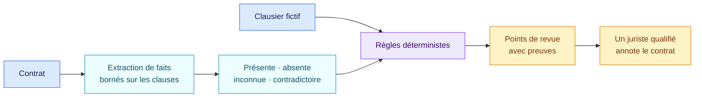

# Revue fictive d’un contrat SaaS · 1.0.0

[Read in English](README.md)

Ce pack pédagogique applique le modèle objets, faits et règles d’AIR à la revue
contractuelle. Le contrat devient l’objet gouverné. La présence des clauses est
établie par des faits reliés à leurs preuves, puis des règles déterministes les
comparent à un clausier fictif.

Ce dossier ne contient aucun modèle contractuel réel, aucune clause recommandée
et aucun avis juridique.

## En bref

| | |
| --- | --- |
| Autorité | Exemple pédagogique fictif |
| Objet évalué | Contrat |
| Source | Clausier fictif original 1.0 |
| Règles encodées | 6 |
| Principaux résultats | Points de revue sur les clauses absentes, avec extrait probant ou lacune de preuve |

## Fonctionnement de la revue



L’extraction peut être réalisée par une personne ou assistée par un modèle de
langage. Le résultat de la règle ne dépend pas du style de formulation du
modèle : les mêmes faits validés produisent le même résultat.

## Vérifications fictives

| Domaine | Fait relevé | Résultat en cas d’absence |
| --- | --- | --- |
| Confidentialité | Une clause de confidentialité est-elle présente ? | Revoir l’opportunité d’ajouter des engagements de confidentialité. |
| Données | Des dispositions sur le traitement des données sont-elles présentes ? | Revoir les dispositions de traitement nécessaires. |
| Propriété intellectuelle | La propriété ou les licences sont-elles traitées ? | Revoir les livrables, licences et éléments préexistants. |
| Incidents de sécurité | Une obligation de notification est-elle présente ? | Revoir le périmètre, les délais, le contenu et la coopération. |
| Audit | Les droits d’audit ou d’assurance sont-ils traités ? | Revoir les droits de preuve, d’audit et de remédiation proportionnés. |
| Responsabilité | La responsabilité est-elle répartie ? | Revoir plafonds, exclusions et répartition avec un juriste qualifié. |

## Lire le résultat

- `matched` signifie que les faits fournis établissent l’absence du domaine de
  clause attendu. Il crée un point de revue, pas une rédaction automatique.
- `not_matched` signifie que la présence du domaine est établie. Le résultat ne
  dit rien sur la qualité ou l’opposabilité de la rédaction.
- `indeterminate` signale une preuve absente ou contradictoire. Le contrat doit
  être relu.

## Limites volontaires

L’exemple vérifie uniquement la présence des clauses. Il n’analyse pas :

- leur qualité, leur opposabilité ou leurs interactions ;
- le droit applicable ou la position de négociation ;
- les mentions légalement obligatoires ;
- l’équilibre commercial ;
- l’acceptabilité d’une rédaction particulière.

Son rôle est de montrer qu’un autre domaine peut définir ses objets, faits,
preuves et règles tout en réutilisant le même moteur.

## Exécuter l’exemple

```bash
air-framework assess \
  --inventory examples/contract-review/inventory.json \
  --pack packs/contract-review-example/1.0.0/pack.json \
  --target contract-cloud-demo
```

Ouvrez [`pack.json`](pack.json) uniquement pour les faits et conditions
interprétables par la machine.
