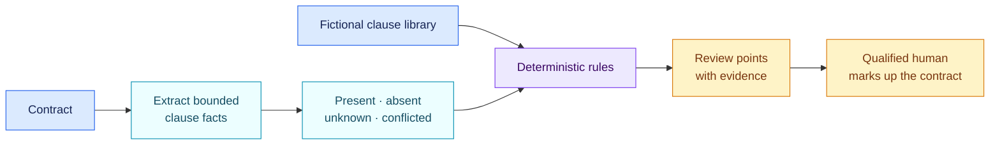

<!-- SPDX-License-Identifier: CC-BY-SA-4.0 -->

# Fictional SaaS contract review · 1.0.0

[Lire en français](README.fr.md)

This educational pack applies Open AIRS’s object, fact and rule model to contract
review. A contract becomes the governed object. Clause presence is captured as
evidence-backed facts, then deterministic rules compare those facts with a
fictional clause library.

Nothing in this pack is a real contract template, recommended clause or legal
opinion.

## At a glance

| | |
| --- | --- |
| Authority | Fictional educational example |
| Assessed object | Contract |
| Source | Original fictional clause library 1.0 |
| Rules encoded | 6 |
| Main outputs | Missing-clause review points with the supporting excerpt or evidence gap |

## How the review works



The extraction step may be completed by a person or assisted by a language
model. The rule outcome does not depend on the wording style of the model: the
same validated clause facts produce the same result.

## Fictional clause checks

| Clause area | Fact captured | Result when absent |
| --- | --- | --- |
| Confidentiality | Is a confidentiality clause present? | Review whether confidentiality terms should be added. |
| Data processing | Are data-processing terms present? | Review whether suitable data-processing terms should be added. |
| Intellectual property | Are ownership or licence terms addressed? | Review deliverables, licences and pre-existing materials. |
| Security incidents | Is a security-incident notice obligation present? | Review incident scope, timing, content and cooperation. |
| Audit cooperation | Are audit or assurance rights addressed? | Review proportionate evidence, audit and remediation rights. |
| Liability | Is liability allocated? | Review caps, exclusions and risk allocation with qualified counsel. |

## Reading the result

- `matched` means the supplied facts establish that the expected area is
  absent. It creates a review point, not automatic drafting.
- `not_matched` means the fact establishes that the clause area is present. It
  says nothing about drafting quality or enforceability.
- `indeterminate` means the evidence is missing or contradictory. The contract
  requires further reading.

## Deliberate limits

The example checks clause presence only. It does not assess:

- the quality, enforceability or interaction of clauses;
- the applicable law or negotiation position;
- mandatory statutory terms;
- commercial reasonableness;
- whether any sample wording should be accepted.

Its purpose is to show how another domain can define its own objects, facts,
evidence and rules while reusing the same engine.

## Run the example

```bash
open-airs assess \
  --inventory examples/contract-review/inventory.json \
  --pack packs/contract-review-example/1.0.0/pack.json \
  --target contract-cloud-demo
```

Open [`pack.json`](pack.json) only when you need the machine-readable clause
facts and conditions.
