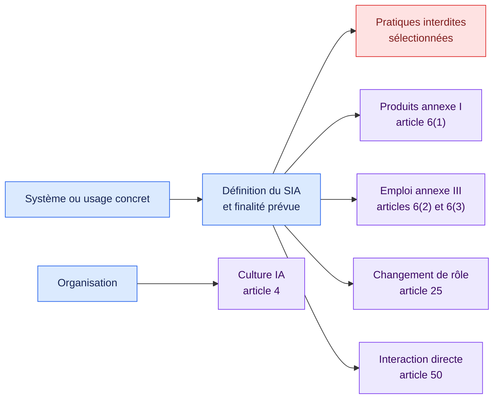
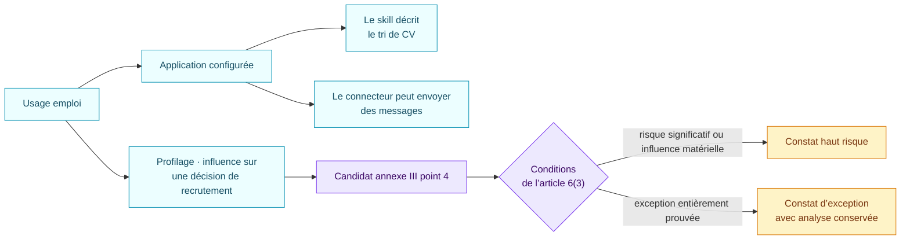

# Qualification socle de l’AI Act européen · 1.0.0

[Read in English](README.md)

Ce pack réalise une première qualification factuelle sur une sélection du
règlement (UE) 2024/1689, modifié par le règlement (UE) 2026/1744. Il sert au
triage d’un parc IA. Il ne constitue pas une analyse exhaustive de conformité
à l’AI Act.

## En bref

| | |
| --- | --- |
| Autorité | Droit contraignant de l’Union européenne |
| Objets évalués | Système d’IA, usage concret, organisation |
| Version source | Règlements (UE) 2024/1689 et 2026/1744 |
| Dernière revue | 29 août 2026 |
| Règles encodées | 9 |
| Principaux résultats | Signal de pratique interdite, qualification haut risque annexe I ou III, exception de l’article 6(3), revue du rôle fournisseur, transparence et culture IA |

## Ce que le pack examine

Les règles portent sur cinq axes distincts. Un usage peut en déclencher
plusieurs.



### Faits à établir

| Domaine | Questions auxquelles il faut répondre avec des preuves |
| --- | --- |
| Périmètre | La composition répond-elle à la définition d’un système d’IA ? Quelle est sa finalité prévue ? |
| Usage | Dans quel domaine intervient-elle ? Quelles tâches matérielles réalise-t-elle ? Correspond-elle à un cas de l’annexe III ? |
| Article 6(3) | Profilage, risque significatif ou influence matérielle sur une décision ? Tâche étroite, préparatoire ou autre condition prévue ? |
| Pratiques interdites | Manipulation préjudiciable ou inférence des émotions au travail ou dans l’éducation ? Une exception s’applique-t-elle ? |
| Produit | S’agit-il d’un composant de sécurité ou d’un produit couvert ? Une évaluation de conformité par un tiers est-elle requise pour le risque concerné ? |
| Chaîne de valeur | Un acteur a-t-il apposé son nom ou sa marque sur un système à haut risque existant, l’a-t-il substantiellement modifié ou a-t-il changé sa finalité ? |
| Transparence | Le système interagit-il directement avec une personne ? Sa nature IA est-elle déjà évidente ? L’exception limitée liée à la recherche d’infractions s’applique-t-elle ? |
| Organisation | Des mesures soutiennent-elles le développement de la culture IA ? |

Chaque réponse est `known`, `unknown`, `conflicted` ou `not_applicable` et
conserve ses preuves. Une preuve absente rend la règle indéterminée ; elle ne
produit pas un faux « non ».

## Exemple : recrutement

L’exemple fictif relie un usage de recrutement à une application configurée,
un skill de présélection et un connecteur de messagerie.



Le skill apporte une preuve sur la finalité. Il reste un objet textuel passif.
Les actions du connecteur sont réalisées par le runtime de l’application ou de
la plateforme. Le pack qualifie l’usage complet et ses faits article 6(3).

## Calendrier enregistré dans cette version

| Date | Événement repris dans les métadonnées du pack |
| --- | --- |
| 1er août 2024 | Entrée en vigueur de l’AI Act |
| 2 février 2025 | Application des chapitres I et II, dont les articles 4 et 5 |
| 2 août 2026 | Date générale d’application, sous réserve des exceptions de l’article 113 |
| 2 décembre 2026 | Application des nouvelles dispositions de l’article 5 sur les contenus intimes |
| 2 décembre 2027 | Application des règles concernées du chapitre III aux systèmes de l’annexe III |
| 2 août 2028 | Application des règles concernées du chapitre III aux systèmes de l’annexe I |

## Couverture et limites connues

Le pack encode :

- une sélection de pratiques interdites de l’article 5 ;
- les entrées haut risque de l’article 6 et les usages emploi de l’annexe III ;
- les changements de rôle fournisseur de l’article 25 ;
- la transparence des interactions directes de l’article 50 ;
- les mesures de culture IA de l’article 4.

Il n’encode pas encore :

- la plupart des domaines de l’annexe III hors emploi et gestion des travailleurs ;
- les textes sectoriels liés aux produits de l’annexe I ;
- les interdictions de l’article 5 ajoutées en 2026 ;
- les obligations GPAI, organismes notifiés, surveillance du marché et sanctions ;
- les listes exhaustives d’obligations des fournisseurs et déployeurs ;
- les futures lignes directrices, normes et modifications déléguées.

Un résultat déclenché est un signal de triage juridique. Il faut toujours
vérifier les faits, le droit et les lignes directrices applicables.

## Sources officielles

- [Règlement (UE) 2024/1689](https://eur-lex.europa.eu/eli/reg/2024/1689/oj/fra)
- [Règlement (UE) 2026/1744](https://eur-lex.europa.eu/eli/reg/2026/1744/oj/fra)
- [Texte consolidé au 27 juillet 2026](https://eur-lex.europa.eu/legal-content/FR/TXT/?uri=CELEX:02024R1689-20260727)
- [Vue d’ensemble de la Commission européenne](https://digital-strategy.ec.europa.eu/fr/policies/regulatory-framework-ai)

Chaque règle déclenchée renvoie aux articles ou annexes exacts. Ouvrez
[`pack.json`](pack.json) uniquement si vous avez besoin des conditions
interprétables par la machine.

## Exécuter l’exemple

```bash
air-framework assess \
  --inventory examples/ai-governance/inventory.json \
  --pack packs/eu-ai-act/1.0.0/pack.json \
  --target use-recruiting-assistant
```
