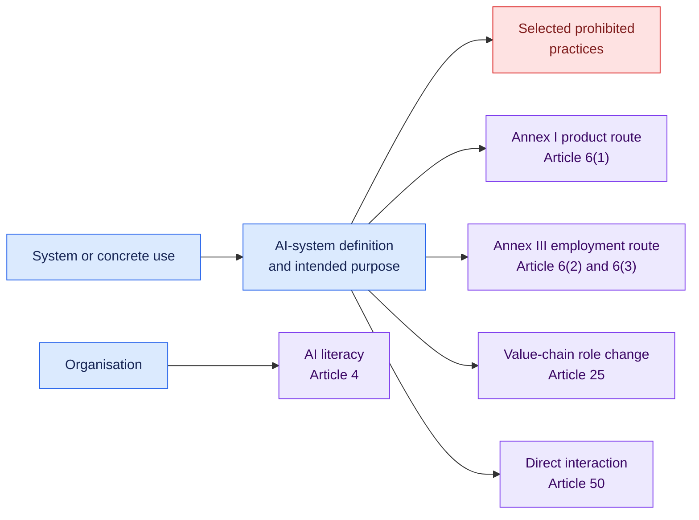
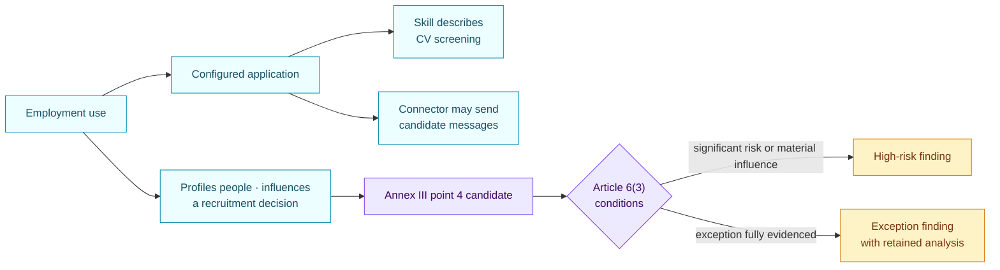

<!-- SPDX-License-Identifier: CC-BY-SA-4.0 -->

# EU AI Act core qualification · 1.0.0

[Lire en français](README.fr.md)

This pack performs a first, evidence-backed qualification against selected
parts of Regulation (EU) 2024/1689, as amended by Regulation (EU) 2026/1744.
It is designed for triage across an AI inventory. It is not a complete AI Act
conformity assessment.

## At a glance

| | |
| --- | --- |
| Authority | Binding European Union law |
| Assessed objects | AI system, concrete AI use, organisation |
| Source version | Regulations (EU) 2024/1689 and 2026/1744 |
| Reviewed | 29 August 2026 |
| Rules encoded | 9 |
| Main outputs | Prohibited-practice signal, Annex I or Annex III high-risk qualification, Article 6(3) exception, provider-role review, transparency and AI-literacy duties |

## What the pack examines

The rules look at five separate lenses. A use may match more than one.



### Facts the reviewer needs

| Area | Questions answered with evidence |
| --- | --- |
| Scope | Does the composition meet the AI-system definition? What is its intended purpose? |
| Use | In which domain is it used? Which material tasks does it perform? Does it match an Annex III use case? |
| Article 6(3) | Does it profile people, pose a significant risk or materially influence a decision? Is it narrow, preparatory or subject to one of the other stated conditions? |
| Prohibited practices | Does it use harmful manipulation or emotion inference in workplace or education, and does an exception apply? |
| Product route | Is it a safety component or covered product and is third-party conformity assessment required for the relevant risk? |
| Value chain | Has an actor put its name or trademark on an existing high-risk system, substantially modified it or changed its intended purpose? |
| Transparency | Does it interact directly with people, is its AI nature already obvious, and does the limited law-enforcement exception apply? |
| Organisation | Are measures in place to support AI literacy? |

Every answer must be `known`, `unknown`, `conflicted` or `not_applicable` and
retain its evidence. Missing evidence produces an indeterminate rule result,
not an assumed negative.

## Worked example: recruitment

The fictional example connects a recruitment use to a configured application,
a CV-screening skill and a messaging connector.



The skill contributes evidence about intended purpose. It remains a passive
text object. Connector actions belong to the application or platform runtime.
The pack evaluates the complete use and its Article 6(3) facts.

## Application timeline recorded by this version

| Date | Event represented in pack metadata |
| --- | --- |
| 1 August 2024 | AI Act enters into force |
| 2 February 2025 | Chapters I and II apply, including Articles 4 and 5 |
| 2 August 2026 | General application date, subject to Article 113 exceptions |
| 2 December 2026 | New Article 5 intimate-content provisions apply |
| 2 December 2027 | Relevant Chapter III rules apply to Annex III systems |
| 2 August 2028 | Relevant Chapter III rules apply to Annex I systems |

## Coverage and known gaps

Encoded coverage:

- selected Article 5 prohibited practices;
- Article 6 high-risk entry points and Annex III employment uses;
- Article 25 provider-role changes;
- Article 50 direct-interaction transparency;
- Article 4 AI-literacy measures.

Not yet encoded:

- most Annex III areas outside employment and worker management;
- sector-specific Annex I product legislation;
- the Article 5 prohibitions added in 2026;
- GPAI obligations, notified bodies, market surveillance and penalties;
- the complete provider and deployer conformity checklists;
- future Commission guidance, standards and delegated amendments.

A matched result is a legal triage signal. Current law, guidance and the
underlying facts still require qualified review.

## Official sources

- [Regulation (EU) 2024/1689](https://eur-lex.europa.eu/eli/reg/2024/1689/oj/eng)
- [Regulation (EU) 2026/1744](https://eur-lex.europa.eu/eli/reg/2026/1744/oj/eng)
- [Current consolidated text, 27 July 2026](https://eur-lex.europa.eu/legal-content/EN/TXT/?uri=CELEX:02024R1689-20260727)
- [European Commission implementation overview](https://digital-strategy.ec.europa.eu/en/policies/regulatory-framework-ai)

Every matched rule returns the exact article or annex anchors used. Open
[`pack.json`](pack.json) only when you need the machine-readable conditions.

## Run the example

```bash
open-airs assess \
  --inventory examples/ai-governance/inventory.json \
  --pack packs/eu-ai-act/1.0.0/pack.json \
  --target use-recruiting-assistant
```
