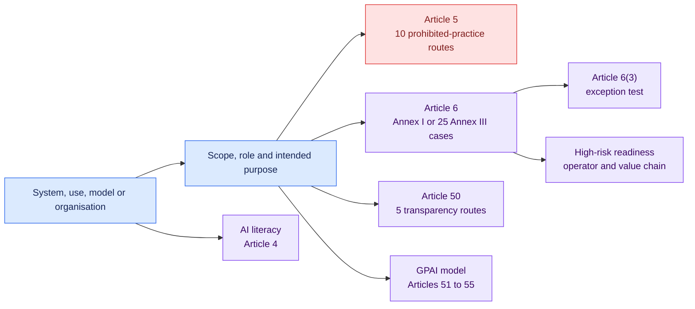

# EU AI Act core qualification and readiness · 1.1.0

[Lire en français](README.fr.md)

This version maps the current consolidated AI Act into an evidence-backed
qualification and readiness layer. It covers every Article 5 category, every
Annex III use case, the Article 6(3) test, high-risk operator duties, Article 50
transparency and GPAI-provider duties.

## Decision map

## Coverage at a glance

| Area | Machine-readable coverage |
| --- | --- |
| Prohibited practices | Article 5(1)(a) to (h), including points (ba), (bb), (1a) and (1b) |
| High-risk classification | Annex I product route, all 25 Annex III use cases, Article 6(3) and provider documentation |
| High-risk requirements | Articles 9 to 15, provider controls, registration, post-market monitoring and incidents |
| Other operators | Authorised representative, importer, distributor and value-chain duties |
| Deployer duties | Instructions, oversight, inputs, monitoring, logs, worker and affected-person notices, registration, cooperation and FRIA |
| Transparency | Direct interaction, machine marking, emotion or biometric notice, deep fakes and public-interest text |
| GPAI | Systemic-risk qualification and Articles 53 to 55 readiness |

The source text applies in stages. The two intimate-content prohibitions are
reported as effective from 2 December 2026. Annex III high-risk requirements
apply from 2 December 2027 and Annex I requirements from 2 August 2028 under
the consolidated timeline reviewed for this release.

## Reading the result

The pack returns legal categories and obligation gaps. It does not assign a
company approval route. An organisation can map the stable finding codes into
its own versioned workflow after reviewing the result.

Every conclusion retains the matched facts, evidence identifiers, rule version
and exact legal anchor. A missing cumulative element produces an indeterminate
result.

## Limits

Sector-specific Annex I product legislation, notified-body procedure, market
surveillance, penalties, harmonised standards and future Commission material
need dedicated profiles or later reviewed versions.

## Official source

- [Consolidated Regulation (EU) 2024/1689, current 27 July 2026](https://eur-lex.europa.eu/eli/reg/2024/1689/2026-07-27/eng)
- [Amending Regulation (EU) 2026/1744](https://eur-lex.europa.eu/eli/reg/2026/1744/oj/eng)

Open [`pack.json`](pack.json) for the executable conditions.
