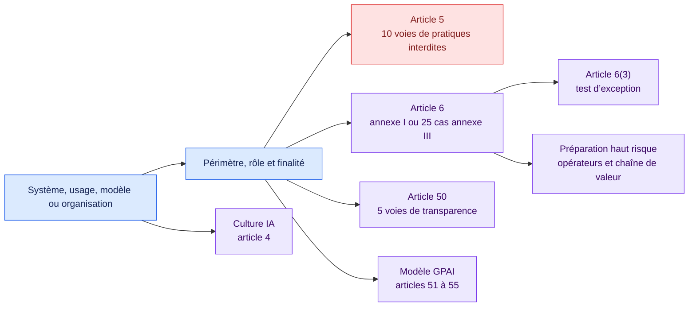

<!-- SPDX-License-Identifier: CC-BY-SA-4.0 -->

# Qualification et préparation à l’AI Act européen · 1.3.0

[Read in English](README.md)

Cette version transpose le texte consolidé actuel de l’AI Act dans une couche
de qualification factuelle et de préparation. Elle couvre toutes les catégories
de l’article 5, les 25 cas de l’annexe III, le test de l’article 6(3), les
obligations des opérateurs à haut risque, la transparence de l’article 50 et
les obligations des fournisseurs de modèles GPAI.

## Carte de décision

## Couverture

| Domaine | Couverture interprétable par le moteur |
| --- | --- |
| Pratiques interdites | Article 5(1)(a) à (h), y compris (ba), (bb), (1a) et (1b) |
| Qualification haut risque | Produits annexe I, 25 cas annexe III, article 6(3) et documentation du fournisseur |
| Exigences haut risque | Articles 9 à 15, contrôles fournisseur, enregistrement, suivi après commercialisation et incidents |
| Autres opérateurs | Mandataire, importateur, distributeur et chaîne de valeur |
| Déployeur | Instructions, supervision, entrées, suivi, journaux, informations, enregistrement, coopération et analyse des droits fondamentaux |
| Transparence | Interaction directe, marquage machine, émotion ou biométrie, deep fakes et texte d’intérêt public |
| GPAI | Risque systémique et préparation aux articles 53 à 55 |

Le calendrier reste explicite. Les nouvelles interdictions relatives aux
contenus intimes s’appliquent le 2 décembre 2026. Les exigences haut risque de
l’annexe III s’appliquent le 2 décembre 2027 et celles de l’annexe I le 2 août
2028 selon le texte consolidé relu pour cette version.

## Comment la classification est dérivée en 1.3.0

Le pack n'a plus besoin d'une conclusion juridique préremplie. La chaîne
part de faits observables :

1. la voie annexe III est établie par les cas d'usage cartographiés, ou par
   les étiquettes de finalité pour les points emploi (4a et 4b) ;
2. la règle de l'article 6(3) filtre la dérogation et émet son résultat,
   vrai ou faux, dans `aiact.article6_3_exception_established` ;
3. la règle de classification émet `aiact.high_risk_established` (et la
   voie) quand la route tient et que la dérogation échoue démontrablement ;
4. chaque règle d'obligation fournisseur ou déployeur consomme la
   conclusion émise.

Une organisation peut toujours attester `aiact.high_risk_confirmed`
directement ; une règle-pont porte l'attestation vers le même fait dérivé.
Ce qui n'est plus possible : qu'un extracteur propose la conclusion. Les
faits attestés et émis sont marqués `derived` et restent hors du catalogue
d'extraction.

## Lire le résultat

Le pack produit des catégories juridiques et des écarts d’obligations. Il
n’attribue aucune voie d’approbation d’entreprise. Une organisation peut relier
les codes de constats stables à son propre processus versionné après revue.

Chaque conclusion conserve les faits, preuves, version de règle et ancrage
exact. Un élément cumulatif manquant rend le résultat indéterminé.

## Limites

Les textes produits de l’annexe I, organismes notifiés, pouvoirs de surveillance,
sanctions, normes harmonisées et futurs documents de la Commission demandent
des profils dédiés ou une version ultérieure relue.

## Sources officielles

- [Règlement (UE) 2024/1689 consolidé au 27 juillet 2026](https://eur-lex.europa.eu/eli/reg/2024/1689/2026-07-27/fra)
- [Règlement modificatif (UE) 2026/1744](https://eur-lex.europa.eu/eli/reg/2026/1744/oj/fra)

Ouvrez [`pack.json`](pack.json) pour consulter les conditions exécutables.
