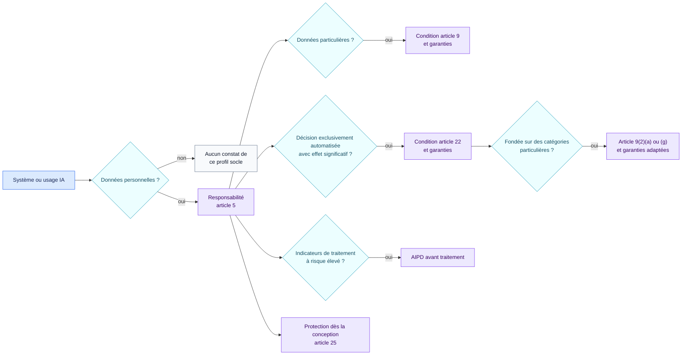
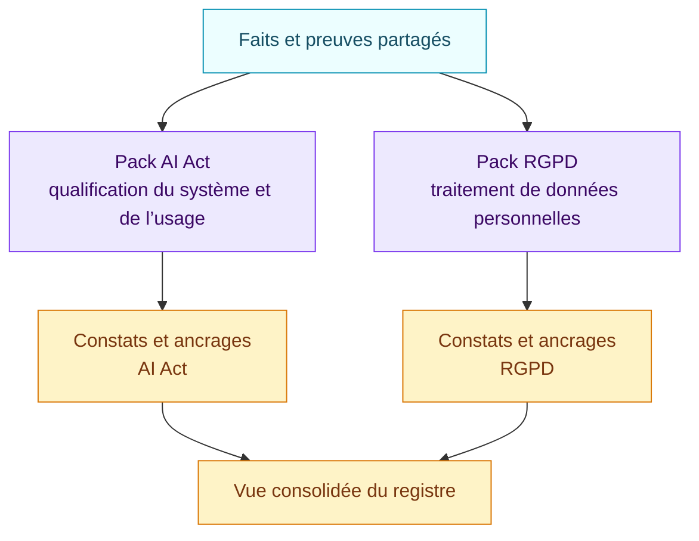

<!-- SPDX-License-Identifier: CC-BY-SA-4.0 -->

# Socle RGPD pour les traitements IA · 1.0.0

[Read in English](README.md)

Ce pack examine un système ou un usage IA au regard d’une sélection de
questions RGPD. Il aide à repérer les analyses et les preuves nécessaires. Il
ne remplace ni le registre des traitements, ni l’AIPD, ni une revue RGPD
complète.

## En bref

| | |
| --- | --- |
| Autorité | Droit contraignant de l’Union européenne |
| Objets évalués | Système d’IA, usage concret, organisation |
| Source | Règlement (UE) 2016/679 |
| Dernière revue | 29 août 2026 |
| Règles encodées | 9 |
| Principaux résultats | Applicabilité du RGPD, lacune article 9, restrictions et garanties article 22 dont les décisions fondées sur des catégories particulières, déclencheur et lacune d’AIPD, lacune de protection des données dès la conception |

## Chemin de revue



Les branches ne sont pas exclusives. Un même usage peut exiger une condition
article 9, une analyse article 22 et une AIPD.

## Faits à établir

| Domaine | Questions auxquelles il faut répondre avec des preuves |
| --- | --- |
| Données personnelles | Des données personnelles sont-elles traitées ? |
| Catégories particulières | Des données de l’article 9 sont-elles traitées et une condition valable est-elle documentée ? |
| Décisions automatisées | La décision est-elle exclusivement automatisée et produit-elle un effet juridique ou similaire significatif ? |
| Conditions article 22 | Nécessité contractuelle, droit applicable ou consentement explicite valable ? |
| Article 22(4) | La décision repose-t-elle sur des catégories particulières ? Dans ce cas, une condition de l’article 9(2)(a) ou (g) et des garanties adaptées sont-elles établies ? |
| Garanties | Intervention humaine, expression du point de vue et contestation sont-elles réellement mises en œuvre ? |
| AIPD | Évaluation systématique, données particulières à grande échelle ou surveillance systématique d’un espace public ? Une AIPD adaptée est-elle terminée ? |
| Conception | Les mesures de protection des données dès la conception et par défaut sont-elles prouvées ? |

La revue humaine est établie à partir de preuves du runtime et du processus. Une
phrase rassurante dans le prompt ne prouve pas qu’une personne peut intervenir
avant la prise d’effet du résultat.

## Articulation avec l’AI Act

Les constats RGPD et AI Act restent séparés parce qu’ils répondent à des
questions différentes.



Un usage peut être haut risque au titre de l’AI Act sans relever de l’article
22. Il peut aussi relever de l’article 22 sans être un système haut risque de
l’annexe III. Le registre affiche les deux axes sans les réduire à un score.

## Couverture et limites connues

Le pack encode :

- le signal d’applicabilité et de responsabilité RGPD ;
- le triage des conditions de l’article 9 ;
- les décisions exclusivement automatisées de l’article 22, dont la restriction du paragraphe 4 sur les catégories particulières ;
- une sélection de déclencheurs d’AIPD de l’article 35 et une lacune distincte lorsque l’AIPD requise n’est pas démontrée ;
- la protection des données dès la conception et par défaut de l’article 25.

Il n’encode pas encore :

- chaque obligation, dérogation et disposition nationale ;
- toutes les bases légales hors questions article 22 sélectionnées ;
- les notices, clauses de sous-traitance, transferts, durées de conservation et
  l’ensemble des droits des personnes ;
- une méthode détaillée d’AIPD et les listes des autorités de contrôle.

## Source officielle

- [Règlement (UE) 2016/679](https://eur-lex.europa.eu/eli/reg/2016/679/oj/fra)

Chaque résultat renvoie à son ancrage exact dans les articles 5, 9, 22, 25 ou
35. Ouvrez [`pack.json`](pack.json) uniquement pour les conditions
interprétables par la machine.

## Exécuter l’exemple

```bash
air-framework assess \
  --inventory examples/ai-governance/inventory.json \
  --pack packs/eu-gdpr-ai/1.0.0/pack.json \
  --target use-recruiting-assistant
```
