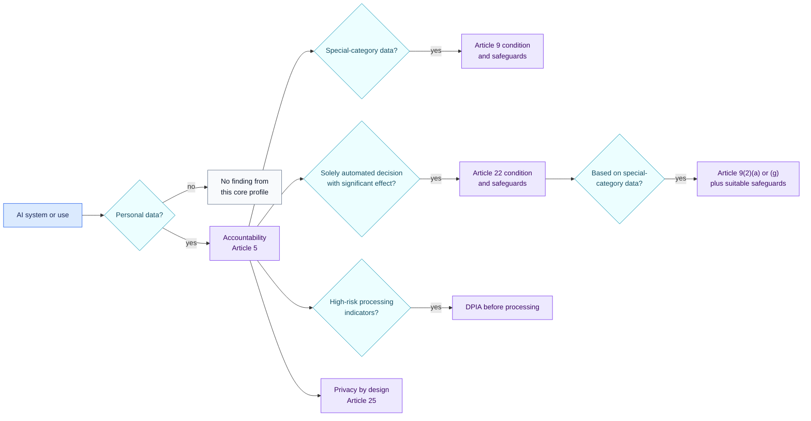
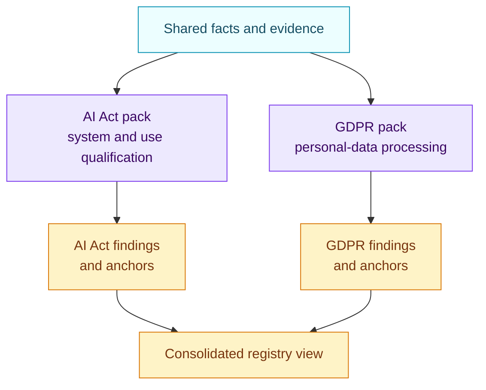

<!-- SPDX-License-Identifier: CC-BY-SA-4.0 -->

# EU GDPR AI processing core · 1.0.0

[Lire en français](README.fr.md)

This pack screens an AI system or concrete use against selected GDPR
questions. It helps identify which privacy analysis and evidence are needed.
It does not replace a record of processing activities, a DPIA or a complete
GDPR review.

## At a glance

| | |
| --- | --- |
| Authority | Binding European Union law |
| Assessed objects | AI system, concrete AI use, organisation |
| Source | Regulation (EU) 2016/679 |
| Reviewed | 29 August 2026 |
| Rules encoded | 9 |
| Main outputs | GDPR applicability, Article 9 evidence gap, Article 22 restrictions and safeguards including special-category decisions, DPIA trigger and completion gap, privacy-by-design gap |

## Review path



The branches are not exclusive. The same use can require an Article 9
condition, an Article 22 analysis and a DPIA.

## Facts the reviewer needs

| Area | Evidence-backed questions |
| --- | --- |
| Personal data | Are personal data processed? |
| Special categories | Are Article 9 data processed, and is a valid condition documented? |
| Automated decisions | Is the decision solely automated and does it have legal or similarly significant effects? |
| Article 22 conditions | Is contract necessity, applicable law or valid explicit consent established? |
| Article 22(4) | Is the decision based on special-category data? If so, is an Article 9(2)(a) or 9(2)(g) condition established alongside suitable safeguards? |
| Safeguards | Are human intervention, expression of viewpoint and contestation implemented where required? |
| DPIA | Is there systematic and extensive evaluation, large-scale special-category processing or large-scale public monitoring? Has a suitable DPIA been completed? |
| Design | Are data-protection-by-design and default measures evidenced? |

Human review is established from runtime and process evidence. Reassuring text
inside an application prompt does not prove that a person can intervene before
an outcome takes effect.

## Relationship with the AI Act pack

The GDPR and AI Act findings remain separate because they answer different
questions.



An AI use may be high-risk under the AI Act without matching Article 22. It may
also trigger Article 22 without being an Annex III high-risk system. The
registry can display both without collapsing them into one score.

## Coverage and known gaps

Encoded coverage:

- personal-data applicability and accountability signal;
- Article 9 special-category condition triage;
- Article 22 solely automated significant decisions, including the paragraph 4 restriction on special-category data;
- selected Article 35 DPIA triggers and a separate completion gap;
- Article 25 data protection by design and by default.

Not yet encoded:

- every GDPR duty, derogation and Member State provision;
- legal bases outside the selected Article 22 questions;
- transparency notices, processor terms, international transfers, retention
  and the full set of data-subject rights;
- detailed DPIA methodology and supervisory-authority lists.

## Official source

- [Regulation (EU) 2016/679](https://eur-lex.europa.eu/eli/reg/2016/679/oj/eng)

Every finding returns its exact Article 5, 9, 22, 25 or 35 anchor. Open
[`pack.json`](pack.json) only when you need the machine-readable conditions.

## Run the worked example

```bash
air-framework assess \
  --inventory examples/ai-governance/inventory.json \
  --pack packs/eu-gdpr-ai/1.0.0/pack.json \
  --target use-recruiting-assistant
```
