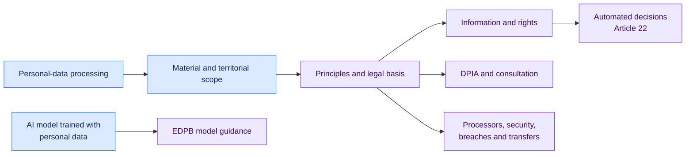

# EU GDPR for AI processing · 1.1.0

[Lire en français](README.fr.md)

This pack maps the GDPR duties most often needed to govern AI development and
use. It begins with scope, then checks principles, legal bases, transparency,
rights, automated decisions, processors, security, impact assessment,
governance and transfers.

## What is covered

| Review lens | Main provisions |
| --- | --- |
| Scope and roles | Articles 2 to 4 |
| Principles and lawful basis | Articles 5, 6, 9 and 10 |
| Information and rights | Articles 12 to 21 |
| Automated decisions | Article 22 conditions and safeguards |
| Operational governance | Articles 24 to 30 and 32 to 39 |
| International transfers | Chapter V |
| AI-model guidance | EDPB Opinion 28/2024, visibly labelled as guidance |

The result remains evidence-bound. Missing lawfulness, DPIA or safeguard facts
stay indeterminate. The pack does not reuse an AI Act risk label.

## Official sources

- [Regulation (EU) 2016/679](https://eur-lex.europa.eu/eli/reg/2016/679/oj/eng)
- [EDPB Opinion 28/2024](https://www.edpb.europa.eu/system/files/2024-12/edpb_opinion_202428_ai-models_en.pdf)

Open [`pack.json`](pack.json) for the executable conditions.
