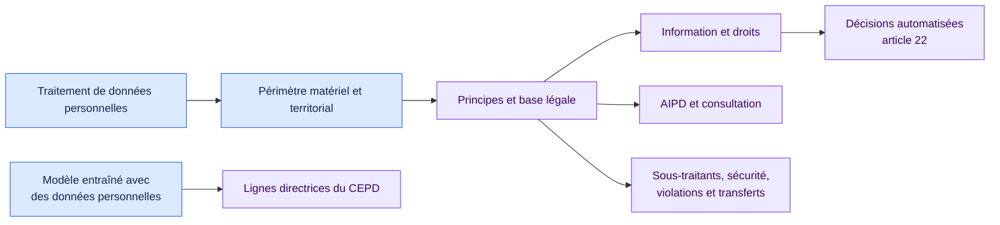

<!-- SPDX-License-Identifier: CC-BY-SA-4.0 -->

# RGPD appliqué aux traitements IA · 1.3.0

[Read in English](README.md)

Ce pack couvre les obligations RGPD les plus fréquentes dans le développement
et l’usage de l’IA. Il part du périmètre, puis examine les principes, bases
légales, informations, droits, décisions automatisées, sous-traitants,
sécurité, analyses d’impact, gouvernance et transferts.

## Couverture

| Axe de revue | Principales dispositions |
| --- | --- |
| Périmètre et rôles | Articles 2 à 4 |
| Principes et licéité | Articles 5, 6, 9 et 10 |
| Information et droits | Articles 12 à 21 |
| Décisions automatisées | Conditions et garanties de l’article 22 |
| Gouvernance opérationnelle | Articles 24 à 30 et 32 à 39 |
| Transferts internationaux | Chapitre V |
| Modèles d’IA | Avis 28/2024 du CEPD, identifié comme ligne directrice |

Le résultat reste lié aux preuves. Les faits manquants sur la licéité, l’AIPD
ou les garanties restent indéterminés. Le pack ne réutilise pas la catégorie
de risque issue de l’AI Act.

## L'article 22 par conception en 1.3.0

La branche « décision exclusivement automatisée » n'exige plus de
conclusion déclarée. Elle est satisfaite soit par l'attestation de
l'organisation, soit par conception : une finalité de décision matérielle
ou déterminante (issue des usages proposés validés) combinée à une action
engageante exécutable sans garde humaine techniquement imposée
(`composition.autonomous_external_send_possible`, dérivé des actions de
connecteur capturées). La règle de restriction émet
`gdpr.article22_established`, et les règles de condition du paragraphe 2 et
de garanties consomment cette qualification émise. Savoir si une décision a
réellement été prise reste une question distincte, au niveau de
l'exécution.

## Sources officielles

- [Règlement (UE) 2016/679](https://eur-lex.europa.eu/eli/reg/2016/679/oj/fra)
- [Avis 28/2024 du CEPD](https://www.edpb.europa.eu/system/files/2024-12/edpb_opinion_202428_ai-models_fr.pdf)

Ouvrez [`pack.json`](pack.json) pour consulter les conditions exécutables.
