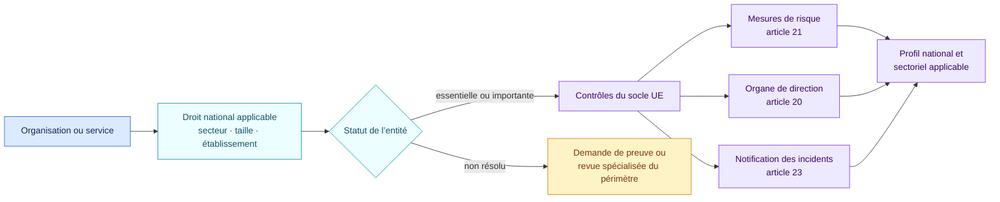
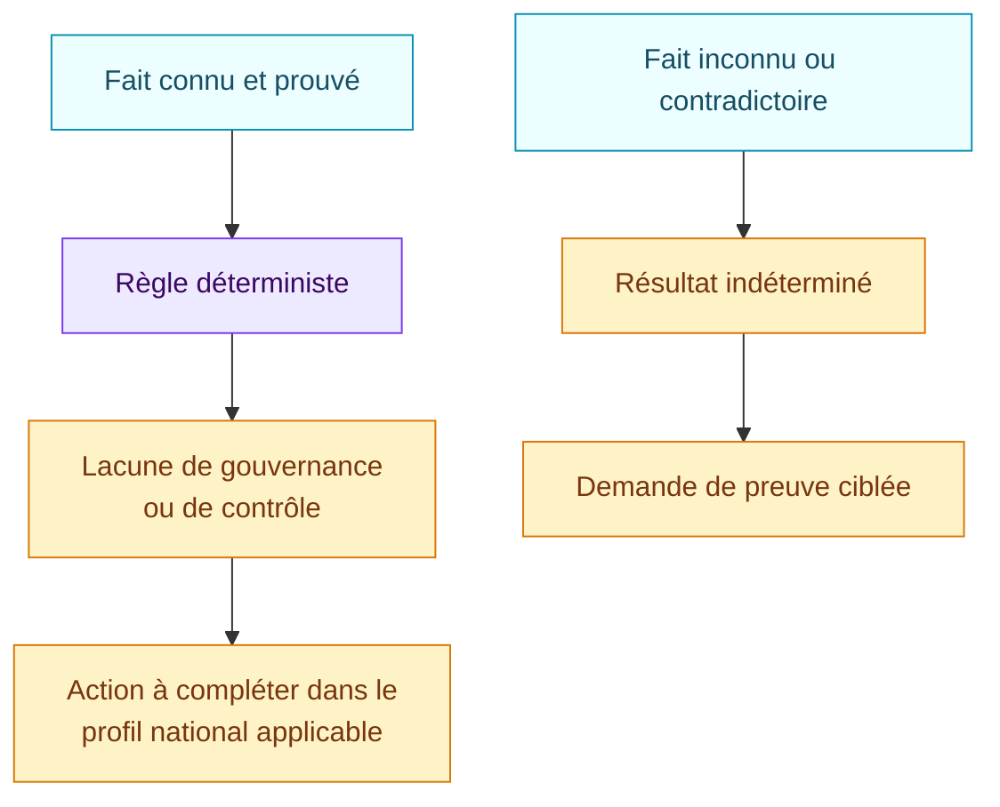

<!-- SPDX-License-Identifier: CC-BY-SA-4.0 -->

# Socle européen NIS2 · 1.0.0

[Read in English](README.md)

Ce pack reprend une sélection de questions de gouvernance et de gestion des
risques cyber issues de la directive (UE) 2022/2555. Il constitue un socle
européen. Une analyse réelle doit ajouter la transposition nationale, les
lignes directrices de l’autorité compétente et les règles sectorielles
applicables.

## En bref

| | |
| --- | --- |
| Autorité | Directive européenne mise en œuvre par le droit national |
| Objets évalués | Organisation, service, plateforme IA, système d’IA |
| Source | Directive (UE) 2022/2555 |
| Dernière revue | 29 août 2026 |
| Règles encodées | 6 |
| Principaux résultats | Marqueur de périmètre, lacunes de l’organe de direction, programme de gestion des risques, chaîne d’approvisionnement et notification des incidents |

## Comment utiliser ce socle

La première question est juridictionnelle. Le pack européen ne décide pas à
lui seul si une entité est essentielle, importante ou hors périmètre.



## Faits à établir

| Domaine | Question à documenter |
| --- | --- |
| Périmètre | L’entité est-elle essentielle, importante, hors périmètre ou non résolue selon le droit national applicable ? |
| Responsabilité de la direction | L’organe de direction approuve-t-il et supervise-t-il les mesures de gestion des risques cyber ? |
| Formation | Ses membres reçoivent-ils la formation requise ? |
| Programme de risque | Des mesures techniques, opérationnelles et organisationnelles appropriées et proportionnées sont-elles mises en œuvre ? |
| Chaîne d’approvisionnement | Le programme traite-t-il la sécurité des fournisseurs et prestataires ? |
| Incidents | Un processus opérationnel de notification des incidents significatifs existe-t-il ? |

Le pack ne remonte une lacune qu’après l’identification de l’entité dans le
périmètre. Un périmètre non résolu reste visible et doit être complété par le
profil national ; il n’est pas deviné à partir du seul secteur affiché.

## Comment lire un résultat



Un constat est un signal du socle. Il ne signifie pas à lui seul que l’entité
a enfreint une disposition précise du droit national.

## Couverture et limites connues

Le pack encode :

- le marqueur de périmètre de l’entité ;
- l’approbation, la supervision et la formation de l’organe de direction ;
- une sélection des mesures de l’article 21 ;
- la sécurité de la chaîne d’approvisionnement ;
- l’existence d’un processus de notification des incidents.

Il n’encode pas encore :

- le calcul du statut à partir du secteur, de la taille, de l’établissement et
  du droit national ;
- les transpositions et canaux nationaux de notification ;
- les seuils et calendriers détaillés de notification ;
- la totalité des mesures de l’article 21 ;
- le règlement d’exécution (UE) 2024/2690 et les textes sectoriels.

## Source officielle

- [Directive (UE) 2022/2555](https://eur-lex.europa.eu/eli/dir/2022/2555/oj/fra)
- [Règlement d’exécution (UE) 2024/2690, identifié mais non encodé](https://eur-lex.europa.eu/eli/reg_impl/2024/2690/oj/fra)

Les ancrages de [`pack.json`](pack.json) renvoient aux articles 20, 21 et 23
ainsi qu’au périmètre. Le JSON sert uniquement aux conditions interprétables
par la machine.

## Valider le pack

```bash
open-airs validate-pack packs/eu-nis2-baseline/1.0.0/pack.json
```
