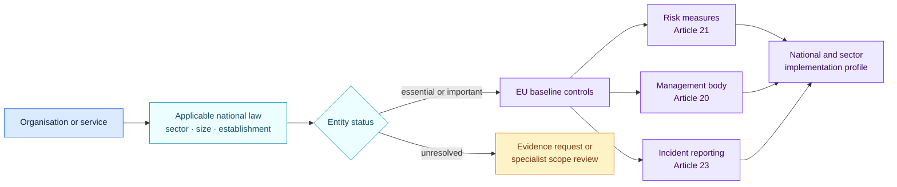
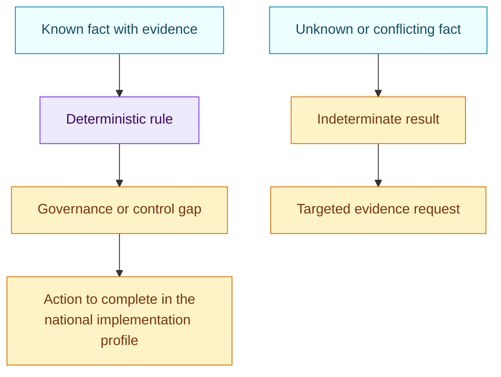

# NIS2 EU baseline · 1.0.0

[Lire en français](README.fr.md)

This pack records a small set of governance and cybersecurity risk-management
questions drawn from Directive (EU) 2022/2555. It is an EU baseline. A real
assessment must add the applicable national transposition, competent-authority
guidance and sector-specific rules.

## At a glance

| | |
| --- | --- |
| Authority | EU directive implemented through national law |
| Assessed objects | Organisation, service, AI platform, AI system |
| Source | Directive (EU) 2022/2555 |
| Reviewed | 29 August 2026 |
| Rules encoded | 6 |
| Main outputs | Scope marker, management-body gaps, cyber risk programme, supply-chain security and incident-reporting process |

## How to use this baseline

The first question is jurisdictional. The EU pack does not decide by itself
whether an entity is essential, important or out of scope.



## Facts the reviewer needs

| Area | Evidence-backed question |
| --- | --- |
| Entity scope | Is the entity essential, important, out of scope or unresolved under the applicable national law? |
| Management responsibility | Does the management body approve and oversee cybersecurity risk measures? |
| Management training | Do management-body members receive the required cybersecurity training? |
| Risk programme | Are appropriate and proportionate technical, operational and organisational measures implemented? |
| Supply chain | Does the programme address supplier and service-provider security? |
| Incident handling | Is there an operational process for significant-incident reporting? |

The pack returns a gap only after the entity has been marked in scope. An
unresolved scope remains visible and must be completed through the national
profile rather than guessed from a company name or industry label.

## What a finding means



A finding is a baseline signal. It is not a determination that the entity has
breached a particular national implementing provision.

## Coverage and known gaps

Encoded coverage:

- entity-scope marker;
- management-body approval, oversight and training under Article 20;
- selected risk-management measures under Article 21;
- supply-chain security;
- existence of an incident-reporting process under Article 23.

Not yet encoded:

- entity classification from sector, size, establishment and national facts;
- national transposition and national notification channels;
- detailed incident thresholds and reporting timelines;
- the full list of Article 21 measures;
- Implementing Regulation (EU) 2024/2690 and sector-specific Union acts.

## Official source

- [Directive (EU) 2022/2555](https://eur-lex.europa.eu/eli/dir/2022/2555/oj/eng)
- [Implementing Regulation (EU) 2024/2690, identified but not encoded](https://eur-lex.europa.eu/eli/reg_impl/2024/2690/oj/eng)

The source anchors in [`pack.json`](pack.json) point to Articles 20, 21 and 23
and the scope provisions. Use the JSON only for machine-readable conditions.

## Validate the pack

```bash
air-framework validate-pack packs/eu-nis2-baseline/1.0.0/pack.json
```
