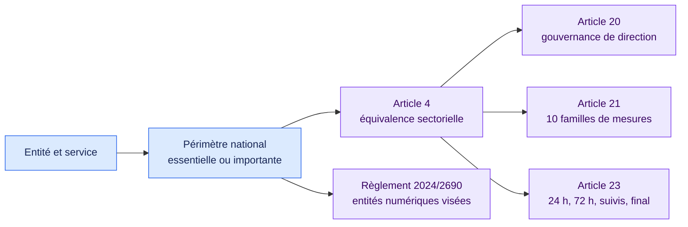

# Socle européen NIS2 au niveau de la directive · 1.1.0

[Read in English](README.md)

Ce pack couvre le socle opérationnel complet de la directive : preuves de
périmètre, gouvernance de la direction, dix familles de mesures de l’article 21
et séquence de déclaration de l’article 23.

## Les dix familles de mesures de l’article 21

| a à e | f à j |
| --- | --- |
| Politiques de risque et de sécurité | Évaluation de l’efficacité |
| Gestion des incidents | Hygiène cyber et formation |
| Continuité et gestion de crise | Cryptographie et chiffrement |
| Sécurité de la chaîne d’approvisionnement | RH, accès et actifs |
| Acquisition, développement et maintenance sécurisés | Authentification et communications sécurisées |

La directive dépend de sa transposition nationale. Le pack demande donc une
classification nationale et une autorité compétente documentées. Pour les
entités numériques et services de confiance visés, il signale aussi l’absence
d’analyse détaillée du règlement 2024/2690.

## Sources officielles

- [Directive (UE) 2022/2555](https://eur-lex.europa.eu/eli/dir/2022/2555/oj/fra)
- [Règlement d’exécution (UE) 2024/2690](https://eur-lex.europa.eu/eli/reg_impl/2024/2690/oj/fra)

Ouvrez [`pack.json`](pack.json) pour consulter les conditions exécutables.
