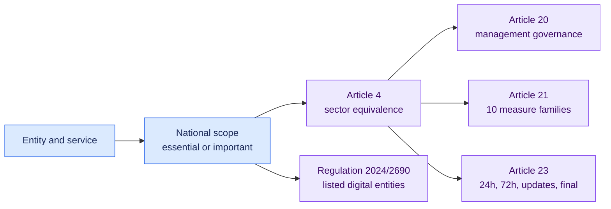

<!-- SPDX-License-Identifier: CC-BY-SA-4.0 -->

# EU NIS2 directive-level baseline · 1.1.0

[Lire en français](README.fr.md)

This pack covers the complete directive-level operational core: scope evidence,
management governance, all ten Article 21 measure families and the staged
Article 23 incident sequence.

## The ten Article 21 measure families

| a to e | f to j |
| --- | --- |
| Risk and information-security policies | Effectiveness assessment |
| Incident handling | Cyber hygiene and training |
| Business continuity and crisis management | Cryptography and encryption |
| Supply-chain security | HR security, access control and asset management |
| Secure acquisition, development and maintenance | Authentication and secure communications |

The directive depends on national transposition. The pack therefore requires a
documented national classification and authority route. Regulation 2024/2690
is detected for its listed digital and trust-service entities, with a finding
when the detailed Annex assessment is missing.

## Official sources

- [Directive (EU) 2022/2555](https://eur-lex.europa.eu/eli/dir/2022/2555/oj/eng)
- [Commission Implementing Regulation (EU) 2024/2690](https://eur-lex.europa.eu/eli/reg_impl/2024/2690/oj/eng)

Open [`pack.json`](pack.json) for the executable conditions.
