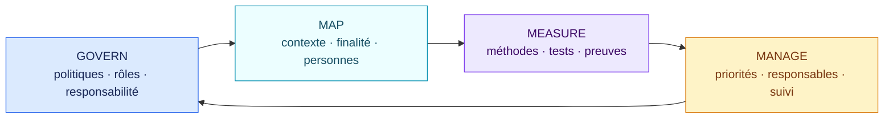
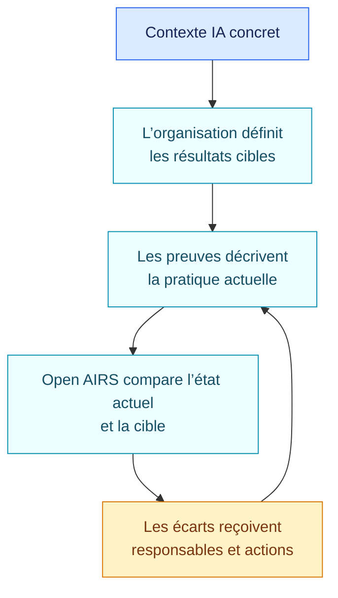

<!-- SPDX-License-Identifier: CC-BY-SA-4.0 -->

# Résultats socles du NIST AI RMF · 1.0.0

[Read in English](README.md)

Ce pack vérifie l’existence de pratiques de premier niveau dans les quatre
fonctions du NIST AI Risk Management Framework 1.0. Il relève aussi si le
profil NIST consacré à l’IA générative a été pris en compte lorsque cette
technologie est utilisée.

Le NIST AI RMF est volontaire. Les résultats décrivent des écarts de maturité
ou de preuve, pas une non-conformité juridique.

## En bref

| | |
| --- | --- |
| Autorité | Référentiel volontaire publié par le NIST |
| Objets évalués | Système d’IA, plateforme, application configurée, usage concret, organisation |
| Sources | NIST AI 100-1 et NIST AI 600-1 |
| Dernière revue | 29 août 2026 |
| Règles encodées | 5 |
| Principaux résultats | Écarts GOVERN, MAP, MEASURE et MANAGE ; absence de prise en compte du profil IA générative |

## Les quatre fonctions

Les fonctions sont complémentaires et doivent être revisitées quand le
contexte ou les risques changent.



## Questions encodées dans ce socle

| Fonction | Question à documenter |
| --- | --- |
| GOVERN | Les politiques, rôles et responsabilités liés aux risques IA sont-ils définis ? |
| MAP | Le contexte, la finalité, les personnes concernées et les impacts sont-ils documentés ? |
| MEASURE | Les risques et caractéristiques de confiance sont-ils mesurés avec des méthodes documentées ? |
| MANAGE | Les réponses prioritaires sont-elles affectées et suivies ? |
| IA générative | Si le système utilise de l’IA générative, le profil NIST AI 600-1 a-t-il été examiné pour le contexte pertinent ? |

Le profil IA générative n’est pas traité comme une certification binaire. Un
écart demande de sélectionner les risques et les actions pertinents pour le
contexte réel.

## Rendre le profil actionnable



Le pack public fournit un socle commun. L’organisation définit encore son
profil cible, sa tolérance au risque, ses mesures et ses responsables dans sa
propre configuration gouvernée.

## Couverture et limites connues

Le pack encode :

- la préparation de premier niveau sur GOVERN, MAP, MEASURE et MANAGE ;
- le marqueur de prise en compte du profil IA générative.

Il n’encode pas encore :

- chaque catégorie, sous-catégorie et action suggérée ;
- les profils cibles et tolérances propres à l’organisation ;
- les mesures, protocoles de test et seuils ;
- les profils sectoriels ou par cas d’usage.

Le NIST AI RMF 1.0 est en cours de révision à la date de revue. Une future
version du NIST devra devenir une nouvelle version du pack, testée en impact,
et ne remplacera jamais silencieusement cette source figée.

## Sources officielles

- [NIST AI Risk Management Framework 1.0](https://doi.org/10.6028/NIST.AI.100-1)
- [Profil IA générative, NIST AI 600-1](https://doi.org/10.6028/NIST.AI.600-1)
- [Page officielle et état de la révision](https://www.nist.gov/itl/ai-risk-management-framework)

Ouvrez [`pack.json`](pack.json) uniquement pour les faits et conditions
interprétables par la machine.

## Valider le pack

```bash
open-airs validate-pack packs/nist-ai-rmf/1.0.0/pack.json
```
